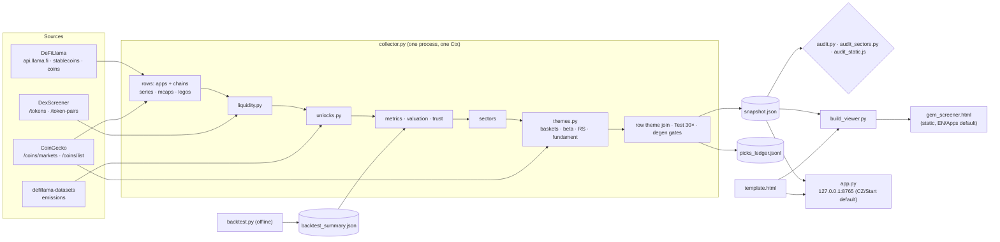

# Gem Screener — architecture and specification

This document describes **exactly how this version is built**: every data source,
every formula and the reason it has its shape, the data contract between the
collector and the page, and the tests that guard all of it. It is written for an
engineer — human or agent — who wants to rebuild the app, change it, or fork and
improve it without re-learning the traps it has already fallen into.

- The UI is Czech with an English switch (`#en` / `#cs`). Code, comments and
  these docs are in English. Czech terms that appear in data or UI are listed in
  the [glossary](#22-glossary-czech--english).
- Companion files: [AGENTS.md](AGENTS.md) (rules for coding agents: commands,
  definition of done, never-do list) and [README.md](README.md) (short, Czech).
- Nothing here is investment advice. The app ranks by a valuation multiple whose
  predictive power the pre-registered backtest could **not** confirm (§17).

## Contents

1. [What it is](#1-what-it-is)
2. [Status of this version](#2-status-of-this-version)
3. [System overview](#3-system-overview)
4. [Repository map](#4-repository-map)
5. [Running it](#5-running-it)
6. [Data sources](#6-data-sources)
7. [The collector pipeline](#7-the-collector-pipeline)
8. [Universe: what becomes a row](#8-universe-what-becomes-a-row)
9. [Metrics — apps and chains](#9-metrics--apps-and-chains)
10. [Trust, tiers and tags](#10-trust-tiers-and-tags)
11. [Degen view: gates, exit flags, picks ledger](#11-degen-view-gates-exit-flags-picks-ledger)
12. [Sectors (DeFiLlama categories)](#12-sectors-defillama-categories)
13. [Themes (the Sektory tab)](#13-themes-the-sektory-tab)
14. [snapshot.json — the data contract](#14-snapshotjson--the-data-contract)
15. [The viewer (template.html)](#15-the-viewer-templatehtml)
16. [Local app, exe and CI](#16-local-app-exe-and-ci)
17. [Backtest and pre-registration](#17-backtest-and-pre-registration)
18. [Quality gates: audits and equivalence proofs](#18-quality-gates-audits-and-equivalence-proofs)
19. [Product decisions and rejected alternatives](#19-product-decisions-and-rejected-alternatives)
20. [Invariants and traps — do not regress](#20-invariants-and-traps--do-not-regress)
21. [Extending it](#21-extending-it)
22. [Glossary (Czech → English)](#22-glossary-czech--english)
23. [Known limitations](#23-known-limitations)

---

## 1. What it is

A screener over the DeFiLlama and CoinGecko APIs that ranks **tokenized crypto
apps and chains** by how cheap they are relative to the business they run, and
explains every number it shows.

It answers four questions per project:

| Question | Where it is answered |
|---|---|
| How much does it earn, and is that growing? | revenue 30 d, 13 monthly bars, growth 6M, quarterly trajectory |
| How much does it cost relative to that? | **Potenciál** = valuation multiple vs. a benchmark (Hyperliquid for apps, the median chain for chains) |
| Can I trust the number and buy the token? | reliability gate + reason tags, holders' share of revenue, liquidity for a $10K ticket, float/unlocks tags |
| Which market narrative does it ride? | the row's **theme**, with the theme's beta to BTC and relative strength on the Sektory tab |

Four tabs: **Start** (the "degen" shortlist: apps passing 7 gates), **Apps**,
**Chains**, **Sektory** (12 themes: which narrative amplifies BTC, which one is
already running).

Target user (a product decision, §19): someone with fresh money expecting an
altseason, hunting 30–50× coins, who will not do their own research — so every
number carries its reason in plain language, and every doubt is a visible tag.

## 2. Status of this version

- **Version:** v14 (2026-09-23): v13 "Pro degena" plus the row-theme ladder and
  the 12th theme Infrastruktura (§13.9).
- **Distribution today:** a local Windows exe (`dist\GemScreener.exe`, served on
  127.0.0.1 with a Refresh button) and a static single-file HTML published as a
  claude.ai artifact (re-published by hand after a collector run).
- **GitHub Pages:** `.github/workflows/update.yml` is ready (collect → audit →
  build → deploy every 6 h) but has **never run**: Pages needs the repository to
  be public (or a paid plan). It goes live after the repo is made public, Pages is
  set to "GitHub Actions" and the first push lands.
- **Evidence:** the pre-registered backtest (§17) came out **INCONCLUSIVE**
  (NEPRŮKAZNÉ); the degen gates' historical variant (H3) did *worse* than the
  rest. The Start tab shows this verdict above the shortlist. The forward picks
  ledger (§11.4) started 2026-09-22.

## 3. System overview



Three properties define the architecture:

1. **One data contract.** The collector writes one JSON file, `snapshot.json`.
   The page is `template.html` with that JSON injected into a
   `<script type="application/json">` tag. There is no backend logic in the page
   path: the served mode only adds Refresh/Quit buttons that call `app.py`.
2. **One truth per number.** Every gate, tag and reason is decided in Python and
   stored on the row (`reliable_fail`, `degen_fail`, `risks`, `theme.source`…).
   The viewer renders; it never re-decides. The audits recompute every stored
   number with a second implementation.
3. **Fail soft, say so.** Every network failure becomes a warning in the snapshot
   (`fetch_warnings`), shown as a chip in the page header. Caches fall back to
   older copies ("stale beats empty"); the themes fall back to the last snapshot.

## 4. Repository map

| Path | Tracked | Role |
|---|---|---|
| `collector.py` | yes | The pipeline: fetch, measure, gate, write `snapshot.json` and the ledger. Entry point `run()`. |
| `themes.py` | yes | The 12 themes: CoinGecko baskets, weekly grid, beta/RS/tags, fundament, altseason index, row-theme join. |
| `liquidity.py` | yes | Can a $10K ticket be bought and sold? DexScreener pair depth or CoinGecko volume. |
| `unlocks.py` | yes | Token emission schedules (DeFiLlama datasets) → cliffs, 90-day unlocks, insiders. |
| `template.html` | yes | The whole viewer: HTML + CSS + JS in one file (~4,000 lines), no build step. |
| `build_viewer.py` | yes | Injects a snapshot into the template → `gem_screener.html`. |
| `app.py` | yes | Local HTTP server (exe entry point): serves the page, runs the collector on Refresh. |
| `audit.py` | yes | 36 sections recomputing every metric, gate and join from the snapshot (+ live spot checks). |
| `audit_sectors.py` | yes | Sector aggregates and themes, recomputed with a second implementation. |
| `audit_static.js` | yes | Static analysis of `template.html` (dead code, undefined ids, CSS tokens, info keys…). |
| `backtest.py` | yes | The pre-registered historical test of the ranking (offline, not run in CI). |
| `backtest_summary.json`, `backtest_report.html` | yes | Its verdict (read by the collector) and the full report. |
| `backtest_cache/prereg.lock` | yes | Hash of the pre-registered criteria; proves they were fixed before the data was seen. |
| `picks_ledger.jsonl` | yes | Append-only forward record of every shortlist (the honest out-of-sample test). CI's bot commits it every 6 h. |
| `baskets_cache.json` | yes | CoinGecko theme candidates, 7-day cache. Tracked as a warm start: a cold CoinGecko rebuild costs ~19 rate-limited calls. |
| `platforms_cache.json` | yes | CoinGecko `coins/list` token addresses (2.4 MB), 7-day cache, tracked for the same reason — the free API rate-limits that call hard. |
| `tools/rr_harness.py`, `tools/compare_snap.py` | yes | Record/replay equivalence proof for refactors (§18.3). |
| `.github/workflows/update.yml` | yes | CI: collect, audit, build, deploy to Pages, commit the ledger. |
| `GemScreener.spec`, `build_exe.bat`, `run_app.bat` | yes | Windows exe build (PyInstaller) and a dev launcher. |
| `requirements.txt` | yes | `requests` — the only third-party runtime dependency. |
| `snapshot.json`, `gem_screener.html`, `dex_cache.json`, `unlocks_cache.json` | no | Rebuilt by every run (CI carries them in `actions/cache`). |
| `dist/`, `build/`, `site/`, `*.log` | no | Build and runtime output. |
| `agentic_scan/` | **no** | A separate private experiment holding an API key — never published. |

## 5. Running it

Requirements: Python 3.13 with `requests` (`pip install -r requirements.txt`),
Node 22 for the static audit. All data files are read from and written to the
**working directory** (the collector's `data_dir`).

```bash
python collector.py            # ~3–6 min; writes snapshot.json (+ caches, ledger line)
python audit.py                # all three audits exit 1 on a hard failure
python audit_sectors.py
node audit_static.js
python build_viewer.py         # -> gem_screener.html (default: English, Apps tab)
python build_viewer.py --lang cs --view start
python app.py                  # local server, Czech, Start tab, Refresh button
python backtest.py             # offline; see §17 before changing anything it reads
```

| Variable | Read by | Effect |
|---|---|---|
| `COINGECKO_DEMO_KEY` | `themes.cg_headers()` | Sent as `x-cg-demo-api-key` on every CoinGecko call. Optional; CI should set it (shared runners get 429s). Never logged. |
| `GEM_PORT` | `app.py` | Pin one port instead of the first free of 8765–8775 (lets a test build run next to a live one). |
| `GEM_NO_BROWSER` | `app.py` | Do not open a browser tab (tests, CI-like runs). |
| `PYTHONIOENCODING=utf-8` | Python | Needed on consoles that are not UTF-8 (Czech log lines). |

`app.py` resolves its data directory with `pick_data_dir()`: next to the exe (or
script) if writable, else `%LOCALAPPDATA%\GemScreener`. The template comes from
the PyInstaller bundle (`sys._MEIPASS`) when frozen.

## 6. Data sources

All requests go through **one** `requests.Session` owned by the run's `Ctx`
(`collector.py`), with the header `User-Agent: gem-screener/1.0 (+personal
research tool)`. Two retry policies exist:

- **`Ctx.get(url, timeout, quiet_status, warn)`** — DeFiLlama, DexScreener,
  datasets, logos. 200 → JSON. **429** → wait `Retry-After` (capped at 60 s) or
  3/8/20/40 s, up to 4 times, on top of the normal retries. Any other non-200 →
  give up at once. Exceptions (incl. bad JSON) → 3 attempts, 0.5 s apart. Final
  failure → `None` **and a warning** (unless `warn=False`, used only by a first
  pass that has its own slow retry).
- **`themes.cg_get(ctx, url)`** — every CoinGecko call. One request at a time,
  6 s pause after each call by the callers, 429 → 15/30/60 s (Retry-After
  honoured, capped at 90 s). CoinGecko's free tier answers 429 even at 7 s spacing.

| Host | Endpoint | Used for | Cache |
|---|---|---|---|
| `api.llama.fi` | `/protocols`, `/config` | protocol metadata, parents, chain → CoinGecko id map (`chain_gecko`), per-chain protocol counts | — |
| | `/overview/fees?…&dataType=dailyRevenue` and `…=dailyHoldersRevenue` | the app universe (revenue 30 d per adapter), holders' revenue | — |
| | `/summary/fees/{slug}?dataType=dailyRevenue` | daily revenue series (apps, chains, every sector adapter) | — |
| | `/protocol/{slug}` | description, url, chains (TVL series is discarded for apps) | — |
| | `/v2/historicalChainTvl/{chain}` | chain TVL (fallback adoption metric) | — |
| | `/overview/dexs/{chain}?dataType=dailyVolume` | chain DEX volume (adoption index) | — |
| `stablecoins.llama.fi` | `/stablecoinchains`, `/stablecoincharts/{chain}` | stablecoin supply per chain (chain valuation, L1/L2 fundament) | — |
| `coins.llama.fi` | `/batchHistorical?coins=…&searchWidth=…` | historical prices: Síla points (6 h), theme weekly grid (12 h) | — |
| | `/prices/current/coingecko:…` | ledger evaluation | — |
| | `/chart/coingecko:bitcoin` | BTC repair when the grid has holes | — |
| `api.coingecko.com/api/v3` | `/coins/markets?ids=…&price_change_percentage=7d,30d,1y` | mcap, FDV, price, supply, ATH, 24 h volume, price changes | never cached (a stale volume would pass for today's) |
| | `/coins/markets?category={id}&per_page=30` | theme candidates | `baskets_cache.json`, 7 d |
| | `/coins/markets?per_page=250` | top-250 universe (altseason index) | `baskets_cache.json`, 7 d |
| | `/coins/list?include_platform=true` | token contract addresses | `platforms_cache.json`, 7 d |
| `api.dexscreener.com` | `/tokens/v1/{chain}/{addr,…}` (30 per call, **sorted**), `/token-pairs/v1/{chain}/{addr}` | deepest money pair per token | `dex_cache.json`: fresh 12 h, kept 7 d |
| `defillama-datasets.llama.fi` | `/emissionsProtocolsList`, `/emissions/{slug}` | unlock schedules | `unlocks_cache.json`, 7 d |
| `icons.llamao.fi` (+ feed logo URLs) | logos | 48 px, ≤ 25 KB, embedded as data URIs | — |

Caches are written atomically (tmp + `os.replace`, 5 retries on Windows
`PermissionError`). "Stale beats empty": a failed refresh keeps the old entry and
logs a warning; nothing is deleted for being old.

## 7. The collector pipeline

`collector.run(log=print, data_dir=None)` is the whole pipeline; `python
collector.py` calls it with the working directory. `app.py` calls it repeatedly
in one process, which is why **all mutable state lives on `Ctx`** (module-level
accumulators once double-counted on the second Refresh).

1. `Ctx(log, data_dir)` — session, bulk data, accumulators, `warnings`.
2. `fetch_bulk` — 5 bulk calls (§6): fee universe, holders' revenue, protocols,
   config (parents, `chain_gecko`), stablecoin chains.
3. `build_candidates` — apps and chains that clear the floor and have a token (§8).
4. `fetch_all_series` — 10 threads. Apps: revenue series (first slug candidate
   that returns data), then `/protocol`. Chains: fees, TVL, stablecoins, DEX
   volume. Every series keeps its last 400 days. A worker exception drops that
   entity with a warning. (Rows arrive in completion order: array order is not
   deterministic — sort before comparing.)
5. `fetch_market_caps` — CoinGecko, 200 ids per call, 6 s apart; stores `cg`
   market fields.
6. `fetch_all_logos`.
7. `drop_untradeable` — no CoinGecko mcap or price → not a row (counted).
8. `score_entity` — growth windows, trajectory, basic measures.
9. `liquidity.build_liquidity` → `liq` on every row (exception → all `None`).
10. `unlocks.build_unlocks` → `unlock` on apps (exception → all `None`).
11. `apply_risks` → `risks` tags (float, cliff, unlock90, thin).
12. `add_sector_share` → `share` (category share among tokenized projects).
13. `compute_metrics` → run-rate, P/S, potential, Síla, growth, reliability,
    tiers; returns `bench` (apps) and `bench_chains`.
14. `build_sectors_v11` (apps, full universe) and `build_sectors` (chains).
15. Read the previous `snapshot.json` as `prev` (used by fallbacks, change lists,
    the ledger).
16. `themes.build_themes` → themes, altseason, theme prices, candidates. On any
    exception: fall back to `prev`'s themes with `themes_stale = true`.
17. `themes.attach_themes` (row themes + `theme_join`), `apply_test30`,
    `apply_degen`.
18. Ledger summary (forward returns of past picks) and `backtest_summary.json`
    if present next to the snapshot.
19. Trim: apps lose their TVL series (~2 MB no view draws); dollar series are
    rounded to cents (`clean_series`). (The adoption index is different: it keeps
    9 significant digits, `%.9g`, because it can start at 0.0007.)
20. `write_snapshot` — tmp file + `os.replace`.
21. `append_ledger` — **only after** the snapshot is safely written.

A full run takes ~3–6 minutes; the first run after the theme definitions change
spends a few more minutes rebuilding CoinGecko baskets.

## 8. Universe: what becomes a row

**Apps** (`group_apps`, `build_candidates`):

- Source: the `dailyRevenue` fee overview, entries with `protocolType == "protocol"`.
- Each adapter needs **≥ $10,000 revenue over 30 days** (`COLLECTION_FLOOR_USD_30D`).
- Adapters flagged `doublecounted` by DeFiLlama are dropped (counted in
  `excluded.doublecounted_count`).
- **A token is required.** `gecko_for_app` tries the protocol's `gecko_id`, its
  config parent's, then the entry's parent's. Adapters without one are counted
  (`excluded.apps_no_token_count`) and never shown — they still count in sector
  totals (§12). *Product decision: no token = not shown, ever.*
- Grouping: by `parentProtocol` (row key `parent#<slug>`), else one leaf
  (`leaf#<defillamaId>`). The parent's name comes from the config. `total30d`
  and holders' revenue are summed over the leaves; **`gecko_id`, `category` and
  logo come from the first leaf seen**. The group is re-checked against the floor.
- Slug candidates, tried in order until an endpoint returns data: parents
  `[parentProtocolSlug of a child, slugify(name), key without "parent#"]`,
  leaves `[slug, slugify(name)]`. (Parent ids are not API slugs: Sky is
  `parent#maker`, and `/summary/fees/maker` returns 400.)

**Chains**: entries with `protocolType == "chain"`, same floor, token from
DeFiLlama's `chainCoingeckoIds[name].geckoId`. Category is `"L2 / rollup"` when
the chain's parent types include L2 or L3, else `"L1"`.

**Tradeable**: a row without a CoinGecko market cap or price is dropped
(`excluded.untradeable_count`).

Three universes exist on purpose and must not be confused:

| Universe | Contents | Used for |
|---|---|---|
| Rows | tokenized, tradeable, ≥ floor | the tables, gates, ranking |
| Sector universe (`sector_universe`) | every adapter ≥ floor, token or not, minus `doublecounted`, minus **Stablecoin Issuer** | sector totals and shares (§12), theme revenue fundaments (§13.6) |
| Chain fundament | every chain with ≥ $10M stablecoins, token or not | L1/L2 theme fundament (Base alone is ~38% of L2 stablecoins and has no token) |

## 9. Metrics — apps and chains

All formulas live in `collector.py` unless noted. Growth rates are **% per month**.

### 9.1 Growth windows and the 6-month trend

- `window_growth` (`rev_growth` for apps, `tvl_growth` for chains): for each
  window in `WINDOWS = [30, 90, 180, 365]` days, a log-OLS slope on the 7-day
  trailing mean: `g = (exp(b · 30/step) − 1) · 100`, clipped to [−99, 999],
  with r² in [0, 1]; ≥ 8 positive points required. Shown only as a reference
  table in the detail panel — **there is no time-window switch anywhere** (§19).
- `growth6m` — the one trend the app uses: the last 182 days in **weekly
  buckets** (apps: weekly sums, partial weeks dropped; chains: weekly means,
  because a stock is not summed), OLS on ≥ 5 weeks. Always bucket weekly before
  regressing: daily revenue is too noisy.
- `monthly` — 13 calendar-month buckets; the newest is `partial` and drawn
  hatched, never as a cliff.

### 9.2 Run-rate (annualised current revenue)

`runrate(series)` returns `{value, basis, cov30, cov90, sparse}` with

```
value = max(0, min( 365·rev30/cov30,        basis "30d"
                    365·rev90/cov90,        basis "90d"
                    12·median(m1, m2, m3) )) basis "med3"  (3 disjoint 30-day blocks)
```

- **The median term is not redundant.** `min(30d·12, 90d·4)` only neutralises a
  spike older than 30 days: a project earning N/month that books 10N in the newest
  month gives `min(120N, 48N) = 48N`, four times the truth; the median gives 12N.
  Cost: a clean 2×/month accelerator reads at its middle month (accepted).
- **Divide by coverage**, not the nominal window: a 45-day-old project must not be
  annualised as if it had a quarter.
- **Sparse reporters** (monthly lumps — Chainlink, LayerZero, Safe): if fewer than
  half the days in the 90-day window are non-zero, only the 90-day reading is
  used and `basis = "90d-sparse"`.
- A block counts as covered with 2 days of slack (a series of exactly 90 days
  starts one day inside the oldest block; a strict test silently dropped the
  median term).

### 9.3 Valuation and Potenciál

- Apps: `ps = mcap / runrate.value`. Chains: `ps = mcap / stables_now`, only when
  stablecoins ≥ $10M (Filecoin read 4,389× off $160K). **Not MC/TVL**: TVL is
  denominated partly in the chain's own token, so mcap ↑ ⇒ TVL ↑.
- Benchmark (`compute_metrics`): apps use **Hyperliquid** (matched by name) —
  `bench.mult = HL mcap / HL run-rate`, fallback "medián appek" (median app);
  chains use the median chain (`bench_chains`, "medián chainů").
- `potential_raw = bench.mult / ps` — how many times the row could re-rate to the
  benchmark's multiple with revenue held still. `potential = min(50, raw)` for
  display (`UPSIDE_CAP`). **The table sorts on `potential_raw`** (uncapped;
  rows tied at the cap used to sort arbitrarily), nulls last in both directions.
- `mcap_at_bench = bench.mult × base` (run-rate for apps, stablecoins for chains)
  — exactly `mcap × potential_raw`; `50 × mcap` and `bench_capped = true` at the
  cap. `price_at_bench` follows.

### 9.4 FDV — the symmetric dilution check

- `fdv_mult = HL FDV / HL run-rate`; `potential_fdv = fdv_mult / (fdv / runrate)`.
  **The basis must be symmetric**: Hyperliquid's own FDV is ~4× its mcap, and
  dividing a coin's FDV multiple into HL's *mcap* multiple once understated a
  coin's potential by a factor of four.
- Skipped when `fdv < 0.98 · mcap` (`FDV_SANE`, a CoinGecko data error).
- `potential_fdv_shown = min(potential, potential_fdv)` — dilution may only lower
  the number, or a full-float coin would read 70×. `float_worse` flags rows where
  dilution bites harder than for the benchmark. Shown as "FDV x×" under the
  multiple; never used in the sort.

### 9.5 Síla 6M (strength) — revenue growth ÷ price growth

`strength` samples 7 points `t_k = now − k·(182/6)` days (k = 0…6); prices from
`batchHistorical` (±3 days); the measure `m` is the run-rate at `t_k` (apps; the
series must start ≥ 90 days before `t_k`) or the stablecoin level (chains).
With `k` the oldest usable point (**k ≥ 3 required**):

```
sila6m = (m_0 / m_k) / (p_0 / p_k)
```

Why this form: the "potential then vs. now" ratio
`bench / (mcap_now · p_t/p_now / rr_t)` cancels the benchmark and today's mcap
entirely, so no market-cap history is needed. `k ≥ 3` because adjacent 90-day
windows overlap by 60 days and bias the ratio toward 1 (a fake "steady").
Assumes constant supply, so inflationary tokens read high.

### 9.6 Trajectory and phases (`trajectory`)

Four quarters back from the series end (`QUARTERS`: p1 364–274 d … p4 91–0 d),
each needing ≥ 6 weekly points; ≥ 60 daily points and ≥ 8 weeks overall.

```
eff(q)   = g(q) · (0.3 + 0.7 · r²(q))          growth discounted by its noise
recent   = eff(p4);  baseline = mean(eff(p1..p3));  accel = recent − baseline
level_vs_peak = mean level of p4 / highest quarter mean
hs = 50 · (1 + 0.5·tanh(recent/40) + 0.4·tanh(accel/40) + 0.1·(2·lvp − 1))
```

Phase, first match: recent < −3 → **Pokles** (declining); recent ≤ 3 →
**Stagnace** (flat); baseline ≤ 3 ∧ recent ≥ 15 ∧ lvp ≥ 0.6 → **Zážeh**
(ignition); accel > 3 → **Akcelerace**; accel < −3 → **Zpomaluje** (slowing);
else **Setrvalý** (steady). Too little data → **Nový** (new). The Trajectory
column sorts by `phase rank · 1000 + hs`.

### 9.7 Chains: adoption instead of revenue

- `adoption_index`: geometric mean of **stablecoin supply** and **30-day DEX
  volume**, each normalised to its own level 182 days ago, on the forward-filled
  union of dates (≥ 30 points). A component is kept only if it is ≥ $1M both at
  the reference point and now (Quai's $14K of DEX volume would swamp a billion
  of stablecoins). `ln(geomean) = mean(ln)`, so the OLS slope of the index is
  exactly the mean of the components' slopes. The reference point is only the
  normalisation base — the index spans the whole series.
- Growth 6M, trajectory and Síla for chains run on this index / on stablecoins.
- **Fee check** (tooltip and panel only; never sort, gate or tag):
  `fee_runrate`, `ps_fees = mcap / fee_runrate`, `potential_fees(_raw)` against
  the median chain's fee multiple (`bench_chains.fee_mult`). The panel turns red
  when adoption says ≥ 1.2× but fees say < 1×.
- A chain with no stablecoin data (Canton, Quai) falls back to TVL for size, gets
  one reason "bez dat o stablecoinech" and no potential.

### 9.8 Value accrual — does revenue reach token holders?

`holders_share = min(1, holders30d / total30d)` from DeFiLlama's
`dailyHoldersRevenue` bulk. A leaf without holders data makes the share `None`,
never zero. Below 5% the row gets the outlined-coral tag **Bez podílu** (no
share). It is a tag, not a filter: a DeFiLlama 0 can also mean the adapter does
not track buybacks.

### 9.9 Share of category

`share[w] = 100 · row total / Σ totals of its category` per window (apps grouped
by DeFiLlama category, chains pooled). The denominator is **tokenized rows
only** — "how big is it among what you can buy" — so for leaders it is a few
points higher than the share of the full sector. Shown as a small bar next to
the category chip.

### 9.10 Test 30× — could it do 30× without becoming absurd?

`apply_test30`: `implied = 30 · mcap`. The ceiling follows the **ladder** rule
(`SIZE_CEILING_RULE = "ladder"`): the biggest *other* token in the same
DeFiLlama category (different `gecko_id`) if it is bigger than the row; if the
row already leads its category, the biggest coin of its **theme's** display
basket (excluding itself); else no ceiling (`size_ok = None`, "bez srovnání").
`size_ok = implied ≤ ceiling`, `room_x = ceiling / mcap`,
`val_ok = potential_raw ≥ 30`. The rejected `larger_of` rule let HYPE, ZEC or
DOGE in a basket wave almost anything through (§19).

### 9.11 Liquidity — can a $10K ticket get in and out? (`liquidity.py`)

- Token addresses from CoinGecko `coins/list?include_platform=true` (cached 7 d),
  platform names mapped to DexScreener chains (55 entries).
- DexScreener `/tokens/v1` in **sorted** batches of 30 (unsorted batches asked
  different URLs every run and defeated the cache), 0.25 s apart; fresh for 12 h,
  kept up to 7 d. The deepest pair where our token is the base and the quote is
  money (stablecoin or native asset); `/token-pairs/v1` fallback (≤ 60 per run)
  when the main pair's quote is not money.
- `impact_pct = 100 · 2 · $10,000 / pair liquidity`. **Pass**: impact ≤ 3%
  (`source "dex"`) or CoinGecko 24 h volume ≥ $2M (`source "volume"`). Data but
  no pass → `ok = false` (tag "Mělká likvidita"); no data → `ok = null`.

### 9.12 Unlocks and risk tags (`unlocks.py`, `apply_risks`)

- DeFiLlama's free `defillama-datasets` emissions: the protocol list and one file
  per protocol (7-day cache). `extract` stores a compact daily curve of cumulative
  unlocked supply from −30 to +400 days (treasury `noncirculating` excluded),
  a separate insiders curve (`insiders`, `privateSale`), future cliffs and the
  share with no schedule (`tbd_pct`). The join is verified on `gecko_id`.
- `derive` (every run): unlocked now, `unlock90_pct`, insiders' share of it,
  `next_cliff {days, pct_of_circ, category, insider_share}`.
- `risks` codes: **float** (mcap/FDV < 25%), **cliff** (≤ 60 days and ≥ 3% of
  circulating), **unlock90** (≥ 10% in 90 days and not already the cliff),
  **thin** (liquidity fails). All are **outlined coral tags — shown everywhere,
  never a filter, never in the sort** (product decision).

## 10. Trust, tiers and tags

**Reliability gate** (`reliability`, stored as `reliable` + `reliable_fail`).
Reasons, in order, with their Czech keys (the viewer's `TRUST_REASONS` renders
each with the row's own numbers):

| Condition | Reason key | Tag |
|---|---|---|
| mcap < $3M | `market cap pod $3M` | Mikro |
| chain without stablecoin data (returns at once) | `bez dat o stablecoinech` | Bez dat |
| history < 180 days | `krátká historie` | **Nový** (gold) |
| `level_vs_peak` < 0.35 (a missing value is *not* a collapse) | `hluboko pod svým maximem` | Po propadu |
| 6M trend not measurable | `trend nejde změřit` | Bez trendu |
| 6M trend < −10%/month | `klesající trend` | Klesá |
| data lag unknown or > 10 days | `stará data` | Stará data |

**Young** (`is_young`): fails *only* on short history, mcap ≥ $3M, size ≥ $1M/30 d
(revenue or stablecoins), growth > 0 and the last complete month not below the
one before. Young rows are kept in the trusted view with the gold **Nový** tag —
the gate once buried the best find in the dataset (Pons, $18M/30 d, filed as
row 69 of 104 for being 57 days old).

**Tier** (`upside_tier`): 5 if potential ≥ 10, 4 if ≥ 5, 3 if ≥ 2.5, 2 if ≥ 1.2,
else 1; 0 if unknown; **capped at 3 unless reliable or young** — it colours the
multiple and tints the row.

**Trust is a filter plus a tag, never a term in the sort.** The switch above the
table has three positions (`state.trustMode`): *Jen prověřené* (reliable or
young, default), *Pro degena* (`degen_ok`), *Vše podle potenciálu* (all). Ranking
bands were tried and rejected: a > 50× row sitting mid-table read as a bug.

Tag colours carry meaning: **gold** = unproven, **filled coral** = a reason not to
trust the number, **outlined coral** = the number is sound but the token may not
benefit (Bez podílu, float, cliff, unlock90, thin liquidity).

## 11. Degen view: gates, exit flags, picks ledger

### 11.1 Seven gates (`degen_fails`, `apply_degen`)

| Gate | Fails with | Grey ("we don't know")? |
|---|---|---|
| business ≥ $100K/30 d | `malý byznys` | |
| reliable or young | `neprověřené` | |
| potential ≥ 2.5 (tier ≥ 3) | `drahé` | |
| Test 30× size ceiling | `moc velký` / `bez srovnání` | the second |
| business growing (phase not Pokles/Stagnace, growth6m > 0) | `byznys neroste` | |
| $10K ticket liquidity | `mělká likvidita` / `likvidita neznámá` | the second |
| theme with a tailwind (tier 5, or tag `leads` / `fund_up`) | `téma bez větru` / `bez tématu` | the second |

Chains get no gates (their multiple is against the median chain, a weaker
yardstick). `shortlist` = the top 10 passing apps by `potential_raw` — a filter,
never a score. `near` = the top 6 apps with **exactly one** failure, provided
that failure is not in `NEAR_REQUIRES` (small, unvetted or expensive rows are
not "near misses" — otherwise a 209× micro-cap headlines the list).
`degen.changes` = rows that entered/left the shortlist since the last snapshot.

`gates_version` = SHA-1 (12 hex) of every threshold, the reason list **and
`themes.row_join_version()`** — the theme a row gets decides two gates (theme
and the Test 30× ceiling), so a change of the join is a new cohort.

### 11.2 Exit flags (`exit_flags`, the "Kdy prodat" rules)

`nad_stropem` (potential_raw < 1: priced above the benchmark), `byznys_slabne`
(phase Zpomaluje/Stagnace/Pokles or growth ≤ 0), `tema_zaostava` (the theme's
1-month relative strength vs BTC < 0).

### 11.3 What is deliberately not a gate

Float, unlocks, cliffs and the holders' share are shown on every card and never
exclude a row (product decision, reaffirmed three times).

### 11.4 Picks ledger (`picks_ledger.jsonl`) — the forward test

- After the snapshot is written, one line per run:
  `{ts, gates_version, btc, picks: [{key, gecko_id, name, price, mcap, potential_raw, potential_fdv}]}`.
  Skipped when the last line is < 20 h old **and** holds the same picks.
- `ledger_summary` (next run): per pick `(p_now / p_then) / (btc_now / btc_then) − 1`,
  a coin with no price anywhere counts as −100%; median / best / worst of the
  last 12 cohorts; `ready` after 28 days. Shown on Start as "proof".
- In CI the bot commits the file every 6 h (it must survive cache eviction, and
  the commit keeps scheduled workflows alive — GitHub disables them after 60 days
  without repository activity).
- Any rule change based on backtest *descriptive* signals would be fitted on the
  same data; it must be pre-registered and judged on this ledger (§17).

## 12. Sectors (DeFiLlama categories)

`build_sectors_v11` aggregates the **full sector universe** (§8: ~515 adapters,
~220 of them without a token) per DeFiLlama category. Member series are summed
and thrown away; only the sector total is stored (`series`), so the audit can
recompute every number offline.

- `rev30d`, `rev30d_prev`, `rev30d_6m_ago` use **one global calendar window**
  (the latest date across all series) so shares are comparable; `g6m` uses each
  sector's own curve (it is a question about that curve). The audit mirrors
  that split.
- `share_pct` = sector revenue / all sectors; **`share_d6m_pp`** = change of that
  share over 6 months in percentage points — the one number a rising market
  cannot fake. `mom_pct`, `breadth6m_pct` (members with positive 6M growth),
  `members_top`, `monthly`.
- **Stablecoin Issuer is excluded** (`SECTOR_SKIP_CATEGORIES`): $687M/30 d from
  five adapters was 57.9% of the whole universe and made every share noise
  around Tether.
- Sectors under $1M/30 d are kept but greyed (`small`) — Privacy is tiny and
  still visible.
- First pass: 10 threads with `warn=False`; failures get a slow second pass (20 s
  pause, sequential, 0.6 s apart). A missing adapter silently shrinks its
  sector, so this retry matters (DeFiLlama rate-limited 70 adapters once).
- In the viewer the **category chip's colour** is the sector's rank by `g6m`
  among non-small sectors (`buildSectorHeat`): top 3 → t5, top quarter (≥ 4) →
  t4, bottom quarter (≥ 2) → t1, the rest t2; unmeasured → t0.
- `sectors.chains` (`build_sectors`) is the per-layer aggregate of chain rows.

## 13. Themes (the Sektory tab)

`themes.py`. The question it answers: **"which sectors get hottest if an
altseason starts now — and which one is already running?"** Two tabs of 70
DeFiLlama categories + 50 CoinGecko narratives were replaced by twelve themes
("people talk about ten at most").

### 13.1 The twelve themes

Price side = CoinGecko categories **only**; fundament = DeFiLlama **only**.
Membership must not leak between the two, or DeFi tokens end up in "memes".

| key | name (cs / en) | CoinGecko categories (price basket) | Fundament | Kind |
|---|---|---|---|---|
| `ai` | AI | artificial-intelligence, ai-agents | revenue: AI Agents, Decentralized AI | narrative |
| `memes` | Memecoiny / Memecoins | meme-token | revenue: Launchpad, Telegram Bot, Trading App (the memecoin trading economy) | narrative |
| `dex` | DEX a perpy / DEX & perps | decentralized-exchange, decentralized-perpetuals | revenue: Dexs, DEX Aggregator, Derivatives, Options | narrative |
| `rwa` | RWA | real-world-assets-rwa | revenue: RWA | narrative |
| `privacy` | Privacy | privacy-coins | revenue: Privacy | narrative |
| `prediction` | Prediction markets | prediction-markets | revenue: Prediction Market | narrative |
| `depin` | DePIN | depin | revenue: DePIN | narrative |
| `gaming` | Gaming | gaming | revenue: Gaming | narrative |
| `defi` | DeFi úvěry a staking / DeFi lending & staking | lending-borrowing, liquid-staking-governance-tokens | revenue: Lending, CDP, Liquid Staking, Liquid Restaking, Restaking | narrative |
| `l1` | L1 | layer-1 | stablecoins on all L1 chains (incl. untokenized) | residual, `chain_layer` |
| `l2` | L2 | layer-2 | stablecoins on all L2/L3 chains (incl. Base) | residual, `chain_layer` |
| `infra` | Infrastruktura / Infrastructure | oracle, cross-chain-communication, bridge-governance-tokens, wallets, name-service | revenue: Bridge, Cross Chain Bridge, Canonical Bridge, Bridge Aggregator, Oracle, Wallets, Domains, Services, Developer Tools, Payments, Crypto Card Issuer, Coins Tracker, Interface, DAO Service Provider, Security Extension, Block Builders | residual (apps) |

- `validate_crosswalk()` (called at the start of `build_themes`) raises if a
  DeFiLlama category feeds two themes (its revenue would count twice), if a
  `NEAREST_THEME` key also feeds a fundament, or if any override/nearest target
  is not a theme.
- **Residual** themes only get what no narrative claims: their baskets drop coins
  that sit in a narrative's display basket (ZEC is Privacy, HYPE is DEX, LINK is
  RWA), and Infrastruktura additionally drops chain-native coins (gecko ids in
  DeFiLlama's chain config ∪ the L1/L2 candidates — Kaspa sits in CoinGecko's
  "wallets"). Reason strings land in the theme's `dropped` list.
- `THEME_OVERRIDES = {"pump-fun": "memes"}`: coins CoinGecko files under several
  themes where one reading is clearly right; the override removes the coin from
  every other theme's candidates.

### 13.2 Candidates and the cache

`refresh_baskets`: per CoinGecko category, `/coins/markets?category=…&per_page=30`
(top 30 by market cap, mcap > 0), merged per theme and cut to the top 60
(`CANDIDATES * 2`). Plus the top-250 universe for the altseason index. Cached 7
days in `baskets_cache.json`, keyed by `themes_version()` = hash of `THEMES` +
`THEME_OVERRIDES` — **any edit to either rebuilds every basket** (≈ 19 category
calls + 1, 6 s apart, 429 back-off). A theme whose fetch fails keeps its old entry.
If a theme has no cache entry at all: the last snapshot's members, then
`THEME_SEED` (7 hand-picked ids per theme), then "unavailable". A dated
`history` of basket membership (≤ 30 entries) is kept for survivorship studies.

### 13.3 The weekly price grid and cleaning

- 53 stamps at Monday 00:00 UTC (52 weekly returns), anchored so past stamps are
  stable between runs. Prices from `coins.llama.fi/batchHistorical`
  (`searchWidth=12h`, 10 coins per call because longer URLs hit 414; a failing
  chunk is split in half recursively), 6 threads. BTC is repaired from the daily
  chart if more than 3 stamps are empty — a hole in the yardstick would corrupt
  every theme.
- `clean_row`: a week with |log move| > ln 20 that reverses within two weeks is a
  **spike** (drop that point); one that does not is a **break** (a redenomination
  like MKR → SKY: drop everything before it). Both are listed in
  `theme_anomalies`.
- `simple_returns`: a coin listed inside the window loses its first two returns.
- `hard_exclusion`: BTC itself; wrapped/bridged/staked/tokenized/treasury/gold
  names (word-bounded regex — "treasur" alone would drop Treasure/MAGIC);
  stablecoins by **history** (≥ 90% of prices within 0.97–1.03; ONDO and ENA
  once traded near $1); non-risk assets (annual volatility < 40% **and** |ρ| < 0.3).

### 13.4 Three baskets per theme — each for its own question

| Basket | Membership | Used for |
|---|---|---|
| **Display** (`members`) | top 15 by **today's** mcap among eligible coins (≥ 40 weekly returns) | logos, basket mcap, the panel, `basket_themes`, chain join, Test 30× ceiling |
| **Beta** (`beta_members`) | top 15 by **year-ago** mcap (`mcap · P₀/P_now`) among coins priced at stamp 0 — no 40-week filter, which would drop the coins that died | beta, the year chart |
| **RS** (`rs_members_1m/3m`) | the basket as it stood at the window start | relative strength vs BTC |

Weights: `cap_weights` = √mcap, capped at 25% per coin, excess spread over the
rest (equal weights gave coin #15 DOGE's vote; mcap weights made Privacy a
synonym for ZEC). Basket returns are weighted **simple** returns (a mean of log
returns tracks a "typical coin", not a holdable basket), renormalised over the
members present (≥ half of them). A theme with < 5 members in either basket is
`few_members` and publishes no numbers.

Why the year-ago basket: beta measured on today's top 15 is measured on the
survivors. On 2026-09-22 it moved Prediction markets' beta enough to change its
tier; the RS equivalent would inflate the quarterly "vs BTC" of AI by +159 pp
(audit_sectors' survivorship warning, 2026-09-23).

### 13.5 Beta to BTC and tiers

- Regress the beta basket's weekly returns (each coin-week clipped to ±ln 4, so
  one +300% week cannot move a 15-coin basket by 9%) on BTC's; ≥ 30 weeks;
  population moments; `SE = σy/σx · √((1 − ρ²)/(n − 2))`.
  **Weekly, not daily**: daily noise biases crypto beta downward.
- Also: `beta_up` (BTC's up-weeks only, ≥ 12), `gamma` (vs the equal-weighted
  top-50 alts), `te_week` (tracking error), `rho`.
- **Tier by what the estimate can support** (`beta_tier`): 5 "strong" if
  `β − SE ≥ 1.15`; 1 "weak" if `β + SE < 0.95`; otherwise 3. With 52 weeks the
  SE is 0.1–0.3 — Privacy once read 1.31 ± 0.28, and a plain "≥ 1.3" cut would
  have painted it the top altseason pick. No composite score (Gem Score died once).
- The year this was built in had no altseason (best 6-week stretch: median alt
  +5% over BTC), so there is deliberately no "how did it do last alt rally"
  column, and the page says beta was measured on an ordinary market.

### 13.6 Fundament

- **Revenue themes** (`fundament_apps`): the sum of the theme's DeFiLlama
  categories' sector series (§12): `rev30d`, `g6m`, `r2`, `monthly`, `share_pct`,
  `by_category`. A category missing from the feed entirely is a typo or a rename
  (`missing`: warning + audit FAIL); one below the floor this month is legitimate
  (`below_floor`). `small` below $1M/30 d.
- **L1/L2** (`fundament_chains`): stablecoin stock on every chain of the layer
  with ≥ $10M, **including untokenized chains** (Base is ~38% of L2 stablecoins),
  largest first until 98% or 20 chains, forward-filled onto the union of dates;
  weekly **means** (a stock).
- `unmapped` = sector revenue in categories that feed no theme (shown under the
  Sektory table). Their projects still carry a theme via §13.9, steps 3–6.

### 13.7 Relative strength and tags

- `rs1m` / `rs3m` = basket return minus BTC's over 4 / 13 weeks, on the basket
  as it stood at the window start, including the live partial week. `breadth` =
  share of that basket beating BTC over 3M; `theme_4w`.
- `z1 = ln(1 + rs1m) / (2 · te)`, `z3 = ln(1 + rs3m) / (√13 · te)`.
- Tags: **`leads`** (z1 ≥ 1.5 and the theme beat the median alt over 4 weeks),
  **`waiting`** ("Čeká na start": tier 5 and z3 ≤ 0.5), **`own_story`**
  ("Vlastní příběh": ρ < 0.5 — its beta says little about an altseason),
  **`fund_up`** ("Fundament roste": revenue fundament, not small, g6m ≥ 5 and
  r² ≥ 0.25). The degen theme gate passes on tier 5, `leads` or `fund_up`.
- Themes are sorted by beta (descending); Start shows the first three.

### 13.8 Altseason index

For every weekly stamp from week 13 on: the top 50 alts of the cached top-250
universe (BTC and hard exclusions out) ranked by the market cap they had **then**
(constant-supply proxy `mcap · p_then / p_now`, ≥ 30 required), and the share of
them that beat BTC over the previous 13 weeks (the Blockchaincenter convention:
≥ 75% = altseason, ≤ 25% = BTC season). `altseason.history`, `index`,
`three_months_ago`, `universe_mcap` (so the audit can re-rank every point).

### 13.9 Which theme a row belongs to — the join

This is the join that puts the theme chip on every Apps and Chains row. It
decides two degen gates (the theme gate and the Test 30× ceiling), so it is
versioned (`row_join_version()`, part of `gates_version`).

**Apps — `app_theme(e, cg_members)`**, first hit wins, `THEMES` order within a step:

| # | Evidence | `theme.source` | Example |
|---|---|---|---|
| 1 | `THEME_OVERRIDES[gecko_id]` | `override` | Pump → Memecoiny |
| 2 | the DeFiLlama category feeds a **narrative** theme (`CAT2THEME`) | `category` | Dexs → DEX a perpy |
| 3 | CoinGecko files the coin under a **narrative** theme (`cg_members`) | `coingecko` | Collector Crypt ("Physical TCG") → RWA; NEAR ("Bridge") → AI; Geodnet ("Oracle") → DePIN |
| 4 | … or under a **residual** theme (l1, l2, infra) | `coingecko` | Sui Foundation ("Canonical Bridge") → L1; Optimism Foundation ("Services") → L2 |
| 5 | the category feeds a **residual** theme (`RESIDUAL_CAT2THEME`) | `category` | Trust Wallet ("Wallets") → Infrastruktura |
| 6 | `NEAREST_THEME[category]` — the closest theme to a category that feeds no fundament | `nearest` | Yearn ("Yield Aggregator") → DeFi; ORE ("Gamified Mining") → Gaming |
| 7 | nothing → `theme = None` (grey "Bez tématu" chip, gate `bez tématu`; the audit lists the category) | — | a category DeFiLlama added after the last map update |

- `cg_members` = the **cached CoinGecko candidates** (≤ 60 per theme, after
  override exclusivity) — the lists the baskets are built from, no deeper: at
  rank 200 CoinGecko tags liberally and "AI" would claim half the market.
- `NEAREST_THEME` covers the ~35 categories that feed no fundament (yield,
  insurance, indexes, synthetics, restaked BTC … → DeFi; interest-rate
  derivatives, DCA tools, OTC → DEX; gamified mining, luck games, NFT
  marketplaces → Gaming; Physical TCG → RWA; video infrastructure → DePIN; SoFi,
  Foundation, Chain → Infrastruktura). It is a **row-only** map: a nearest-joined
  row wears the chip, but its category's revenue is *not* added to the theme's
  fundament (it stays in `unmapped`).
- **The principle, stated plainly:** the chip describes the **coin** (the most
  specific evidence about its market narrative); the fundament describes
  **categories**. They can disagree on purpose — Chainlink's revenue is filed
  under "Services" and counts in Infrastruktura's fundament, while its chip says
  RWA because CoinGecko files LINK as RWA and LINK sits in the RWA basket. Steps
  3–4 before step 5 keep Apps and Chains consistent: NEAR's app is a DeFiLlama
  "Bridge", but NEAR trades as an AI coin and is AI on the Chains tab too.
- **`theme_of_app` is frozen.** It is steps 1–2 exactly as they were before the
  ladder existed, and `backtest.py` calls it to rebuild the pre-registered H3
  theme gate. Changing what it returns silently changes a locked result; extend
  `app_theme` instead. (H3 therefore ran on the category-only join.)
- Before the ladder (≤ 2026-09-22) 67 of 213 apps had no theme, 35 of them also
  failed Test 30× for lack of a ceiling, and 19 more hid their chip because the
  theme name repeated the category.

**Chains — `theme_of_chain(e, members)`**: first a narrative whose **display**
basket holds the chain's coin (NEAR is AI, HYPE is DEX before either is a chain),
then the L1/L2 baskets (POL sits in CoinGecko's layer-2 basket though DeFiLlama
files Polygon as L1), then the layer (`source` `basket` or `layer`). Infrastruktura
never takes a chain.

**What is stored**: `theme = {key, name, tier, tags, beta, rs1m, stale, source}`
on every row (or `None`), `basket_themes` (display baskets holding the coin) and
`cg_themes` (themes whose candidates hold it) for the audit, and the snapshot
block **`theme_join`** = `{version, ladder, order, residual, chain_layers,
overrides, nearest, counts, none_categories, changed, n_changed}`. `changed`
lists rows whose theme differs from the previous snapshot: a CoinGecko-sourced
theme can flip when the weekly refresh moves a coin across a category's top 30;
a category-sourced one cannot.

### 13.10 Failure modes

If `build_themes` raises, the collector keeps the previous snapshot's themes,
altseason and prices with `themes_stale = true` (every row's `theme.stale` too),
and the join runs **without** CoinGecko candidates — rows fall to steps 5–6 and
`theme_join.changed` shows who moved because of it.

## 14. `snapshot.json` — the data contract

One JSON object (~5.9 MB, most of it daily series and base64 logos). Everything
the page shows is in it; nothing is computed in the page that the collector did
not decide. Czech strings in the data (reason keys, phase names, category and
theme names) are **values**, translated by the viewer's lookup tables. Key lists
below were generated from a live snapshot; audit §36 fails if a key the
collector writes is missing from this section.

### 14.1 Top level

| Key | Meaning |
|---|---|
| `generated_at` / `generated_at_iso` | build time (epoch seconds / wall-clock ISO) |
| `collection_floor_usd_30d` | 10,000 — the universe floor |
| `windows` | `[30, 90, 180, 365]` |
| `bench` | apps benchmark: `label` (Hyperliquid or "medián appek"), `mult` (its mcap/run-rate), `basis`, `mcap`, `rr`, `fdv`, `fdv_mult` |
| `bench_chains` | `label` ("medián chainů"), `mult` (median mcap/stablecoins), `basis`, `fee_mult` |
| `test30_rule` | `"ladder"` |
| `liquidity_meta` | `ticket`, `max_impact_pct`, `vol_pass`, `platforms` (source of the address map), `addresses`, `sources`, `unmapped_platforms`, `calls`, `fallbacks`, `failed_addresses`; `null` if the step failed |
| `unlocks_meta` | `matched`, `fetched`, `join_rejected`, `list_size`, `list_at`; `null` if the step failed |
| `degen` | the Start block: `gates_version`, `n_ok`, `n_total`, `fail_hist` (apps per reason), `shortlist` (row keys), `near` (near misses), `val30_trusted`, `stale_theme`, `changes` (`entered` / `left`), `rules` |
| `picks_ledger` | forward-test summary: `since`, `cohorts` (≤ 12: `ts`, `n`, `median_vs_btc`, `best`, `worst`, `gates_version`), `n_lines`, `ready` |
| `backtest_summary` | the content of `backtest_summary.json` (§17) or `null` |
| `risk_rules` | `float_tag`, `unlock90_tag`, `cliff_days`, `cliff_min`, `ticket`, `max_impact_pct`, `vol_pass` |
| `apps` / `chains` | the rows (§14.2–14.4) |
| `sectors` | `{apps: [...], chains: [...]}` (§14.6) |
| `themes` | 12 theme objects, sorted by beta (§14.5) |
| `altseason` | `index`, `history` (`[stamp, %]`), `n` (50), `three_months_ago`, `universe`, `alt50`, `universe_mcap`, `alt_4w_median`, `btc_1m`, `btc_3m`, `btc_index` |
| `theme_prices` | `stamps` (53 weekly), `live_ts`, `coins` (id → 53 prices), `live` (id → price) — every coin any stored theme number was computed from |
| `coin_meta` | id → `{sym, name, logo}` for basket members |
| `theme_anomalies` | `[{id, k, kind: spike|break, jump}]` from price cleaning |
| `unmapped` | `rev30d`, `share_pct`, `top` — sector revenue outside every fundament |
| `themes_stale` | `true` when themes come from the previous snapshot |
| `theme_join` | the row-theme join (§13.9): `version`, `ladder`, `order`, `residual`, `chain_layers`, `overrides`, `nearest`, `counts`, `none_categories`, `changed` (`[{key, name, from, to, source}]`, sorted), `n_changed` |
| `fetch_warnings` / `fetch_warning_count` | first 40 warnings / their count (header chip) |
| `excluded` | `apps_no_token_count`, `chains_no_token` (top 20), `untradeable_count`, `doublecounted_count` |

### 14.2 App row (54 keys)

| Set by | Keys |
|---|---|
| `group_apps` | `key` (`parent#…` / `leaf#…`), `slug`, `name`, `gecko_id`, `category` (first leaf's), `total30d`, `holders30d`, `holders_leaves` |
| `fetch_app_series` | `description`, `url`, `chains`, `rev_series` (`[[ts, usd], …]`, ≤ 400 days) |
| `fetch_all_logos` | `logo_data` (data URI) |
| `score_entity` / market caps | `rev_growth` (per window: `g`, `r2`, `total`, `days`), `mcap`, `fdv`, `price`, `price_chg_24h_pct`, `symbol`, `cg`, `primary` (`"rev"`), `traj` |
| `liquidity` / `unlocks` / `apply_risks` | `liq`, `unlock`, `risks` (codes: float, cliff, unlock90, thin) |
| `add_sector_share` | `share` (per window, % of the category among tokenized rows) |
| `app_measures` | `hist_days`, `lag_days`, `rev30d`, `runrate`, `growth6m`, `monthly`, `ps`, `holders_share` |
| `strength` | `sila6m` |
| `apply_valuation` | `potential_raw`, `potential`, `reliable`, `reliable_fail` (reason keys, §10), `young`, `tier` |
| `apply_reframe` | `mcap_at_bench`, `price_at_bench`, `bench_capped`, `potential_fdv`, `potential_fdv_shown`, `float_worse` |
| `attach_themes` | `theme`, `basket_themes`, `cg_themes` |
| `apply_test30` / `apply_degen` | `test30`, `degen_fail` (reason keys), `degen_ok`, `exit_flags` |

### 14.3 Chain row (60 keys)

Shared with apps: `slug`, `name`, `gecko_id`, `total30d`, `category` (`"L1"` /
`"L2 / rollup"`), `rev_series`, `description`, `url`, `logo_data`, `rev_growth`,
`mcap`, `fdv`, `price`, `price_chg_24h_pct`, `symbol`, `cg`, `primary`
(`"tvl"`), `traj`, `liq`, `risks`, `share`, `hist_days`, `lag_days`,
`growth6m`, `ps`, `sila6m`, `potential_raw`, `potential`, `reliable`,
`reliable_fail`, `young`, `tier`, `mcap_at_bench`, `price_at_bench`,
`bench_capped`, `theme`, `basket_themes`, `cg_themes`, `test30`, `degen_fail`
(always empty), `degen_ok` (always `null`), `exit_flags`. Chains have no `key`
(rank and ledger use `key or slug`).

Chain-only:

| Key | Meaning |
|---|---|
| `tvl_series` | the **adoption** series: stablecoins if ≥ 120 points, else TVL |
| `adoption_metric` | `"stablecoins"` or the fallback |
| `raw_tvl_series`, `tvl_now` | real TVL (size column) and its last value |
| `adoption_now` | last value of `tvl_series` |
| `stablecoin_supply`, `stables_now` | current stablecoin supply (bulk) / from the series |
| `dex_series`, `dex30d` | daily DEX volume and its 30-day sum |
| `protocol_count` | DeFiLlama protocols on the chain |
| `tvl_growth` | window growth on the adoption series |
| `adoption_index` | the geometric-mean index (§9.7) |
| `monthly_stables`, `monthly_dex` | 13 monthly buckets |
| `fee_runrate`, `ps_fees`, `potential_fees_raw`, `potential_fees` | the fee check (§9.7) |

### 14.4 Nested row objects

| Object | Keys |
|---|---|
| `theme` | `key`, `name` (Czech), `tier`, `tags`, `beta`, `rs1m`, `stale`, `source` (`override` · `category` · `coingecko` · `nearest` for apps; `basket` · `layer` for chains) — or `null` |
| `test30` | `mult` (30), `implied`, `ceiling`, `ceiling_name`, `ceiling_kind` (`category` / `theme`), `size_ok`, `room_x`, `val_ok`, `val_ok_fdv` |
| `liq` | `ticket`, `impact_pct`, `pair_liq_usd`, `dex`, `chain`, `pair_url`, `quote`, `dex_vol24h`, `vol24h`, `source` (`dex` / `volume` / `none`), `ok`, `as_of`, `stale` |
| `unlock` | `unlocked_now`, `unlock90_pct`, `insider90_share`, `next_cliff` (`ts`, `days`, `tokens`, `pct_of_circ`, `category`, `insider_share`), `tbd_pct`, `slug`, `as_of`, `stale` |
| `runrate` | `value`, `basis` (`30d` / `90d` / `med3` / `90d-sparse`), `cov30`, `cov90`, `sparse` |
| `growth6m` | `g` (%/month), `r2`, `weeks`, `days`, `label` |
| `traj` | `periods` (per quarter), `phase`, `hs`, `recent`, `baseline`, `accel`, `level_vs_peak` |
| `sila6m` | `ratio`, `k`, `rev_factor`, `price_factor`, `points` |
| `cg` | `vol24h`, `circ`, `total`, `max`, `ath`, `ath_chg_pct`, `ath_date`, `rank`, `chg7d`, `chg30d`, `chg1y` |
| `monthly` entries | `m` (YYYY-MM), `v`, `days`, `partial` |

### 14.5 Theme object

| Keys | Meaning |
|---|---|
| `key`, `name`, `blurb`, `kind` (`apps` / `chains`) | identity (Czech name and blurb; English via `THEME_EN`) |
| `basket_source` (`fresh` / `cache` / `snapshot` / `seed`), `basket_age_days`, `dropped` (`[{id, sym, reason}]`, ≤ 40) | where the candidates came from, and why coins were left out |
| `status` (`ok` / `few_members`), `n`, `members`, `mcap`, `top3` | the display basket |
| `beta`, `beta_se`, `rho`, `n_weeks`, `beta_up`, `gamma`, `te_week`, `tier`, `index`, `beta_members` (`{id, w, mcap}`), `beta_basket_overlap` | beta on the year-ago basket (§13.5) |
| `rs1m`, `rs3m`, `rs_members_1m`, `rs_members_3m`, `breadth`, `theme_4w`, `z1`, `z3`, `beat_median_alt_1m`, `tags` | relative strength and tags (§13.7) |
| `fundament` | revenue themes: `kind: "revenue"`, `categories`, `missing`, `below_floor`, `rev30d`, `g6m`, `r2`, `monthly`, `share_pct`, `by_category`, `small`, `series`; L1/L2: `kind: "stables"`, `level`, `g6m`, `r2`, `monthly`, `chains`, `covered`, `top`, `top2_share`, `untokenized_share`, `small`, `series` |
| `shared_with` | other themes whose display baskets share coins (theme mcaps are never added) |

Member (`members[]`): `id`, `sym`, `name`, `w` (weight), `mcap`, `rs1m`, `rs3m`,
`beta`, `chg7d`, `chg30d`, `vol24h`, `ath_chg_pct`. Theme keys: `ai`, `memes`,
`dex`, `rwa`, `privacy`, `prediction`, `depin`, `gaming`, `defi`, `l1`, `l2`,
`infra`.

### 14.6 Sector rows

- `sectors.apps[]`: `category`, `n_all`, `n_tok`, `rev30d`, `rev30d_prev`,
  `rev30d_6m_ago`, `mom_pct`, `g6m`, `r2_6m`, `breadth6m_pct`, `rated`,
  `monthly`, `series`, `members_top`, `share_pct`, `share_d6m_pp`, `small`.
- `sectors.chains[]` (per layer): `category`, `n`, `total_revenue_30d`,
  `members`, and per window `w`: `g_w`, `r2_w`, `total_w`, `size_w`,
  `breadth_w`, `rated_w`.

## 15. The viewer (`template.html`)

One file, no build step, no framework, no bundler: HTML + one `<style>` + one
strict-mode IIFE. External requests: Google Fonts (IBM Plex Sans / Mono) only.
Charts are hand-built SVG.

### 15.1 The data contract with the page

Four tokens, each **including its default value** so the raw template is valid
JavaScript on its own (a token that did not swallow its default once produced
`falsefalse`):

```html
window.GEM_SERVED = /*__SERVED__*/false;
window.GEM_DEFAULT_LANG = /*__LANG__*/'cs';
window.GEM_DEFAULT_VIEW = /*__VIEW__*/'start';
<script id="snapshot-data" type="application/json">/*__SNAPSHOT_JSON__*/</script>
```

`build_viewer.inject(tpl, snapshot_text, served, lang, view)` replaces them
(snapshot first), escapes `</script` inside the JSON, and raises if a token is
missing or `lang`/`view` is invalid. `python build_viewer.py` writes
`gem_screener.html` (static, **English + Apps** by default — the shareable
build); `app.py` injects with `served=True` and the defaults **Czech + Start**.
The page reads `DATA = JSON.parse(#snapshot-data)`; there is no `DATA` global.

### 15.2 State, views and tables

- `state = {view, sortKey, sortDir, search, floorIdx, trustMode, selectedId,
  selectedTheme, lang}` (`view` ∈ start | apps | chains | sectors; `trustMode` ∈
  reliable | degen | all; `floorIdx` indexes `FLOOR_STEPS` = $0 … $5M, default
  $100K; the theme table keeps its own `themeSort`).
- `setView` toggles the tab sections, shows the filter bar only on Apps/Chains,
  and closes the panel. `passesFilter`: degen mode = `degen_ok`; otherwise the
  revenue floor (apps), then trust (`reliable || young`) in the default mode,
  then the search over name, symbol and category.
- Sorting: `sortValue` per column key, `compareWith` puts nulls **last in both
  directions**. Potenciál sorts on `potential_raw`.
- Columns are declared as data (`COLS_APPS`, `COLS_CHAINS`, `COLS_THEMES`:
  `{key, label, en, left, tight, sortable, info}`) and rendered by one
  `renderHead` — each table passes its own sort state.
- Row cells: `nameCell` (logo, trust tags, holders tag, risk tags) ·
  `categoryCell` (category chip coloured by sector heat, share bar, **theme
  chip** — on every row, `source` explained in its tooltip) · mcap · revenue or
  stablecoins · `monthlyCell` (13 bars, partial month hatched) · `potentialCell`
  (tier colour, "> 50×" at the cap, "FDV x×" line) · Síla · growth · trajectory.
- Rows carry `data-tier` (row tint), `data-young`, `data-untrusted`.

### 15.3 Panels, charts, Start

- `openPanel(id)`: stat grid (`statCell` + info buttons), the trust explanation,
  `buyBlock` (Test 30×, liquidity, unlocks), revenue/adoption charts,
  potential-over-time, quarterly trajectory table, and the window reference table.
- `openThemePanel(key)`: basket stats, members (logos, weights, per-member RS),
  dropped coins with reasons, shared members, the fundament block, the index
  chart vs BTC, and every app/chain of the theme (`themeRowsBlock`, with how each
  was assigned).
- Sektory: `renderAltStrip` (altseason index), `renderThemeScatter` (x = beta
  with ±1.96 SE whiskers, y = RS 3M, bubble = log basket mcap, colour = tier;
  labels placed strongest-first, trying above/below/right/left, avoiding bubbles,
  edges and earlier labels), `renderThemes` table, `renderThemesNote`.
- Apps/Chains hero: `renderHeroChart` (year chart of the top 10 trusted rows, log
  scale) and a ranked list.
- Start: the backtest verdict box first, the altseason strip, the top three
  themes, the shortlist cards (`degenCard`: why chips, theme chip, exit rules),
  near misses with the gate histogram, the ledger's "proof".

### 15.4 Language and number formatting

- `L(cs, en)` returns one of two strings — **both are always evaluated**, so a
  translation must not do work with side effects.
- Language: bare `#en` / `#cs` hash > `localStorage['gem-lang']` (the only storage
  key; wrapped in try/catch) > `GEM_DEFAULT_LANG`. `setLang` re-renders
  everything and reopens the open panel.
- Czech data values are translated by lookup: `THEME_EN` (**every theme key needs
  an entry**, audited), `PHASE_EN`, `VERDICT_EN`, `DROP_EN` + `dropReason`,
  `benchName`, `TRUST_REASONS`, `DEGEN_REASONS`, `THEME_TAGS`, `EXIT_TEXT`,
  `UNLOCK_CAT`, `MONTHS_EN`.
- Czech numbers use a **decimal comma** and a space as the thousands separator
  (English: point and comma): `czNum`, `grp`, `fmtUsd` ($K / $M / "mld" vs "bn"),
  `fmtPct` (" %" with a space in Czech), `fmtMult` (decimals chosen by the rounded
  value: "10×" not "10,0×"; two decimals below 0.1 because "0,0×" read as zero),
  `fmtPrice` (never an exponent), `fmtDate`.
- Never label a row with the name of the rule it broke: every reason renders
  with that row's own numbers, and run-rate bases are spelled out in words.

### 15.5 Styling

- 24 colour tokens defined three times with identical names: light `:root`,
  `@media (prefers-color-scheme: dark) :root:not([data-theme="light"])`, and
  `:root[data-theme="dark"]` (audited). Warm near-black terminal palette:
  blue accent, coral for doubt, gold for "new", green only for the gem tier.
- One heat scale `.t1`–`.t5` for the multiple and the category chip.
- `[hidden]{display:none !important}` — a class rule once outranked the browser's
  own `[hidden]` and left dead buttons visible on the static page.
- Mobile: viewport meta, 16 px side gutter, sticky header under the notch.

### 15.6 Served mode

Everything that talks to `app.py` sits after `if (!window.GEM_SERVED) return;`
(audited: no `fetch` before it). Refresh → `POST /api/refresh`, poll
`GET /api/status` every 2 s (progress from the log lines), reload when
`generated_at` changes; Quit → `POST /api/quit`; a keep-alive `GET /api/status`
every 60 s while the tab is visible, stopping (and disabling Refresh) at the
first failure.

## 16. Local app, exe and CI

### 16.1 `app.py`

- Tees stdout/stderr to `gem_screener.log` **before** importing the collector:
  with PyInstaller `--noconsole`, `sys.stdout` is `None` and every `print` is a
  silent no-op.
- Port: `GEM_PORT` or the first free of 8765–8775, bound to 127.0.0.1 with
  `allow_reuse_address = False` (otherwise a second instance binds a live port
  silently); an existing instance is detected via `/api/status`
  (`app == "gem-screener"`) and simply reopened in the browser.
- Endpoints: `GET /` (page, template re-read per request, snapshot from memory),
  `GET /api/status`, `POST /api/refresh` (202, or 409 when running),
  `POST /api/quit`. `Cache-Control: no-store` everywhere. The server never
  re-reads `snapshot.json` while serving, so `os.replace` during a refresh
  cannot hit its own open handle.
- Refresh runs `collector.run(log=…, data_dir=DATA_DIR)` on a daemon thread.
  Auto-refresh at start when the snapshot is missing or older than 12 h.
- Idle watchdog: exits after 30 min without requests and without a refresh. The
  page's keep-alive keeps an open tab alive; a forgotten background tab lets it
  die. `--noconsole` means no window and no Ctrl-C, hence the **Ukončit** (Quit)
  button. Fatal errors show a Windows message box.

### 16.2 The Windows exe

`build_exe.bat` → PyInstaller `--onefile --noconsole`, bundling `template.html`
and certifi (`GemScreener.spec` holds the same settings). The exe serves its
**bundled** template: edits to the project template are invisible until the exe
is rebuilt. Data files live next to the exe. A running onefile exe is locked by
Windows — stage a new build as `GemScreener.new.exe` and swap it after quitting.

### 16.3 CI — `.github/workflows/update.yml`

Every 6 h (`17 */6 * * *`), on manual dispatch, and on pushes to `main` touching
the pipeline files:

1. checkout, Python 3.13, Node 22, `pip install -r requirements.txt`;
2. restore `snapshot.json` and the four caches from `actions/cache`;
3. `python collector.py` with the `COINGECKO_DEMO_KEY` secret;
4. save the caches (before the audits — see §23);
5. **the three audits — any non-zero exit stops the run, nothing is deployed**
   and the site stays on the last good version;
6. `build_viewer.py` → `site/index.html` (+ `backtest_report.html`);
7. commit `picks_ledger.jsonl` as `gem-screener-bot` (pull `--rebase
   --autostash` first: the tracked caches were rewritten by the run);
8. deploy `site/` to GitHub Pages.

Concurrency group `gem-screener-update` (no cancellation), 40 min timeout,
permissions `contents`, `pages`, `id-token: write`.

## 17. Backtest and pre-registration

`backtest.py` asks whether ranking by Potenciál would have found winners in the
past. It is offline (its HTTP cache lives in `backtest_cache/`), not part of CI.

- **Formations:** 30 monthly, 2024-01-01 … 2026-06-01; horizons 3M (91 d) and 6M
  (182 d) on a weekly lattice. Universe: apps with ≥ $100K revenue over 30 days
  at *t* and a price at *t* (primary variant: listed before *t*), rebuilt with the
  collector's own `app_measures`, `trajectory`, `strength` and `apply_valuation`
  against Hyperliquid's multiple at *t*. Market cap at *t* = today's supply × p(t)
  (a constant-supply proxy: diluting tokens look *more* expensive in the past).
  A coin with no later price is dead (multiple 0).
- **Statistics:** Spearman IC, moving-block bootstrap (B = 5,000, seed 20260922),
  Wilson intervals; sensitivity variants (no listing filter, cleaned prices,
  dead excluded).
- **Hypotheses** (fixed in the `PREREG` dict *before* the data was looked at):
  H1 mean IC of `potential_raw` vs 3M excess log return ≥ 0.05 with CI90 > 0;
  H2 lift of P(6M multiple ≥ 3) in the top quintile ≥ 1.5 with CI90 > 1; H3
  (secondary) rows passing the reconstructable degen gates beat the rest over 6M.
  Verdict: FUNGUJE (works) if H1 and H2 pass, NEFUNGUJE if IC ≤ 0 or lift ≤ 1,
  else NEPRŮKAZNÉ.
- **The lock:** `prereg_lock` hashes `PREREG` (SHA-256) into
  `backtest_cache/prereg.lock` on the first run; later runs report
  `prereg_changed`. audit §35 checks the summary's hash equals the lock. The lock
  covers the criteria, not the code — which is why `themes.theme_of_app` (called
  by H3) is frozen.
- **Result (2026-09-22): NEPRŮKAZNÉ.** H1 IC 0.017 [−0.020, 0.051]; H2 lift 1.49
  [0.00, 1.88]; **H3 negative**: gate-passing rows did 23 pp *worse* than the rest
  over 6M (CI [−0.62, −0.12], 41 rows / 17 tokens; the liquidity gate and theme
  baskets are not reconstructable). ≥ 10× in 6 months: 2 of 2,829 rows, 0 of
  1,586 trusted. The Start tab prints this above the shortlist.
- Outputs: `backtest_summary.json` (read by the collector into
  `snapshot.backtest_summary`), `backtest_report.html`. `python backtest.py
  --selftest` runs the statistics on synthetic data only.

## 18. Quality gates: audits and equivalence proofs

The audits are the acceptance tests. They read `snapshot.json` (and
`themes.py`, `template.html`, `prereg.lock`, `ARCHITECTURE.md`) **from the
repository root**, recompute stored numbers with a second implementation, and
**exit 1 on any hard failure** (warnings never fail). Judge them by exit code.

### 18.1 `audit.py` — 36 sections

| § | Checks |
|---|---|
| 1–3 | series freshness, window totals recomputed, one point per day |
| 4–6 | log-OLS vs a from-scratch fit on synthetic data; trajectory quarters; `level_vs_peak` |
| 7–9 | shares sum to 100% per arena; DeFiLlama's `doublecounted` respected (live, warns); parents sum their children |
| 10 | **live spot check** of Hyperliquid, Pump and Uniswap end to end (FAIL if > 1% off) |
| 11–12 | market-cap coverage; chain TVL vs live (warns) |
| 13–14 | phase labels and the hs score recomputed |
| 15–18 | run-rate, potential/tier/reliability, Síla closed form, adoption index — every stored point rebuilt |
| 19–24 | default sort (straight by the multiple), monthly buckets, growth 6M, quarter slopes, multiples, Síla points |
| 25–27 | value accrual, every reliability reason recomputed **and has a tooltip entry**, chain fee check |
| 28 | money potential and FDV on the same basis |
| 29 | **the row-theme join** re-implemented (§13.9), sources, English names, residual baskets clean, same coin = same theme on Apps and Chains |
| 30 | Test 30× ceilings recomputed from rows and baskets |
| 31–33 | CoinGecko market fields, liquidity decisions, unlocks and risk tags |
| 34 | the seven degen gates, shortlist, near misses, exit flags — recomputed; every reason has viewer text |
| 35 | the backtest verdict comes from the locked pre-registration |
| 36 | **this document covers the data contract**: every snapshot key, row key, theme key and theme field appears in ARCHITECTURE.md |

### 18.2 `audit_sectors.py` and `audit_static.js`

- `audit_sectors.py` (§1–11): sector growth, MoM and monthly buckets from the
  stored sector series; shares = 100% and Δ shares = 0 pp; universe and
  exclusions; chain layers; the theme crosswalk (a category in two themes or a
  `missing` category = FAIL); **beta, ρ, SE and tier rebuilt from
  `beta_members` and the stored price grid**; RS from the window-start basket
  (and a survivorship warning quantifying what today's basket would change);
  the altseason history re-ranked; tags; anomalies and fallbacks; member market
  fields.
- `audit_static.js` (reads `template.html` only; strips comments and string
  literals with a real scanner before looking for identifiers): duplicate or
  undefined functions, including ones passed as callbacks; every
  `getElementById` has an element; sortable columns have a `sortValue` branch;
  every info key exists in `INFO_TEXT`; no `fetch` outside served mode; CSS
  tokens identical in all three blocks and no undefined `var(--x)`; the
  `[hidden]` rule; views and trust modes wired.

### 18.3 Record/replay equivalence (`tools/`)

For any refactor or rule change, prove what changed:
`tools/rr_harness.py record` runs the collector live once, stores every HTTP
response (SQLite, zlib) and freezes `time.time()`; `replay` runs any code
version on those exact bytes with no network and no sleeps; `--shim`
synthesises the two id-list endpoints whose chunking shifts when the coin set
changes. `tools/compare_snap.py` diffs two snapshots keyed by entity. The v14
change was proven this way: old vs new code on one recording → the 11 existing
themes, every metric, sector and chain identical; the only differences were the
67 newly themed apps (and their Test 30×/degen fields), Infrastruktura, the
shrunken `unmapped`, `theme_join` and the new `gates_version`.

### 18.4 Definition of done for a change

1. `python collector.py` on the changed code, then all three audits exit 0.
2. For logic changes: a record/replay diff with every difference explained.
3. UI changes checked in the browser in **both languages**, desktop and phone
   width (verify layout by DOM measurement — screenshots are unreliable under
   viewport emulation).
4. This document updated (audit §36 enforces the schema part).

## 19. Product decisions and rejected alternatives

Standing decisions (the product owner's, not incidental):

- **No token = not shown**, even for large businesses (a $30M/30 d untokenized
  chain stays out; it still counts in sector totals).
- **No time-window switching.** One fixed lens: revenue 30 d, 13 monthly bars,
  a 6-month trend, a 4-quarter trajectory. If a metric needs a horizon, pick one
  and defend it in the tooltip.
- **Reliability over recall**, but say the number out loud: the count badge
  shows how many rows the trust filter hides.
- **Trust is a filter plus a tag, never a term in the sort.**
- **Tokenomics are shown, never gated**: float, unlocks, cliffs, holders' share
  are tags everywhere (degen view included), never exclusions or sort inputs.
- **Explain with the row's own numbers**; never label a row with the name of the
  rule it broke.
- **Czech first** (decimal commas everywhere), English switch; the shareable
  static build opens in English on Apps.
- **~Ten themes**, now twelve: Infrastruktura was added (2026-09-23) so that every
  app has a sector.

Tried and rejected — do not reintroduce without new evidence:

| Rejected | Why |
|---|---|
| A composite "Gem Score" | Weights hide the reasons; it died once. One multiple + explicit gates and tags instead. |
| Trust bands in the sort | A > 50× row mid-table read as a bug. |
| 1M/3M/6M/1Y switch | The user had to flip views to form a picture. |
| Tabs of 70 DeFiLlama categories + 50 CoinGecko narratives | Too many; replaced by themes. |
| TTM revenue; `min(30d·12, 90d·4)` | TTM punishes growth; the pair misses a fresh one-month spike (§9.2). |
| Chain valuation on MC/TVL | TVL is partly the chain's own token — circular. MC/stablecoins, with MC/fees as a check. |
| Beta on daily returns / today's basket / equal or mcap weights | Daily noise biases beta down; today's basket is survivors; equal weights give coin #15 DOGE's vote; mcap weights make Privacy = ZEC. |
| A plain β ≥ 1.3 "strong" cut | SE is 0.1–0.3; tiers use β ± SE. |
| "Last alt rally" column | The measured year had none. |
| Test 30× `larger_of` ceiling | HYPE / ZEC / DOGE in a basket let almost anything through. |
| Hiding the theme chip when it repeats the category | Rows without a chip read as rows without a theme (v14: always shown). |
| A grey "Mimo témata" chip for the ~20 infra apps | Chosen instead: a real 12th theme with its own basket and fundament. |
| CoinGecko membership 250 deep for the join | Unmeasured; CoinGecko tags liberally at depth. The join uses the cached top 30 per category. |

## 20. Invariants and traps — do not regress

Each of these broke once.

- **All mutable state on `Ctx`.** `app.py` calls `run()` repeatedly in one
  process; module-level accumulators double-counted on the second Refresh.
- **Every final HTTP failure is a warning.** `Ctx.get` once returned `None`
  silently after three 429s and a run quietly lost series; 429 has its own
  back-off schedule now, and failures surface as the header's warning chip.
- **Sorted DexScreener batches** (unsorted ones defeated the cache).
- **Parent ids are not slugs** (`parent#maker` → Sky); try slug candidates.
- **Bucket weekly before any regression**; drop partial weeks when summing.
- **Round indices by significant digits** (`%.9g`), not decimals: an index that
  started at 0.0007 kept one digit.
- **Sector `rev30d` on one global window, growth on each sector's own curve** —
  and the audit must mirror the split or it reports phantom mismatches.
- **A missing `level_vs_peak` is not a collapse** (short history was punished twice).
- **Injection tokens include their defaults** (`/*__SERVED__*/false`).
- **`<meta charset>`, the viewport meta, `[hidden]{display:none !important}`** —
  each was missing once (mojibake, 980 px phones, visible dead buttons).
- **A viewer lookup without an entry fails silently** (`trustTags` drops unknown
  reasons; `THEME_EN` falls back to Czech) — so the audits check coverage of
  `TRUST_REASONS`, `DEGEN_REASONS`, `RISK_TAGS`, `THEME_EN` and `INFO_TEXT`.
- **Functions passed as callbacks must exist** (`hideTip` without parentheses once
  threw at registration and killed a chart) — audit_static checks them.
- **`theme_of_app` is frozen** (backtest H3); a narrative theme's `dl` list *is*
  its fundament; `NEAREST_THEME` is row-only; editing `THEMES` or
  `THEME_OVERRIDES` rebuilds every CoinGecko basket.
- **`--noconsole`**: stdout is `None`; tee the log before importing the collector.
- **`allow_reuse_address = False`** and probe `/api/status` before binding.
- **The exe bundles the template**; a running onefile exe is locked.
- **Rows arrive in thread-completion order**; sort before comparing, and keep
  derived lists (like `theme_join.changed`) sorted.
- **`generated_at_iso` is wall-clock** (gmtime): ignore it in replays.
- **Only delete CSS that the audit flags** as unused; class names built at
  runtime (`t5`, `p-…`, `q-…`) look dead to a grep.

## 21. Extending it

- **Add a theme** — a `THEMES` entry (`key`, `name`, `cg`, `dl`, `blurb`; add
  `residual` and/or `chain_layer` when it only takes what others leave), a
  `THEME_SEED` entry, a `THEME_EN` entry in the template, a row in §13.1. Expect
  a full basket rebuild on the next run (§13.2). Check `unmapped`, the scatter
  labels, and that audit §29/§36 pass.
- **Map a new DeFiLlama category** — if it *is* a theme's economy, add it to that
  theme's `dl` (this changes the theme's fundament numbers — say so in the
  change); otherwise add it to `NEAREST_THEME` (row chip only). audit §29 warns
  with the category of every app left without a theme.
- **Add a column** — a `COLS_*` entry (with `en` label and `info` key), a
  `sortValue` branch, a cell renderer, an `INFO_TEXT` entry in both languages.
  audit_static enforces the sort branch and the info key.
- **Add a metric** — compute it in the collector and store it on the row; add a
  second implementation to `audit.py`; render it; document it in §9 and §14.
- **Change a gate or threshold** — it changes `gates_version` automatically (if
  it is in `degen_version()`); pre-register what you expect and judge it on the
  picks ledger, never on the backtest's descriptive statistics (that would be
  fitted on the same data).
- **Add a data source** — go through `Ctx.get` or `themes.cg_get`; cache with
  atomic writes and "stale beats empty"; every failure a warning.
- **Refactor** — prove equivalence with `tools/` (§18.3).

## 22. Glossary (Czech → English)

| Czech (UI / data) | English | Meaning |
|---|---|---|
| Potenciál | Upside | re-rating multiple to the benchmark (§9.3) |
| Síla 6M | Strength 6M | revenue growth ÷ price growth (§9.5) |
| Růst 6M / Růst adopce 6M | Growth 6M / Adoption growth 6M | weekly OLS trend, %/month |
| Trajektorie; Zážeh, Akcelerace, Setrvalý, Zpomaluje, Stagnace, Pokles, Nový | Trajectory; Ignition, Accelerating, Steady, Slowing, Flat, Declining, New | §9.6 |
| Kategorie · podíl · téma | Category · share · theme | the category column |
| Jen prověřené / Pro degena / Vše podle potenciálu | Vetted only / For degens / All by upside | trust switch |
| Nový, Mikro, Po propadu, Klesá, Bez trendu, Bez dat, Stará data | New, Micro, Post-crash, Declining, No trend, No data, Stale data | reliability tags (§10) |
| Bez podílu | No holder share | < 5% of revenue reaches holders |
| Mělká likvidita / likvidita neznámá | Thin liquidity / liquidity unknown | §9.11 |
| malý byznys, neprověřené, drahé, moc velký, bez srovnání, byznys neroste, téma bez větru, bez tématu | small business, not vetted, expensive, too big, no comparison, business not growing, theme without tailwind, no theme | degen reasons (§11.1) |
| Kdy prodat; nad_stropem, byznys_slabne, tema_zaostava | When to sell; above ceiling, business weakening, theme lagging | exit flags |
| Sektory; téma; koš; fundament | Sectors; theme; basket; fundamentals | §13 |
| Zesílení β; Korelace; Šíře | Beta β; Correlation; Breadth | theme table |
| Už vede, Čeká na start, Vlastní příběh, Fundament roste | Already leading, Waiting to start, Own story, Fundamentals rising | theme tags |
| Memecoiny; DEX a perpy; DeFi úvěry a staking; Infrastruktura | Memecoins; DEX & perps; DeFi lending & staking; Infrastructure | theme names |
| Mimo fundamenty | Outside every fundament | `unmapped` revenue |
| FUNGUJE / NEPRŮKAZNÉ / NEFUNGUJE | WORKS / INCONCLUSIVE / DOES NOT WORK | backtest verdict |
| záznam tipů | picks ledger | §11.4 |
| Aktualizovat / Ukončit | Refresh / Quit | served-mode buttons |
| medián appek / medián chainů | median app / median chain | benchmark fallbacks |

## 23. Known limitations

- The template has no `<!DOCTYPE>`: browsers render it in quirks mode. A few rules
  use `:root:not([data-theme="light"])` outside the dark-mode media block and so
  also apply in light mode. Neither is known to break anything; both are worth
  fixing with a visual check.
- CI saves `actions/cache` **before** the audits: a snapshot that fails the audits
  is still cached and becomes the next run's `prev` (used for fallbacks and change
  lists), though it is never deployed.
- Constant-supply proxies: Síla, the backtest's historical market caps and the
  altseason ranking all assume today's supply.
- Chain valuation is the weakest metric: MC/stablecoins and MC/fees agree only
  moderately; chains are judged on adoption by design.
- A holders' share of 0 may mean the DeFiLlama adapter does not track buybacks.
- A CoinGecko-sourced theme can flip when a coin crosses rank 30 of a category
  (visible in `theme_join.changed`); an app's category is its first leaf's.
- The backtest cannot reconstruct the liquidity gate or the theme baskets; its
  H3 used the category-only theme join.
- CoinGecko's free tier rate-limits hard: a cold basket rebuild takes ~5 minutes;
  set `COINGECKO_DEMO_KEY` in CI.
- The exe does not bundle `backtest_summary.json`; without it next to the exe,
  Start says the backtest has not run.
