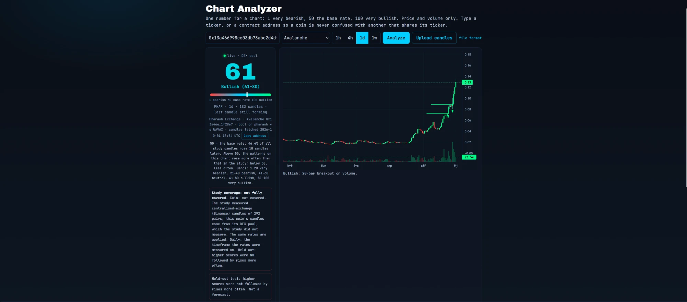
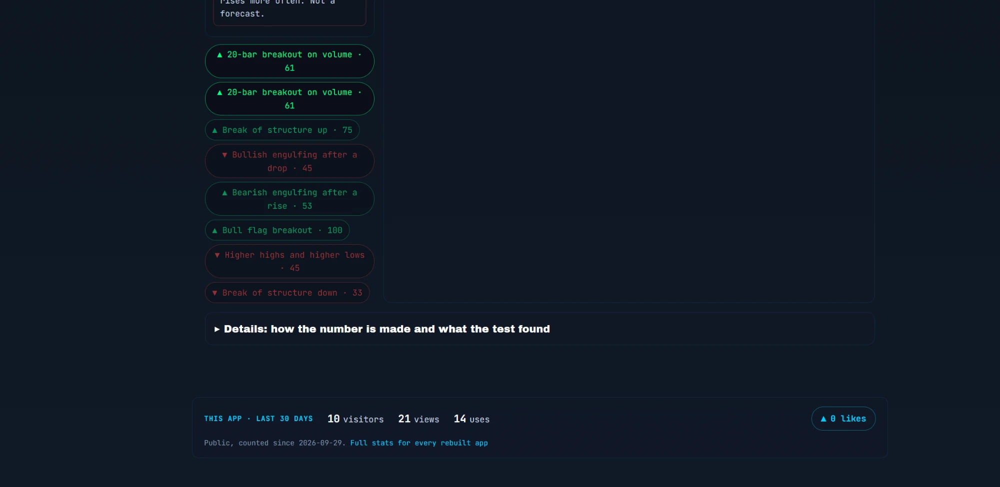
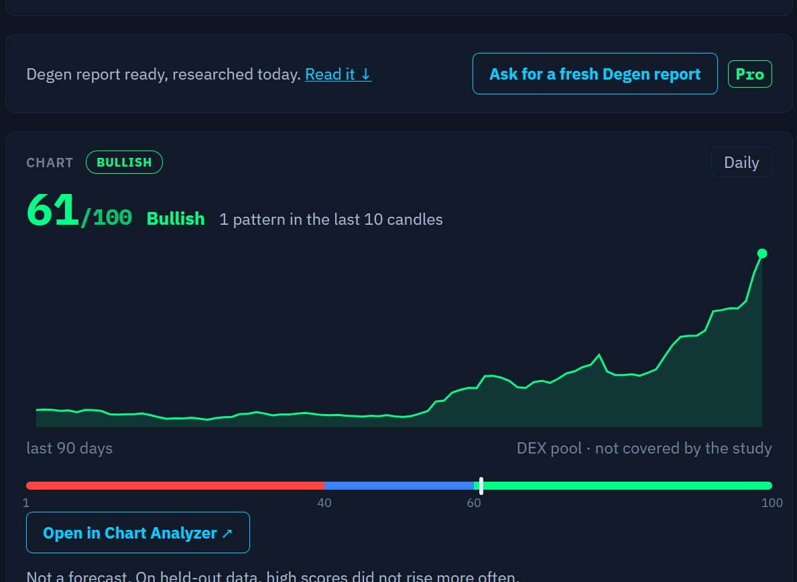

# Build request: Chart Analyzer, a new top design (cymetica.com/chart-analyzer)

**For:** the lead agent of the Cymetica SDLC pipeline
**From:** Adam (product owner, Gem Screener)
**Scope:** the look and the layout of `/chart-analyzer`: the result view (where "Open in Chart Analyzer" from the Gem Screener lands) and the states around it. The analysis, the API and the numbers do not change. Build or change only what is named.

> **HOW TO READ THIS SPEC**
> 1. **The mock is the template, the spirit is the requirement.** `reference/chart-analyzer-result-mock.svg` shows the result view and `reference/chart-analyzer-states-mock.svg` the start screen, the loading, the "collecting" and "too little history" states and the phone. Do everything the page has in this spirit; where the mocks do not show a state, work it out the same way. Shape, proportions and wording are yours to improve.
> 2. **Goals, not methods.** How you build it is your call.
> 3. **Every number is read from the live site on 2026-10-01** (Collector Crypt, daily). They are there so you can check that a change took effect.
> 4. **English only**, degen-friendly: the number first, plain short words, no statistics jargon on the main view.
> 5. **The site's colour rule is binding.** The palette is the site's: cyan accent, green for positive, red for negative, blue. Purple, fuchsia, indigo, violet, magenta, amber, orange, yellow and plain gray are not allowed. Neutrals are the slate-blue the site uses. Every colour in the mocks follows it. Warnings and notes are blue or cyan (or red when something is negative), never orange.

## The goal

A degen who clicks **Open in Chart Analyzer** is delighted: on **one screen, without scrolling and without reading**, they see the score, the chart, and what the score is made of. They say "wow", and they love Cymetica a little more.

## 1. What the page is today

Live on 2026-10-01, at 1440 x 900, for Collector Crypt on the daily timeframe:

- The site header and the block "Give this to your AI agent to get started" stand above the tool: the heading "Chart Analyzer" begins at 314 px down and the score at 522 px. The tool itself is a column 1,028 px wide in a 1,440 px window, set in small monospaced text.
- The score is one number in a narrow card of small paragraphs ("50 = the base rate: 46.4% of all study candles rose 10 candles later. Above 50 ..."), with the study coverage and the held-out test as two more boxes of text under it.
- The chart carries volume, red zigzag drawings and a text under it; the patterns are 8 pills under the chart, among them **the same pill twice** ("Bullish engulfing after a drop · 45"): the pattern really was confirmed twice (4 and 6 candles ago) but nothing says so.
- **The arrows and colours contradict the names**: "▲ Bearish engulfing after a rise · 53" is green. The API holds both a `direction` (what was measured: it rose more often than average) and a `textbook_direction` (what the textbook says); the page shows the first with the second's name and explains nothing.
- The month names on the chart axis follow the browser's language (Czech on the owner's screen: kvě, čvn, zář, říj) on an English-only page.
- "Details" opens a table with statistics jargon ("rank correlation", "95% range").

## 2. The new design

**[1] Everything on one screen.** At 1440 x 900 the score, the chart and the pattern cards are all visible without scrolling. The block "Give this to your AI agent" shrinks to one small line or chip in the header, so the tool starts near the top of the page (today at 314 px). The content uses the width of the window, not a 1,028 px column.

**[2] The coin header.** The coin's logo in a ring (from the Gem Screener when the coin is known there, a neutral placeholder otherwise), its name, `TICKER · CHAIN`, and a link back to the coin in the Gem Screener ("From Gem Screener ›"). On the right: the timeframe as four separate rounded segments (1H 4H 1D 1W; the style of the Gem Screener sliders), a **Share** button (copies the link of this analysis; the address bar carries it), and **+ New**, which opens the start screen.

**[3] The score is the hero.** A big number on an arc of five separate rounded segments (very bearish, bearish, neutral, bullish, very bullish: two reds, blue, two greens), the active segment bright with a soft glow, the others dim, a white tick at the score. Under it the band name in a pill and **one plain sentence** with the number behind it (the mock: "A little above an average chart.", because the patterns on this chart rose 47.1% of the time against 46.4% for the average candle). The sentence is a proposal: it must never sound like advice, and the words "not a forecast" are **not** used as a label on the score (the owner does not want them there). The arc draws itself once when the result arrives and the score counts up.

**[4] The chart is clean.** The last 90 candles by default (a control for more), thick candles, three faint grid lines, the price axis at the right with the current price in a cyan tag, the last candle marked as forming (a pulse and a small "forming" tag; the sentence "the last candle is still open, so the number can change" is in the tooltip of the score). Volume is off by default (a switch). The last 10 candles, the ones the score is read from, sit in a lightly shaded window. The patterns that count are small numbered markers on the candles where they were confirmed; their drawn lines show only while a marker or its card is hovered.

**[5] What the number is made of.** Today's pills, shown as cards: one card per pattern that counts toward the score. The same pattern confirmed twice is **one card with two numbers**. A card shows its number(s), the pattern's name as the textbook has it, and in big figures how often it rose in the study (green when above the average candle, red when below), on a small bar with a tick at the average (46.4%). A hover or a tap on a marker lights its card and the other way round (as on the Gem Screener year chart). The tooltip of a card holds the rest: what the textbook says against what was measured (so "Bearish engulfing" in green is explained), the number of cases, the pattern's own score, how many candles ago. Patterns older than the last 10 candles are not on this view; they are in [6].

**[6] "How the number is made" holds everything else.** One click or a panel under the page: the scale and what 50 means; the held-out test and its plain-language result (the daily and the other timeframes); which candles the study measured and which ones this chart uses (the DEX pool against Binance); the earlier patterns; pool, DEX, quote and liquidity; the number of candles and when they were fetched; copy address; volume. Nothing the old page said is lost, it is moved (see the table below).

**[7] The start screen and the search.** "Analyze a chart": a large field for a ticker or contract address, the chain (auto), **Analyze**, **Upload** (the candles upload and its file format), and under it the coins from the Gem Screener as chips to try (the mock). The same functions as today.

**[8] Every state is designed**, as in the states mock: **loading** (the arc draws itself, the chart is a shimmer, never an empty box), **collecting** (today the API answers 503 COLLECTING for a coin whose candles are not cached: a calm card, an automatic retry and the time of the next one), **too little history** (today 404 TOO_LITTLE_HISTORY: "27 of 60 weekly candles", a bar, "No score is guessed", a button to open 1D), a coin that is not found, and any other error. Raw JSON and bare error text are never shown; every state has a way out.

**[9] Phone, 390 px.** The same order in one column: coin header, timeframes, score, chart (60 candles, full width), the pattern cards in a row that scrolls sideways. Nothing wider than the screen.

**[10] The entry from the Gem Screener.** "Open in Chart Analyzer" lands on this view already analysed (contract, chain and timeframe from the link, as today), with the back link to the coin and the same logo.

**[11] Motion** is part of the wow and stops for a visitor who asks for less motion: the arc draws itself, the score counts up, the forming candle pulses, markers and cards light up together.

**[12] The faults above do not come back**: no identical duplicate pills, no colour or arrow that contradicts a name, the axis months in English, no jargon on the main view.

## Where everything on the old page goes

| On the page today | In the new design |
|---|---|
| The score, its band, the scale 1 to 100 | The arc, the band pill; the scale text in [6] |
| "50 = the base rate ..." | Tooltip of the score; the text in [6] |
| The sentence "last candle still forming" | The forming tag on the chart and the tooltip of the score |
| Study coverage box, held-out test box | [6] "How the number is made" |
| Details: the held-out tables (daily, 4-hour, 1-hour, weekly), "What 50 means" | [6] |
| The footer line "a measured pattern statistic, not advice and not a forecast. It places no orders." (from the API) | stays in the footer as it is today |
| The chart with candles | [4], 90 candles by default |
| Volume under the chart | A switch, off by default |
| The red pattern drawings | On hover of a marker or a card |
| The pattern pills, counted | [5] cards, duplicates merged |
| The older patterns, not counted | [6] |
| Coin, chain, pool, DEX, quote, liquidity, copy address | The coin header (name, ticker, chain) and [6] (the rest) |
| Candle count, when the candles were fetched | [6] |
| Ticker or contract field, chain list, Analyze, Upload candles, file format | [7] the start screen, and "+ New" |
| The timeframe buttons | [2] the segmented control |
| "This app, last 30 days": visitors, views, uses, likes | The footer, in one small line |
| "Give this to your AI agent" | One small line or chip in the header |

---

## Checklist (one line each; done when all are true)

- [ ] 1 At 1440 x 900 the score, the chart and the pattern cards are visible without scrolling; the page starts near the top; the "Give this to your AI agent" block is one small line.
- [ ] 2 The coin header shows the logo, the name, `TICKER · CHAIN`, a link back to the Gem Screener, the timeframe as four separate rounded segments, a Share button and "+ New".
- [ ] 3 The score is a big number on an arc of five separate rounded segments with the active one bright, a band pill and one plain sentence; the arc draws itself and the score counts up; the words "not a forecast" are not a label on the score.
- [ ] 4 The chart shows 90 candles by default, thick candles, three faint grid lines, the current price tag, the forming last candle tagged, the last 10 candles in a shaded window, numbered pattern markers; volume is a switch, off by default; the pattern lines show on hover only.
- [ ] 5 One card per counted pattern, the same pattern twice is one card with two numbers; big rate coloured green above and red below the average, a bar with the average tick; hover or tap lights the marker and the card both ways; the tooltip tells textbook against measured.
- [ ] 6 "How the number is made" holds the held-out test, the coverage, the earlier patterns, the pool details, volume and copy address; every row of the table above has its place.
- [ ] 7 The start screen has the search, the chain, Analyze, Upload and chips for Gem Screener coins; "+ New" opens it.
- [ ] 8 Loading, collecting (with an automatic retry and the time of the next try), too little history (with the count and a way to 1D), not found and errors each have a designed state; no raw JSON or bare error text is ever shown.
- [ ] 9 At 390 px the page is one column in the order of the mock and nothing is wider than the screen.
- [ ] 10 "Open in Chart Analyzer" from the Gem Screener lands on the new view already analysed, with the back link.
- [ ] 11 All motion stops for a visitor who asks for less motion.
- [ ] 12 No identical duplicate pills; no arrow or colour contradicts a name; the axis months are English; no statistics jargon on the main view.
- [ ] All colours are from the site's palette (cyan, green, red, blue, slate neutrals); none of the forbidden ones appears.
