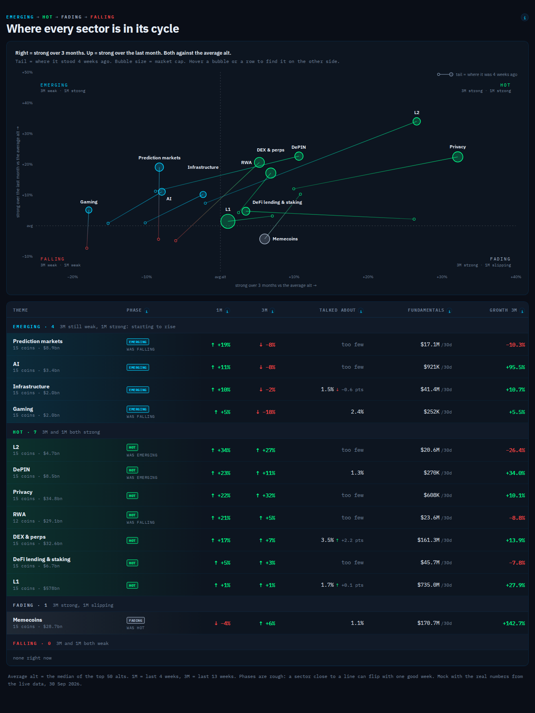
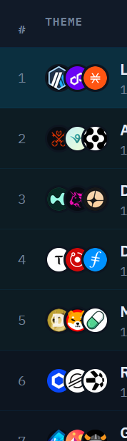
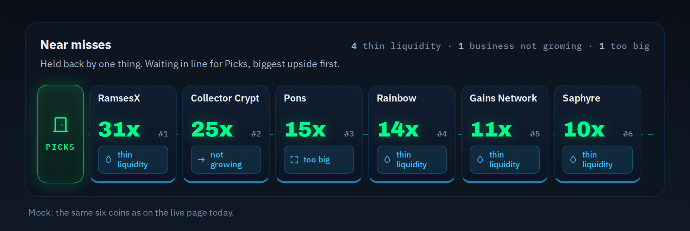
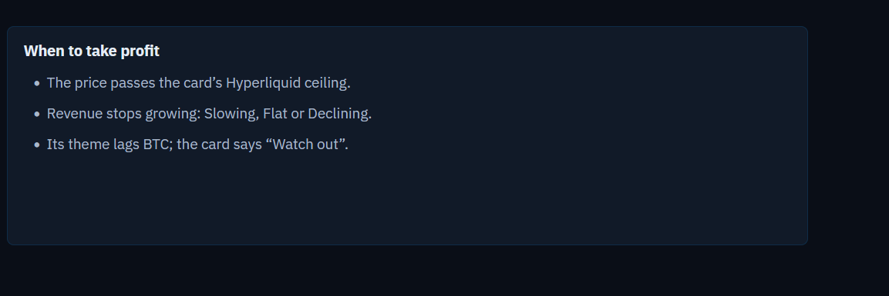

# Build request: Gem Screener, changes after ET-28378 (cymetica.com/gem-screener)

**For:** the lead agent of the Cymetica SDLC pipeline
**From:** Adam (product owner, Gem Screener)
**Scope:** the open changes to the Gem Screener app after ET-28378. Everything here is about what a degen sees and can rely on. Build or change only what is named; leave the rest of the app as it is.

> **HOW TO READ THIS SPEC**
> 1. **Goals, not methods.** How you build it is your call: data, formulas, thresholds, components. Where an item gives a rule or a number, it is a good default, and you may improve it; say what you changed and why in your spec.
> 2. **Every number is read from the live site on 2026-09-30** (snapshot of 18:50 UTC, 215 apps, 26 chains, 12 sectors). They are there so you can check that a change took effect; they are not the requirement.
> 3. **English only**, degen-friendly: the number first, plain short words, no statistics jargon on the page, every explanation in a tooltip or behind an expand.
> 4. **Keep the look.** The owner likes the current design: the circles, the tooltip card (C.5), the check rows by area, the Degen meter, the tables and the layout. Change only what an item names. Where an item is about the circles and their tooltips (43, 44, 45), the look stays exactly as it is: what changes is which checks there are, what their texts say, and the caution colour.
> 5. **Item numbers are stable** (the list was worked on before it was written down here); 26 and 27 were merged into 37, 39 into 43, and 32, 38 and 47 were dropped, so those numbers do not appear.

## What is already done from ET-28378 part 4 (do not redo)

The Degen meter colours and width (A.1), the check circles with the C.5 card (A.3), the Supply card agreeing with the page for Pharaoh and Curve (A.4), the trajectory stepper colour (A.5), "The bet" section name (A.7), and the new checks: hidden supply, whales, insider flow and team now run (after the 18:50 refresh: hidden supply on 113, insider flow on 97 and team on 72 of 215 apps). What remains of that part is in items 42 and 43 (the Legend, and how many checks are still not scanned).

---

## 1. Apps tab and Top Picks

**[10] Apps table fits a 1360 px window without sideways scrolling** (live: 1593 px in a 1294 px box, still scrolling at 1920). Idea from the product owner: the long blue "32x if all tokens were out" text under Upside becomes a small symbol with a tooltip. Fewer columns is the other half: the Growth 6M column goes (the 12-month revenue chart shows the growth and the Trajectory column, Ignition and so on, already says it).

**[17] The Trajectory cell in the Apps table uses the same colour as the detail** (today: a green glow in the table, and light blue in the detail).

**[23] The price-tag lines** on Apps ("Hyperliquid is priced at 33x its yearly revenue...") and on Chains become a bigger, dense stamp with the explanation in a tooltip.

**[22] Top Picks fund line: remove "CyMetica-managed"** (it stands twice on one line).

**[24] Top Picks, the chart "Revenue over 12 months, start = 100. Top 10 by upside":** on a wide screen (about 2000 px) the lines stop halfway and leave a large empty space before the legend on the right. The chart uses the full width, or the legend sits next to it.

**[30] The 50x cap hides the order.** 11 apps sit at the 50x cap and really stand at 72x to 2,291x, so their order is lost. Keep it. (The "if all tokens were out" line under Upside is already there and stays.)

**[31] A warning icon on the Top Picks card.** A pick can be recommended and still carry a warning that shows only after you open its detail: NEST has the flag "business weakening" and earns $213K a month less than it pays out in new tokens; UP earns $762K a month less than it pays out and has 81 days of history. Put a small warning icon on the card, with the reason in a tooltip.

**[33] Old prices: fix the cause, shorten the banner.** The supply behind most market caps is 45 hours old and 189 of 241 prices came from DefiLlama because CoinGecko did not answer (PHAR: $4.1M on the page, $3.3M at CoinGecko). Read supply fresh. The banner that says this ("2 of 241 prices did not refresh this time, so those coins show their last known price, from 45 h ago. 189 of 241 prices came from DeFiLlama because CoinGecko did not answer; market cap uses the last known token supply, from 45 h ago.") is too long: one short line, the detail in a tooltip. No age on every row.

## 2. Chains tab

**[11] Readable columns.** The number columns are 80 to 95 px and their headers break over two or three lines, while Trajectory takes 369 px at 1360. The Growth 6M column goes here too, for the same reason as on Apps.

**[12] Drop the share from the Layer, Share, Theme cell** (Apps keep theirs).

**[13] Chains are priced on adoption, Apps on revenue.** Design the best algorithm you can to show a chain's TRUE adoption (method and data are yours): say how it resists wash trading and incentives, and how chains with very low fees are treated. Yearly activity fees say what users paid, not how many use the chain. The price-tag line and the Upside of chains follow that measure.

## 3. Coin detail

**[14] Supply card: degen-friendly.** Fewer words, no "not available" paragraphs, the number first. And in colour: today the card is all grey. Colour the float and not-out parts, the weekly mint and the revenue cover.

**[15] Degen report.** The one way to get a report is "Ask for Degen report" on the page, which researches, fills the dashed circles and narrows the level's range. Remove the "Ask NEXUS about this coin" chat prompt from the card; a Nexus answer never fills anything. Today "Ask for Degen report" shows only on coins without a report (YFI, XVS); on coins that already have one (PHAR, NEST, UP, MNDE) the card carries only the Nexus button, so the visitor sees no way to ask. The card also sits about 3,200 px down the detail, at the very bottom.

**[16] Asking for a Degen report needs a Pro plan or higher** (NEXUS build plans). Reading a finished report stays free.

**[18] Chart card: remove the Copy button;** "Open in Chart Analyzer" stays.

**[25] The report status icon in the detail header.** A ready report glows green (today it is a plain grey outline, hard to tell from "not researched" except for dashed against solid). Not researched stays a dashed grey outline; outdated is a solid outline in light blue with a dot, as in the reference. Spec 4 C.1 names only dashed, solid and solid with a dot; the reference draws ready in its accent colour with a soft fill. Clicking the icon scrolls to the report card (it does today, for every state); when nothing is researched the card it lands on carries the "Ask for Degen report" button, and the tooltip says so, not "Opens the report below."

**[40] Trajectory phase.** On a coin detail the pill at the top of the panel is green while the stepper under it is light blue for the same phase (Pharaoh, Ignition). One phase, one colour, in the table, the pill and the stepper.

**[43] The checks, cut to what a degen needs.** Today 18 checks feed six areas (Control 2.5, Supply 2, Earnings 2, Liquidity 1.5, Heat 1, History 1 of 10) and the level is ten times their weighted mean, so the circles are the level. On 96 coins read on 2026-09-30 an average of 5.9 of the 18 are "Not scanned" and count as half a risk, and several circles light up on nearly every coin and so say nothing: "Admin can mint" on 44 of 74 scanned, "Timelock" green on 1 coin, "Audit" green on 1 of 96, "Market cap" under $20M on 72 of 96 (the screener is for small caps). Cut to the questions a degen asks: can the owner rug it (owner type, timelock and mint power as ONE check; "can mint" alone is not a warning); what new tokens are coming (emissions, unlocks in 90 days and the share of tokens out together); does it earn after paying emissions; is it growing; do holders get a share; can I get out (slippage on $10K; market cap as a plain number, not a verdict); already pumped (30-day price run, and price against revenue); is it legit (audit, hacks; the audit line says what the audit covers, the token contract, the vault or a fork of someone else's code, and what "None listed" means for this coin). Whales, insider flow, hidden supply and team stay, but as one dashed group "Not checked yet" with the "Ask for Degen report" button, until they run for most coins. Weigh the areas by what a degen can lose on: Control weighs most (2.5) while two of its three checks are not scanned on about half the coins. **The level is recomputed from the new set of checks:** say how (the weights, how a check that was not scanned counts: as today it widens the range and never counts as good) and show before and after for the 215 apps, how many change by two steps or more and why. The level stays display only, as today.

**[44] The line at the end of each check row** says the key number in plain words, in the colour of its worst check, and the reason for the colour is in the tooltip. Today Supply reads "Unlocks 0.0% unlocks in 90 days, 6.8% of tokens out" in red: nothing unlocks in 90 days, but only 6.8 % of tokens are out (FDV is 14.7× market cap), so the red is the 93 % still to come, which the line never says. Say "7% of tokens out (FDV 15× market cap), 0% unlock in 90 days". Earnings reads "Trend Ignition, 3.6× spike" for a business that earns $2.5M a month and nets +$1.2M after $1.3M of new tokens, and its circle shows "2.0×" for a real value of 1.96, just under where green starts. Say "Earns $2.5M a month, $1.3M goes out as new tokens: +$1.2M", and for the trend "Revenue 3.6× its usual month, one month so far". No jargon (Ignition, spike) on the line.

## 4. Altseason panel

**[19] The Expand button is easier to see: make it green.**

**[20] The slider.** "Calm" and "Week of Sep 28" are not understood; say the same thing so anybody gets it. Draw the slider as the three-segment scale with a marker used in the coin's Chart card (bands: below 35, below 70, 70 and up).

**[34] The latest reading beside the mean.** "49 % of the top 50 alts beat BTC" is the mean of the last four weeks; the latest week is 68 %, three months ago 22 %. Show the latest reading beside the mean.

**[35] The altseason number counts three non-alts.** The figure is the share of the top 50 alts that beat BTC. Three of the 50 are dollar-like assets (a home-equity-loan token, USYC, a euro fund) that move under 3 % a month, so they never beat BTC in a rally and always beat it in a fall: up to 6 points of error either way. Leave assets priced at a currency unit out.

**[48] Retail: more of what degens actually do.** The Retail tile is the mean of only three scored rows (Coinbase, Upbit, memecoins on-chain) and gets a fourth, the App Store row, at the weekly close of 5 Oct. It misses where degens trade now and what they follow: offshore exchanges and perp DEXs such as Hyperliquid, crypto apps outside the hand-picked list, and social attention. Add what you can license and store, as a scored row where the history reaches back to the 2021 altseason (or a year of warm-up) and as an unscored fact otherwise: market-wide spot and perp volume by venue including offshore and DEX; ranks or downloads of every finance or crypto app, with new ones found automatically; a social-attention feed whose licence allows storing history; and YouTube views of crypto channels, which the product owner wants (the altseason-panel reference left YouTube out because its API terms forbid storing and aggregating its statistics, so get it in a way that is allowed, for instance from a licensed data provider; your call how). The "AI questions on crypto" row shows the Anthropic Economic Index as a fact, or keeps saying why it cannot. This is the open brief of the altseason-panel spec, section 4.4.

**[49] The Retail calculation, tuned to the top.** Today each scored row is 100 × ln(20 × today / its own 4-year high) / ln(20): 100 at its high, 0 at a twentieth of it. The tile is the plain mean of the rows present (Coinbase 63, Upbit 29, memecoins 72, mean 55), and "hot" starts at 41 % of a row's peak and "calm" ends at 14 %. What is weak: (1) USD turnover and USD fees rise with the price, so a price rally reads as a retail rush; (2) all three reference highs come from one episode, December 2024 to February 2025 (Coinbase and Upbit the week of 9 Dec 2024, memecoins 3 Feb 2025), so the tile says how far we are below that frenzy, not below the retail peaks of other cycles; (3) a row that is added or dropped moves the mean without the market moving: three rows today, four from 5 Oct; (4) memecoins on-chain is the fees of a few apps (the three the page names, GMGN, pump.fun and fomo Wallet, make $106M of the $178M); (5) it does not say how sure it is (the rows read 63, 29 and 72). Make it the best retail measure you can (method and data are yours) and show the evidence: (a) participation, not dollars: normalise by market cap or use counts (trades, active users, downloads), so a price move does not read as retail; (b) a scale that one episode does not define, for instance a percentile within a longer window; (c) adding or dropping a row does not move the index: backfill the new row, or compute on a fixed set, and say so; (d) a backtest of the tile at the tops of 2017/18, 2021 and 2024/25 and now, with the rules written down before they are run on the history (the altseason-panel spec asks for this in 4.4, principle 4); (e) say how sure it is: how many rows, how old, how far apart.

## 5. Sectors tab

**[36] Where each sector is in its rotation.** In an altseason sectors rotate every few months, and a degen must see the ones starting to rise and the ones fading. Today "Hot now" sits on 10 of 12 because everything beats BTC (10 of 12 beat the median alt too). Compare each sector with the median sector and give it a stage: Emerging (below it over 3 months, above over 1), Hot (above on both), Fading (above over 3, below over 1), Falling (below on both). Show the rule in a tooltip; improve it if you can. On the 2026-09-30 numbers this gives Hot: L2, DEX & perps, DePIN, RWA, Privacy; Emerging: AI; Fading: DeFi lending & staking; Falling: Memecoins, Gaming, Infrastructure, Prediction markets, L1.

**[37] The chart and the table.** The four-quadrant chart shows these stages (3-month strength across, 1-month momentum up), a bubble per sector with a trail to where it stood four weeks ago; its names, quadrants and legend are clear and in colour (today the words in the background and the legend are grey and barely visible, and some labels sit away from their bubble: DEX & perps, DeFi lending & staking, Privacy). The table is sorted by stage, one colour each, with only: stage, 1M, 3M, Talked about, Fundamentals, Growth 3M. The Alt sensitivity column and both vs BTC columns leave the table.

**[21] The wide green text tags** in the Theme column (Hot now, Already leading, Beaten down but turning, Fundamentals rising; L2 carries three side by side) become small icons with a tooltip, as in the coin detail and in Apps. The Legend and the "Hot sectors" cards on Top Picks follow.

## 6. The whole app

**[9] One tooltip style everywhere** (the card of A.3), including tiles, the Revenue tile, table cells and the Legend. No browser-native tooltips left.

**[28] Go through the whole app** and make sure everything is degen friendly: the number first, plain short words, no statistics jargon on the page (beta, alpha, error bars, r-squared), every explanation in a tooltip or behind an expand.

**[29] One look everywhere:** the same tooltip, the same badge and the same symbol style on every tab and in every panel, so the same thing never looks different on another page. Pick one of each and use it throughout.

**[45] Caution is orange, not light blue:** green, orange, red, and blue-grey only for neutral or does not apply. Light blue looks neutral and sits beside "Does not apply" in the Legend. The same colours on the Degen meter (zone 4 to 6), the tags and the Legend. This changes spec 4 A.1, which says light blue for 4 to 6.

**[42] The Legend shows only what the open tab shows.** On Apps it lists Post-crash, Declining, No data and Thin liquidity, which only the Chains tab draws (4, 3, 5 and 1 of 26 chains; none of the 215 Apps rows, whose flags moved into the Degen meter and the checks), and "Tradeable here", which no row carries (the exchange lists 11 pairs, none a listed coin). The two tabs should not mark the same kind of warning in two different ways.

**[46] Loading speed.** A cold visit shows everything after about 10 s (measured from Czechia on 2026-09-30). The app page is 2.1 MB (411 kB gzipped, no brotli), 1.7 MB of it one inline data block, and three API calls (funds, exchange pairs, page-extras) start only after it has loaded; a repeat visit takes about 1 s. On top of that, every few requests the server stalls for 3 to 11 s (a 2 kB status call took 5.3 s once, funds 11.1 s; the same pattern as ET-28064), and a page that makes four dependent requests meets one of those almost every visit. Goal: a cold visit shows the table within about 3 s, a revisit within the 6-hour snapshot downloads nothing new, and no request stalls for seconds. Ideas, yours to judge: a cache or CDN in front (picks, ranked, coins and funds already send `Cache-Control: public, max-age=60`, but nothing in front honours it), the data block as its own versioned, cacheable URL, the three calls started in parallel with it, page-extras loaded only when its tab opens.

## 7. Agent access

**[41] The full list for an agent.** `GET /api/v1/gem-screener/ranked` takes `limit` up to 100 and ignores `offset`, so an agent cannot list all 215 apps without the 2 MB snapshot. Let it page the full list.

## 8. Open elsewhere (repeated here so the build does not miss them; not new asks)

- **A Degen pick's link opens another token.** "Definitive" (EDGE) links to `?coin=EDGE` and the symbol route answers edgeX. Four tickers are shared by two apps each (EDGE, UP, MET, INDEX). The route accepts a slug, so the link should carry it. Report #140.
- **The run-rate multiplier.** The tooltip says "last 30 days × 12"; all 45 rows on that basis carry × 365/30 = 12.1667, 1.4 % higher (the 90-day basis does the same, × 365/90, in the two apps we recomputed). Say one or the other. Report #141.
- **The method behind four figures is not written anywhere** (ticket ET-28597): Strength 3M's revenue factor, the trajectory's normalisation of each quarter, Growth 6M dropping weeks with missing days and numbering the rest as consecutive, and "share of revenue to holders" clipped to 100 % where holders revenue exceeds total (SPK 175 %, DUST 192 %, FWA 111 %).

## 9. Added after the first send: how two things should look (references)

Items 48 to 50 are new. Nothing above this section was changed. The reference files sit next to this spec in `reference/`; open the two `.html` files in a browser (hovering works). Both were built from the live numbers of 2026-09-30.

**[48] Sectors: the look of the chart and the table (item 37). Inspiration, not literal.** `reference/sector-cycle.png`, `reference/sector-cycle.html`.

Take from it:
- the chart and the table in the look of today's Sectors tab: flat, mono labels, outlined bubbles with a light fill, a dashed line through "average", no glows;
- the four stage names in the four corners, each in its colour (Emerging top left, Hot top right, Fading bottom right, Falling bottom left), with the two-part rule under each name;
- a bubble per sector, sized by market cap, with a thin tail to where it stood four weeks ago; the tail runs from the colour of the old stage to the colour of the new one, and the table says "was Falling" (and so on) under a stage that changed;
- every name sits next to its bubble and touches no other name, bubble or tail (the reference places them with a small collision check; the method is yours);
- hovering a bubble lights the same sector in the table, and hovering a row lights its bubble;
- the table grouped by stage in the order Emerging, Hot, Fading, Falling, with a small header and a count per stage.

Do not take literally:
- **The Theme column keeps its coin icons**: the three overlapping coin logos before the name, as in today's table (`reference/theme-icons.png`). The owner likes them a lot; the reference has none.

  
- **The columns.** Only those of item 37: stage, 1M, 3M, Talked about, Fundamentals, Growth 3M, plus the theme itself. The reference's widths, order and number formats are not final: use the live table's formats (the arrows, "too few", the muted units) and widths, and check that nothing scrolls sideways at 1360 px.
- **The stage counts.** The reference compares each sector with the median of the top 50 alts and gets Hot 7, Emerging 4, Fading 1, Falling 0. Item 36 compares with the median sector and gives Hot 5, Emerging 1, Fading 1, Falling 5. Item 36 rules; do not copy the reference's counts.
- **The colours.** The reference uses cyan, green, grey and red. With item 45 (caution is orange) Fading is the natural orange; keep the four clearly different, also for a colour-blind visitor.
- **Fundamentals and Growth 3M** in the reference are the last 30 days and the last 90 days against the 90 before, read from the daily series. The definition is yours (item 37).

**[49] Near misses become a queue (Top Picks).** `reference/near-misses-queue.png`, `reference/near-misses-queue.html`. The owner likes this as drawn: build it like this.

- Today the box is a list ("RamsesX 31x · thin liquidity"). It becomes a lane: on the left a green "Picks" gate, then the coins standing in line in small cubes, closest to the gate first, in the same order as today (biggest upside first).
- A cube (about 124 px wide) holds the name, the upside in big green, its place in line (#1, #2, ...) and, at the bottom, the reason it is held back as a small chip with an icon: a drop for thin liquidity, an arrow for business not growing, a frame for too big. "Business not growing" is shortened to "not growing" on the cube; the tooltip has the full words.
- A dashed rail runs behind the cubes and moves slowly toward the gate; it stands still for visitors who ask for less motion.
- One short line above the lane says why most of them wait, for example "4 thin liquidity · 1 business not growing · 1 too big".
- The lane scrolls sideways when the queue is longer than the box; the right edge fades while there is more.
- Hover and keyboard focus show the tooltip card of item 9: name, upside, what holds it back, place in line. A click opens the coin detail, as the names do today.
- Live on 2026-09-30 the queue holds RamsesX 31x (thin liquidity), Collector Crypt 25x (business not growing), Pons 15x (too big), Rainbow 14x, Gains Network 11x and Saphyre 10x (thin liquidity each).
- Two things in the reference change in the build: its reason chips are light blue, use the caution orange of item 45; and its cubes carry no coin logos, add them only if they fit without crowding the cube.

**[50] Top Picks: remove "When to take profit".** The box at the bottom of Top Picks (`reference/when-to-take-profit.png`: the price passes the card's Hyperliquid ceiling; revenue stops growing; its theme lags BTC and the card says "Watch out") goes. Nothing replaces it, and the near-misses queue (item 49) takes the full width.

---

## Checklist (one line each; done when all are true)

- [ ] 9 No browser-native tooltip is left anywhere; one card style.
- [ ] 10 Apps table: no sideways scroll at 1360 px; no Growth 6M column; the "if all tokens were out" text is a symbol with a tooltip.
- [ ] 11 Chains table: number-column headers on one line; Trajectory no wider than its content; no Growth 6M column.
- [ ] 12 Chains: no share in the Layer, Share, Theme cell.
- [ ] 13 Chains: adoption measure documented (wash trading, incentives, very low fees); the price-tag line and Upside use it.
- [ ] 14 Supply card: coloured, number first, no "not available" paragraphs.
- [ ] 15 "Ask for Degen report" on every coin, near the top; no "Ask NEXUS" prompt on the card.
- [ ] 16 A Pro plan or higher is needed to ask; reading a finished report is free.
- [ ] 17 Trajectory: same colour in the table and the detail.
- [ ] 18 No Copy button; "Open in Chart Analyzer" stays.
- [ ] 19 Altseason Expand button is green.
- [ ] 20 Altseason slider: plain words; three-segment scale with a marker (35 and 70).
- [ ] 21 Sector tags are small icons with a tooltip (Theme column, Legend, Top Picks cards).
- [ ] 22 "CyMetica-managed" appears once, or not at all, on the fund line.
- [ ] 23 Price-tag lines are a bigger, dense stamp with the explanation in a tooltip.
- [ ] 24 Top Picks revenue chart uses the full width on a 2000 px screen.
- [ ] 25 Report status icon: ready glows green; not researched dashed grey; outdated solid light blue with a dot; the tooltip says what a click does.
- [ ] 28 No statistics jargon on the page; explanations behind a tooltip or an expand.
- [ ] 29 One tooltip, one badge, one symbol style on every tab and panel.
- [ ] 30 Capped rows (50x) keep their order.
- [ ] 31 A Top Picks card carries a warning icon (exit flag, earnings below emissions, young history) with the reason in a tooltip.
- [ ] 33 Supply is read fresh; the stale-price banner is one short line with the detail in a tooltip; no age on every row.
- [ ] 34 The altseason panel shows the latest reading beside the four-week mean.
- [ ] 35 The altseason universe has no asset priced at a currency unit.
- [ ] 36 Every sector has one of four stages against the median sector; the rule is in a tooltip.
- [ ] 37 Sectors chart: four quadrants with stage names, a bubble and a four-week trail per sector, readable in colour; the table has only stage, 1M, 3M, Talked about, Fundamentals, Growth 3M, sorted by stage.
- [ ] 40 One phase, one colour: table, pill and stepper.
- [ ] 41 `ranked` pages through all 215 apps.
- [ ] 42 The Legend lists only flags the open tab draws; Apps and Chains mark warnings the same way.
- [ ] 43 The check panel asks about ten questions, not 18; whales, insider flow, hidden supply and team sit in one dashed "Not checked yet" group with the report button; the weights are explained in a tooltip; the audit line says what the audit covers; the level is recomputed with a before and after for the 215 apps.
- [ ] 44 Each check row ends in one plain line with the key number (the Supply and Earnings examples above), in the colour of its worst check, with the reason in the tooltip; no jargon.
- [ ] 45 Caution is orange everywhere (circles, Degen meter zone 4 to 6, tags, Legend); blue-grey is only neutral or does not apply.
- [ ] 46 A cold visit shows the table within about 3 s; a revisit inside the snapshot's 6 hours downloads nothing new; no request stalls for seconds.
- [ ] 43 to 45 The circles, the tooltip card and the row layout look as before: only the set of checks, the texts and the caution colour differ.
- [ ] 48 Sectors: the chart and the table look like today's Sectors tab and the reference (inspiration, not literal); the Theme column keeps its coin icons; only the item 37 columns; no name touches another name, a bubble or a tail.
- [ ] 49 Near misses are a queue of small cubes in front of a green "Picks" gate, as in the reference; the reason is a chip with an icon in the caution orange of item 45.
- [ ] 50 The "When to take profit" box is gone from Top Picks; the queue takes the full width.
- [ ] 48 Retail has at least one more row for where degens trade now (offshore or perp DEX volume), includes YouTube views of crypto channels (as a scored row or a fact), and says which other social and AI rows it has and why the others are missing.
- [ ] 49 The Retail score is not driven by price (participation or normalised), not defined by one episode, does not move when a row is added, has a written-down backtest at the tops of 2017/18, 2021 and 2024/25, and says how sure it is.
