# Build request: Gem Screener, changes after ET-28606 (cymetica.com/gem-screener/app)

**For:** the lead agent of the Cymetica SDLC pipeline
**From:** Adam (product owner, Gem Screener)
**Scope:** the open changes to the Gem Screener app after ET-28606. Build or change only what is named; leave the rest of the app as it is.

> **HOW TO READ THIS SPEC**
> 1. **Goals, not methods.** How you build it is your call. Where an item gives a rule or a number, it is a good default, and you may improve it; say what you changed and why in your spec.
> 2. **Every number is read from the live site on 2026-10-01.** They are there so you can check that a change took effect; they are not the requirement.
> 3. **English only**, degen-friendly: the number first, plain short words.
> 4. **Keep the look.** Change only what an item names.
> 5. **What "the owner sees" says is what the owner observed** on the live page (items 15, 16 and 17 especially): check it first, then fix it.
> 6. **The files are in this folder.** `assets/` holds what is ready to use; `reference/` holds pictures of what is live today and mocks of what is wanted (inspiration, not literal).

## What is ready to use (`assets/`)

| File | For item | What it is |
|---|---|---|
| `assets/logo/svg/gem-screener-logo-A-horizontal.svg`, `assets/logo/png/gem-screener-logo-A-horizontal-on-dark.png` | 1 | The header logo (gem in scanner corners, the name, "Revenue-driven AI Research", "by CyMetica"). The other sizes and the colours are in `assets/logo/` (`README.md` has the spelling). |
| `assets/logo/svg/gem-screener-icon-A-small.svg`, `assets/logo/png/gem-screener-icon-A-small.png` | 2 | The gem alone, for the favicon. |
| `assets/near-misses-gate.svg` | 5 | The gate that replaces the "Picks" box, with its pulse and running chevron. |
| `assets/price-tag-badge-apps.svg`, `assets/price-tag-badge-chains.svg` | 13 | The two benchmark badges (Hyperliquid 35x revenue, Solana 38x adoption). |

---

## 1. Header

**[1] The logo replaces the title, and links to cymetica.com.** The header of `/gem-screener/app` shows the words "Gem Screener" with "Revenue-driven research" under them (live: an `h1` and a `span`, the header 130 px high, no link anywhere in it). Replace both with the finished horizontal logo: the gem in scanner corners, "Gem Screener", "Revenue-driven AI Research" and "by CyMetica". A click or a tap on it opens https://cymetica.com. The logo carries the tagline, so the old line goes; the wording to show is the logo's "Revenue-driven AI Research".

The logo is ready, as SVG (sharp at any size) and PNG, in this folder under `assets/logo/` (the same files as in the owner's repository: https://github.com/zakutana/gem-screener/tree/91196c2f01a4fa9df438a9de5ad6133eaeba53ab/docs/logo-gem-screener ). `assets/logo/svg/gem-screener-logo-A-horizontal.svg` is the one for the page header (the PNG made for a dark ground is `assets/logo/png/gem-screener-logo-A-horizontal-on-dark.png`); `assets/logo/README.md` gives the colours and the spelling. The page is dark (`#0a0e17`), so use the version made for a dark ground. Do not redraw it, recolour it, or set its words in a font.

What stays: the right side of the header (updated time, apps and chains count, Live) and the tabs. The header must not get taller than it is now, at 1360 px and at 390 px, and the logo must not be cut off or squeezed at either width.

**[2] A favicon.** The page has none (live: no `link rel="icon"` in the head). Use the gem alone from the same folder: `assets/logo/svg/gem-screener-icon-A-small.svg` (made for favicons; the PNG is `assets/logo/png/gem-screener-icon-A-small.png`).

---

## 2. Altseason panel and the sliders

**[3] The altseason panel gets a clear outline.** The panel at the top of Top Picks (live: the five tiles, Expand and the slider sit in a box whose edge is almost the colour of the page, so the tiles and the slider float on the page). Give the panel a visible border, so it reads as one block that is set apart from "Hot sectors" below it. The look otherwise stays.

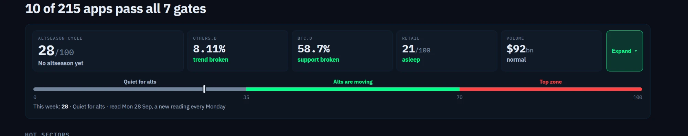

**[4] One slider style: separate segments.** Today the scale in the altseason panel (0, 35, 70, 100) is one continuous bar whose colours run into each other, and so is the scale in the coin's Chart card (1, 40, 60, 100). The owner wants the style of the reference below: each band is its own rounded segment with a small gap between segments, the band the marker is in is bright and the other bands are dimmed, the marker is a white tick. One component, used in both places (and anywhere else a band scale is drawn), so the same thing never looks different on another page.

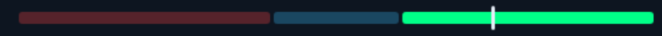

In the Chart card the bands and their colours stay as they are (below 40 red, 40 to 60 blue, 60 and up green).

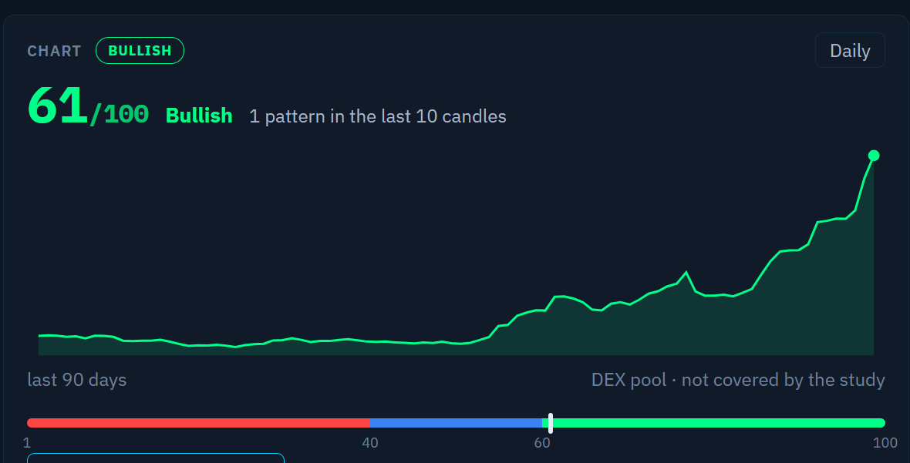

In the altseason panel the first band, "Quiet for alts" (0 to 35), changes from grey to the same blue as the middle band of the Chart card. The other two stay: "Alts are moving" (35 to 70) green, "Top zone" (70 to 100) red. Its labels above the segments and the numbers 0, 35, 70, 100 below stay.

---

## 3. Near misses (Top Picks)

**[5] A logo on every cube, and a gate instead of the "Picks" box.** The "Near misses" lane under the Degen picks (live: six cubes, each with name, place in line, upside and a reason chip, ending in a plain green box that says "Picks"). Two changes:

- **The logo.** Each cube shows the app's round logo (about 28 px) before its name: the same logo the app already shows on the pick's card and in the Apps table, so no new data is needed. The place in line (#1, #2, ...) moves down next to the upside so that the name is not cut off; "Collector Crypt" and "Gains Network" read in full at 1360 px.
- **The gate.** The green "Picks" box becomes an entrance gate: an arch in the page's green with a small gem on its keystone, a softly glowing doorway, a check mark and the word PICKS. It is a little taller than the cubes so that it reads as a gate, and the queue stands on a dashed floor line that runs into it. The doorway pulses slowly and a chevron runs into it; both stand still for a visitor who asks for less motion.

Everything else about the lane stays: the order (biggest upside first), the reason chips, the tooltip card, a click opening the coin, the sideways scroll with the fading right edge.

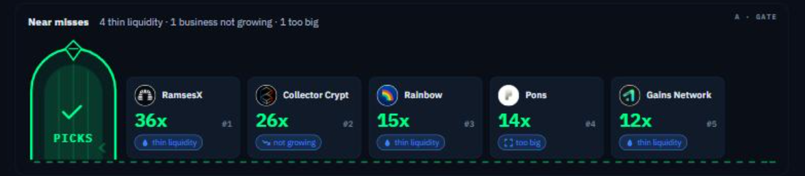

The full mock below also shows a second design (B, a trampoline that throws the first cube up into the picks). **The owner chose A; B is not wanted.** The mock is inspiration, not literal: the arch, the proportions and the motion are yours to improve. The gate as a vector, with its slow pulse and its running chevron (both stop for a visitor who asks for less motion), is `assets/near-misses-gate.svg`.

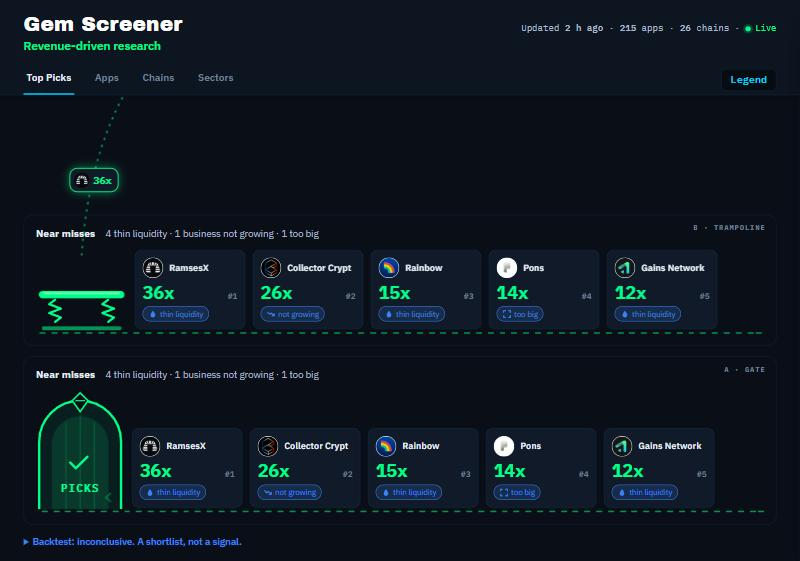

---

## 4. The Degen picks gate "business not growing"

**[6] The size of the revenue counts in the "business not growing" gate.** Today this gate turns away 126 of the 215 apps, more than any other of the seven (not vetted 117, not cheap 110, small business 104, thin liquidity 94, too big 67; live on 2026-10-01). It also turns away businesses that earn a great deal and have simply stopped climbing.

The case that raised it is **Collector Crypt**: upside 26x, vetted, **$12.4M of revenue in the last 30 days** (annual run-rate $138M), and the only gate it fails is this one, so it waits in the near-misses queue ("1 business not growing"). Its numbers: monthly revenue was $2.5M to $5.3M from October 2025 to March 2026, stepped up to $7.2M, $9.4M and $16.1M in April to June, and has held at $10.8M, $11.5M and $12.1M in the last three full months. The last 30 days grew +127% a month (r² 0.85), the last 90 days +1.5% (r² 0.00), six months +7.5%, twelve months +17% a month. Its trajectory phase reads "Flat" and the card says "the business is no longer growing".

The owner's view: a business that earns $12M a month and has held that level for months does not have to keep growing steeply to be worth a degen's look. Growth should weigh on the **small** businesses, where a few hundred thousand dollars of revenue can be a blip, and much less on large ones.

**Goal:** the revenue size and the growth that is asked for are weighed together. The larger the revenue, the less growth the gate demands (a large business is held back only when its revenue is clearly falling); the smaller the revenue, the more growth it must show. Method and thresholds are yours: say what you chose and why. Show before and after for the 215 apps: which apps enter the Degen picks, which leave, and how the near-misses queue changes. For reference, on 2026-10-01 six apps fail only this gate: Collector Crypt ($12.4M a month), GMX ($1.3M), Velodrome ($0.40M), Centrifuge ($0.41M), Tokenlon ($0.36M) and Dolomite ($0.25M).

A pick that has stopped growing still carries the "Watch out: the business is no longer growing" line on its card, as NEST does today: it is flagged, not hidden. The other six gates, and the minimum revenue, stay as they are.

---

## 5. The warning colour

**[7] Every warning is orange, not blue.** This was item 45 of the previous request ("caution is orange, not light blue") and it is still open on the live page: the page's own caution colour (`--warn`) is blue (`#3b82f6`), and only one mention of orange is left in the whole page. The owner wants it done everywhere a warning or a caution is drawn, not in a few places. Two examples the owner pointed at:

- the warning triangle with its count on a Top Picks card ("2 warnings: Earns $1.3M a month less than it pays out in new tokens. Only 82 days of history."),
- the small clock symbol beside the upside ("27x if all tokens were out: Only 6% of the tokens are out today"), and the line of the same name on the card.

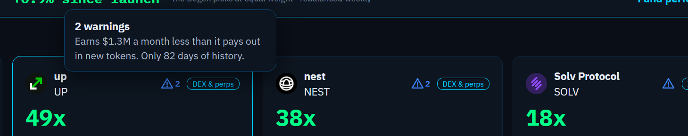

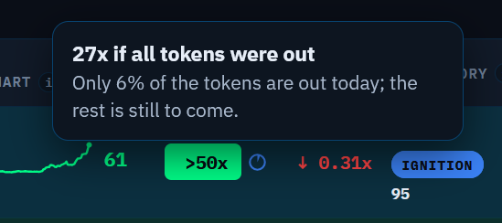

Others that read the same blue on 2026-10-01: the reason chips of the near-misses ("thin liquidity", "not growing", "too big"), the middle band of the Degen meter (its segments and its number, `d-warn`), and the Legend's blue entries. Where the check circles or anything else show a caution state, they follow. Find the rest yourself: the goal is that wherever the app says "watch out", the colour is the same orange.

The colours then mean one thing each: green is good, **orange is caution**, red is bad, and blue-grey is only for neutral or "does not apply". Pick an orange that is clearly different from the page's red (`#ff4444`) and its green (`#00ff88`), also for a colour-blind visitor (a good default: `#ff9f1a`), and use it for the text, the icon, the border and the soft background alike. Where the owner has asked for blue for something that is not a warning (the Chart card's middle band, the altseason panel's first band, item 4), that stays blue.

---

## 6. The Apps table: alignment and width

**[8] The Apps table is tidy: one header line, no empty strip, an aligned Upside column.** Three faults the owner sees on a wide screen:

- **The headers do not sit on one line.** Some column titles stand high and some low (live at 2000 px: the titles of #, Project and Trajectory are at the top or middle of the header row, the others at the bottom; the difference is up to 26 px, and the two-line titles Market cap, Revenue 30D and Strength 3M make it worse). All titles share one baseline.
- **The width is not used.** The table stops growing, and the last column leaves an empty strip (live at 2000 px: the Trajectory cell is 241 px wide and its content 74 px, so about 170 px at the right edge is empty). Let some columns take the spare width, for instance Category / Share / Theme, the 12 months chart, the Chart column and Trajectory, so the table ends at the edge of its box with no empty strip.
- **The Upside column is not aligned.** The green upside tag sits further left in the rows that have the small clock symbol ("tokens still to come") than in the rows that do not (live: 7 px from the cell edge with the symbol, 26 px without; the tags are 75 px and 56 px wide). The tag is in the same place in every row, and so is the symbol, whether a row shows it or not (a row without it keeps the space free).

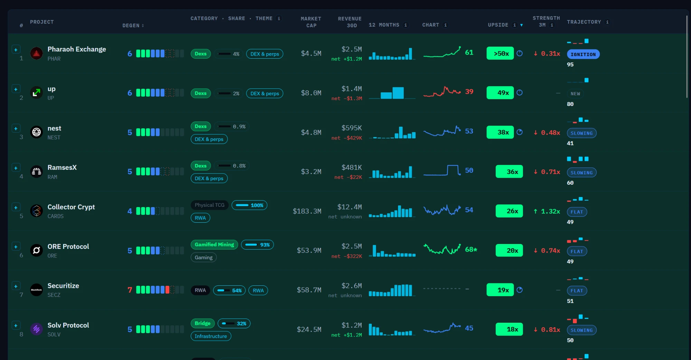

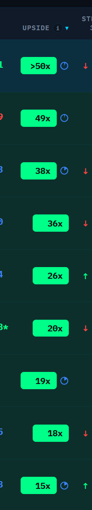

The Chains and Sectors tables are not named, but check them against the same three rules.

---

## 7. The coin detail

**[9] A new order of the sections, with the checks and the report last.** Today the detail of a coin runs (live, Pharaoh Exchange): the header; the Degen level (the meter, with its "Degen report ready, researched today. Read it ↓" line or the "Ask for a fresh Degen report" button); the Chart card; the **Degen report** (verdict, what it is, good, shady, the bet, sources); Monthly revenue; the **check rows** (the circles by area, "Not checked yet", "What changed in the level"); Supply; the figures (Market cap, Revenue 30D, Emissions 30D, FDV, Upside, Strength 3M); Trajectory; 30x test; Weekly history; Upside over time; Growth windows; How it's calculated; For AI agents. The report starts about 1,200 px down and the checks about 2,300 px down, in front of the numbers a degen came for.

The order the owner wants:

1. the header and the Degen meter, as now, with its "Read it ↓" line (it scrolls to the report, wherever the report is) and the "Ask for a fresh Degen report" button, which stay where they are;
2. the Chart card;
3. **Monthly revenue**, straight under the chart;
4. **Supply**;
5. the figures (Market cap, Revenue 30D, Emissions 30D, FDV, Upside, Strength 3M), and the rest of the sections in the order they have now;
6. **Trajectory**;
7. 30x test, How it's calculated, For AI agents, as now;
8. at the very bottom, the **checks** (the circles by area, "Not checked yet", what changed in the meter), and as the last block of all the **Degen report**.

**[10] Three sections are removed.** "Weekly history", "Upside over time" and "Growth windows" (the three collapsed lines in the detail) go from the page altogether, with any mention of them in the Legend or the help texts. The API keeps its data.

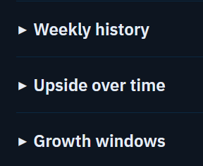

**[11] "Degen level" is called "Degen meter".** In the detail (the label above the meter, "Degen level 6 of 10" in the spoken label, "What changed in the level", "Not available: this coin has no Degen level yet", the text that starts the Nexus question), in the Apps table (the column title today reads only "Degen"; it becomes "Degen meter"), in the Legend and tooltips, in `llms.txt` and the API descriptions: anywhere a reader sees the name. Field names such as `degen_level` stay, so that no agent breaks.

**[12] A Share button in the coin's detail, and a link that opens that coin.** The owner wants to send a coin's detail to someone: a button at the top of the detail, in the row with "CoinGecko ↗" and "DEXTools ↗". A click copies the link of that coin and says "Link copied" for a moment; on a phone that has the system share sheet it opens the share sheet instead. The link is `https://cymetica.com/gem-screener?coin=<slug>`, by slug and never by ticker (two apps can share one). Today the only line that carries this link is "Gem Screener ↗" far down in the sources list of the detail.

Whoever opens the link sees that coin's detail already open on the page. Live on 2026-10-01 this part already works (`/gem-screener?coin=collector-crypt` opens Collector Crypt); keep it working, for every coin on the list, also for one that is not in the default view of the Apps tab.

Two faults found on the way, both part of this item:

- **The address bar does not follow the open coin.** Opened plain (`/gem-screener`), a click on Pharaoh Exchange opens its detail and the address bar still says `/gem-screener`. Opened as `?coin=collector-crypt`, a click on Pharaoh Exchange leaves `collector-crypt` in the address bar: a visitor who copies it sends the wrong coin. The address bar carries the coin that is open and loses it when the detail is closed, so the button and the address bar give the same link.
- **The preview of a shared link is the page's, not the coin's.** The link of a coin is previewed in a chat or on X with the title "Gem Screener | EventTrader" and the page's own description and image, the same as the front page. Give the link of a coin a preview that names the coin and its upside (for instance "Collector Crypt: 26x upside vs revenue") and the Gem Screener's own image.

---

## 8. The two price-tag stamps become badges

**[13] The two blue price-tag panels become two badges; the explanation lives in the tooltip.** The panel above the Apps table reads "35x · HYPERLIQUID'S PRICE TAG · × its yearly revenue · the bar for every Upside", and the one above the Chains table "38x · SOLANA'S PRICE TAG · × its adoption · the bar for every Upside". The owner of the product could not tell what the 35x and the 38x are: "price tag", "× its adoption" and "the bar" are jargon, and the meaning is hidden in a tooltip that is too short.

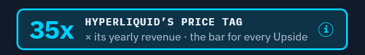

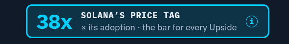

Today they are two plain panels (362 x 46 px, a cyan outline on a pale cyan fill) that read as a long bar. The owner wants **two real badges**: emblems of the same family as the new logo (item 1) and the gate (item 5), the top emblems of the page. Not a wide panel and no sentence on the page: the **picture alone gives the first idea** ("this coin, this many times this thing"), and everything else is in the tooltip.

The owner's picture for the kind of badge is a metal shield, like a police badge: a top edge that dips in the middle with a point at each shoulder, sides that narrow and a point at the bottom, a wide metal rim with a thin line inside it, and a flat face. The shape itself is not binding ("it does not have to be that shape"); the badge look is. The mock below is the shield in the page's colours, about 92 x 110 px on the page:

- the **rim** is metallic, in the logo's cyan-to-green, with the light and dark bands of polished metal;
- the **face** is a green metal with a soft sheen (the page's bright green against its dark ground is what the owner likes);
- across the top, a **ribbon** with the word **BENCHMARK**, so that everybody knows at a glance that this is the yardstick (the owner asked for the word on the badge; it is readable at the real size, about 9 px high);
- under it a round **medallion** with the benchmark's own logo (Hyperliquid for Apps, Solana for Chains; the page already serves both);
- the **number** big in the logo's heavy font ("35x", "38x"), and under it one small word for what it is a multiple of: "revenue" on Apps, "adoption" on Chains.

Nothing else is on the page: no title line, no sentence, no (i). The whole badge opens the tooltip on hover, on focus and on a tap, with the full words in plain language, for instance for Apps: "The benchmark. Hyperliquid is worth 35 times its yearly revenue (market cap ÷ yearly revenue). Every Upside on this page is measured against it: what a coin would gain if it were worth the same multiple of its revenue." and for Chains: "The benchmark. Solana is worth 38 times its adoption: market cap ÷ adoption, which is made of daily users (2.2M a day) and the fees they pay ($3.5bn a year). Every Upside on this page is measured against it." The words "price tag", "× its adoption" and "the bar" are gone. The tooltip is the page's own tooltip card (item 9 of the last request).

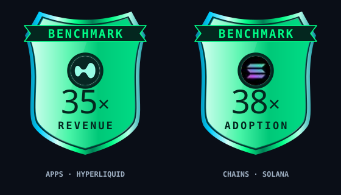

The two badges as vectors, ready to start from: `assets/price-tag-badge-apps.svg` and `assets/price-tag-badge-chains.svg` (the logo inside is read from `https://cymetica.com/api/v1/gem-screener/logo/apps/121` and `.../chains/0`; on the page use the benchmark's own logo URL). The mock is inspiration, not literal: the shape, the metal, the proportions and the wording are yours to improve, as long as it reads at a glance as a proper badge with the word BENCHMARK on it.

**Where it sits.** At the right end of the toolbar, **directly under the Legend button**, in the empty space there; it replaces the old panel, and the row that panel takes at the left of the toolbar goes away. The header and the toolbar are sticky together (live: 130 + 116 = 246 px of the screen stay pinned while the list scrolls), so the badge is sized to fit inside the toolbar's height: about 92 x 110 px, and the toolbar is **no taller than 124 px** (today 116). The badge shows on the Apps and Chains tabs, as the old panel does. At 390 px it shrinks (about 56 px wide, the ribbon word may drop to the tooltip) and stays at the right end of the toolbar without covering a control.

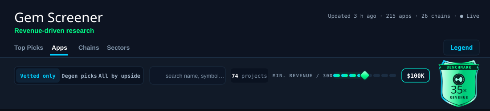

**[14] The "min. revenue / 30d" slider moves left and is restyled.** The slider in the Apps toolbar (live: the browser's own range control, 130 px wide in its default look, the label "min. revenue / 30d" before it and the value, "$100K", after it, pushed to the right end of the toolbar) does two things:

- **It moves a little to the left**, because the right end of the toolbar now belongs to the badge of item 13.
- **It is restyled to look as dense as the badges.** It keeps its nine stops ($0, $10K, $25K, $50K, $100K, $250K, $500K, $1M, $5M; default $100K) and its behaviour. The look, as in the mock above: the track is eight separate rounded segments with small gaps, between the nine stops (the style of item 4); the segments up to the knob are lit in the logo's cyan-to-green, the rest are dim; the knob is a small gem (a diamond, as in the logo) with a soft glow; the value sits in a pill with the logo's outline; the label is in small capitals. The look is yours to improve.

It stays a real slider for the keyboard, a screen reader (it says "$100K") and a touch screen: drag, tap on a segment, arrow keys.

---

## 9. The year chart: hover both ways

**[15] Hovering a line lights its name, as hovering a name lights its line.** The chart "Top 10 by upside: their year" (Apps and Chains tabs) has a legend on its right with the ten names. Today a hover on a name in the legend lights that coin's line and dims the other nine (and a small card says "Upside 15x · index 41"). The owner wants it to work the other way too: **a hover on a line in the chart lights the matching name in the legend** (the same highlight the row gets today when it is hovered), and the line itself stands out and the others dim. Both directions, on both tabs, the same behaviour.

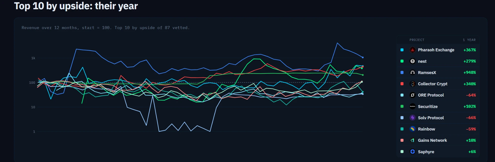

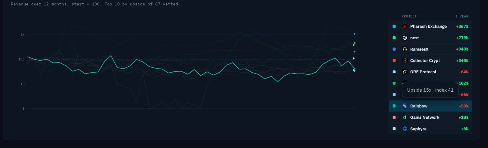

Two details: a thin line is hard to hit with a mouse, so the line reacts in a generous band around it (several pixels either side), and the nearest line wins where lines cross. The small card with "Upside 15x · index 41" covers other rows of the legend in the second picture; it sits where it hides nothing (beside the pointer, or above the row). On a touch screen a tap on a line or a name does what the hover does.

---

## 10. The Chains detail

**[16] The detail of a chain gets the look and the order of the Apps detail.** The detail of a chain (live: Polygon) is the old design: a grey capital heading with a sentence under it for every block, empty cards, tables of dashes. It has not followed the changes made to the Apps detail. The owner wants it brought **up to date with the Apps detail, in look and structure, without adding the things that belong only to apps** (no Degen meter, checks, Supply card or 30x test copied across because Apps have them).

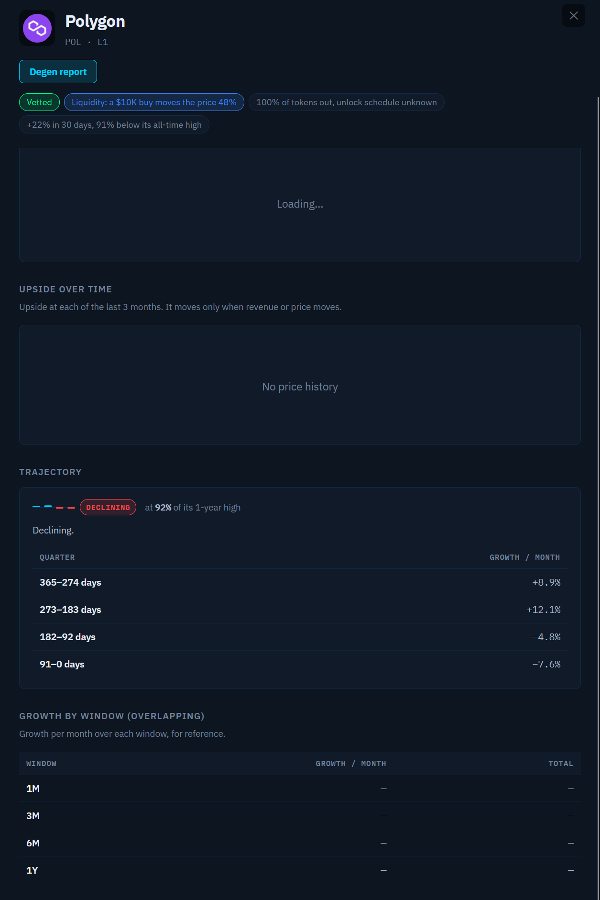

What to do:

- **The same building blocks as the Apps detail**: its cards, the row of key figures (for a chain: Market cap, Adoption, Upside, Strength 3M), its tooltip card, its pills and icons, the Share button and the address-bar link of item 12 (a chain's link works the same way, by its slug), the close button. The pills at the top ("Vetted", "Liquidity: a $10K buy moves the price 48%", "100% of tokens out...", "+22% in 30 days...") are drawn as the Apps detail draws its flags, and the liquidity warning is orange (item 7), not blue.
- **The same order**, as in item 9: the header, the figures, the charts (the chain's own monthly series, in the style of the Apps' Monthly revenue chart, from the data the page already holds for a chain: its monthly activity fees, stablecoins and DEX volume), Trajectory, then the small collapsed lines (How it's calculated, For AI agents) at the bottom.
- **Nothing shown empty.** A block with nothing to show is left out instead of standing there empty: in the picture, a card that says "Loading..." (it never filled), "Upside over time" with "No price history", and a "Growth by window" table whose cells are all dashes. These three are the ones item 10 removes from the Apps detail as well; none of them comes back on a chain.
- **Trajectory as on Apps**: the same card, the same one colour for the stage in the pill and the stepper (item 40 of the last request), and no repeated stage name ("Declining." under the pill); the line says the number in plain words.
- **Plain words, number first**, as on the rest of the page: no capital-letter heading with a sentence under it where a figure or a short label does the job.
- **Check that every control in the chain header** does something for a chain. The picture shows a "Degen report" button; keep it only if a chain has such a report, otherwise take it away.

The result is the Chains detail that looks like the same product as the Apps detail, with only what is true of a chain on it.

---

## 11. Tooltips: one card, every time

**[17] Every tooltip is the same dark card, on hover and on click, everywhere.** This was item 9 of the last request ("one tooltip style everywhere, no browser-native tooltips left") and it is only half done. The owner sees two faults:

- **A hover works in some places and not in others.** Some (i) icons and symbols open their dark card when the pointer rests on them, others open nothing.
- **A click shows the old design.** A click or tap on an (i) opens a **light** popover (white card, dark text, an underlined "How it's calculated" link), which is the old view. It does so everywhere, so the page has two different tooltips for the same thing.

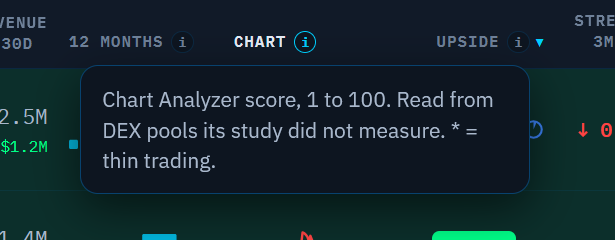

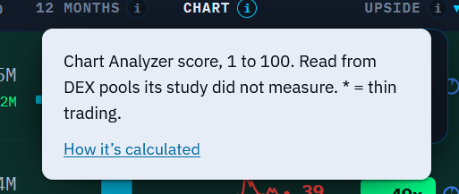

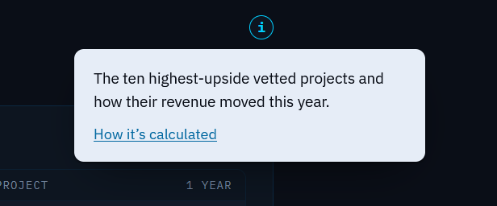

The goal: **one tooltip, the dark card, for hover, keyboard focus and click or tap**, on every tab and in every panel: Top Picks, Apps, Chains, Sectors, the Legend, the detail of a coin and of a chain, the altseason panel, the near-misses queue, the badges. The light popover is removed, and what it carries (the "How it's calculated" link) moves into the dark card, which stays open on a click so the link can be used and closes on a click elsewhere or on Escape.

**Check every one.** Go through every (i), every symbol and every table-header hint on every tab and test the three ways (hover, keyboard focus, click or tap), on a wide screen and at 390 px; list what was checked in your spec. A tooltip that never opens or opens the old view is a fault.

---

## Checklist (one line each; done when all are true)

- [ ] 1 The header shows the logo (not text) with "Revenue-driven AI Research" and "by CyMetica" in it; the old title and the old tagline are gone.
- [ ] 1 A click or a tap on the logo opens https://cymetica.com; it is a real link (keyboard focus works, it has a text alternative such as "Gem Screener by CyMetica").
- [ ] 1 The header is no taller than today's 130 px, and nothing is cut off, at 1360 px and at 390 px.
- [ ] 2 The browser tab shows the gem icon.
- [ ] 3 The altseason panel has a visible border; it reads as one block apart from "Hot sectors".
- [ ] 4 The altseason slider and the Chart card slider are drawn as separate rounded segments with gaps, the marker's band bright and the others dimmed, with a white tick; one shared component.
- [ ] 4 In the altseason panel the "Quiet for alts" band is blue (the Chart card's blue), not grey; the other two bands and all labels are unchanged. The Chart card keeps its three colours.
- [ ] 5 Every near-miss cube shows the app's round logo; the place in line sits next to the upside; no name is cut off at 1360 px.
- [ ] 5 The "Picks" box is a gate (arch, gem on the keystone, glowing doorway, check mark, PICKS); the queue stands on a floor line that runs into it; the motion stops for visitors who ask for less motion; the rest of the lane behaves as before.
- [ ] 6 The gate weighs revenue size and growth together: a business with large revenue that is flat is no longer held back by it (Collector Crypt, $12.4M a month, is judged on the other six gates); a small business still has to show growth.
- [ ] 6 The spec says what rule was chosen and why, with before and after for the 215 apps (who enters the Degen picks, who leaves, the queue).
- [ ] 6 A pick whose business has stopped growing keeps the "Watch out" line on its card.
- [ ] 7 The warning triangle on a Top Picks card and the "if all tokens were out" symbol and line are orange.
- [ ] 7 Near-miss reason chips, the Degen meter's caution zone (segments and number), the check circles in a caution state and the Legend's caution entries are the same orange; no warning anywhere on any tab is blue.
- [ ] 7 Green, orange and red stay clearly apart (also for a colour-blind visitor); blue is left only for neutral or "does not apply" and for the owner's named exceptions.
- [ ] 8 All column titles of the Apps table stand on one baseline (at 1360 and at 2000 px).
- [ ] 8 At 2000 px the table fills its box: no empty strip at the right of the last column.
- [ ] 8 The Upside tag starts at the same x in every row, with or without the clock symbol.
- [ ] 9 In a coin's detail the order is: header and Degen meter, Chart, Monthly revenue, Supply, the figures, Trajectory, 30x test / How it's calculated / For AI agents, then the checks, and last of all the Degen report.
- [ ] 9 "Read it ↓" under the meter still scrolls to the report, and "Ask for a fresh Degen report" is still beside the meter.
- [ ] 10 "Weekly history", "Upside over time" and "Growth windows" are gone from the page, and no help text or Legend line mentions them.
- [ ] 11 No reader-facing text says "Degen level" any more (page, Apps column title, Legend, tooltips, `llms.txt`, API descriptions); it says "Degen meter". Field names are unchanged.
- [ ] 12 The detail of a coin has a Share button at the top beside the CoinGecko and DEXTools links; a click copies `https://cymetica.com/gem-screener?coin=<slug>` and says "Link copied" (on a phone with a share sheet it opens that).
- [ ] 12 Opening that link shows the coin's detail; true for every coin, also one outside the default Apps view.
- [ ] 12 Opening a coin's detail puts its link in the address bar and closing it takes it out; after clicking from one coin to another the address bar names the second.
- [ ] 12 The link of a coin is previewed with the coin's name and upside, not with the front page's title and image.
- [ ] 13 The two price-tag panels are metal-shield badges (about 92 x 110 px): a ribbon with the word BENCHMARK, the benchmark's round logo, the number big ("35x", "38x") and one word under it ("revenue", "adoption"); the same family as the logo and the gate. No title line, no sentence, no wide panel on the page, and the word BENCHMARK is readable at the real size.
- [ ] 13 The whole badge opens a tooltip (hover, focus, tap) that says in plain words what the number is (market cap ÷ yearly revenue, or ÷ adoption with its meaning) and that every Upside is measured against it; "× its adoption" and "the bar" are gone.
- [ ] 13 The badge fits at 390 px and at 1360 px without being cut off.
- [ ] 13 The badge stands at the right end of the toolbar under the Legend button (Apps and Chains tabs), and the toolbar is no taller than 124 px; the old panel is gone.
- [ ] 14 The min. revenue slider sits to the left of the badge and is drawn as eight separate rounded segments lit up to a gem-shaped knob, with the value in an outlined pill; it keeps its nine stops, the default of $100K, and works by drag, tap and arrow keys.
- [ ] 15 On the year chart (Apps and Chains) a hover on a line lights that coin's name in the legend and dims the other lines, as a hover on a name lights its line; a tap does the same on a touch screen.
- [ ] 15 A line can be hit within a few pixels of it; where lines cross, the nearest wins; the small hover card never covers legend rows.
- [ ] 16 A chain's detail uses the Apps detail's cards, key-figure tiles, tooltip card, pills and icons, Share button and close button; the liquidity warning pill is orange.
- [ ] 16 Its order follows item 9 (header, figures, monthly chart, Trajectory, the small collapsed lines last); Trajectory is the Apps card with one colour for the stage and no repeated stage name.
- [ ] 16 No block stands empty on a chain (no "Loading...", no "No price history", no table of dashes); "Weekly history", "Upside over time" and "Growth windows" are not there.
- [ ] 16 Nothing that belongs only to apps was added to the chain detail; every control in its header works for a chain.
- [ ] 17 Every (i), symbol and header hint on every tab and panel opens the same dark card on hover, on keyboard focus and on click or tap; none opens nothing.
- [ ] 17 The light popover is gone everywhere; its "How it's calculated" link is in the dark card, which stays open on a click and closes on a click elsewhere or Escape.
- [ ] 17 The spec lists every tooltip checked, on a wide screen and at 390 px.
