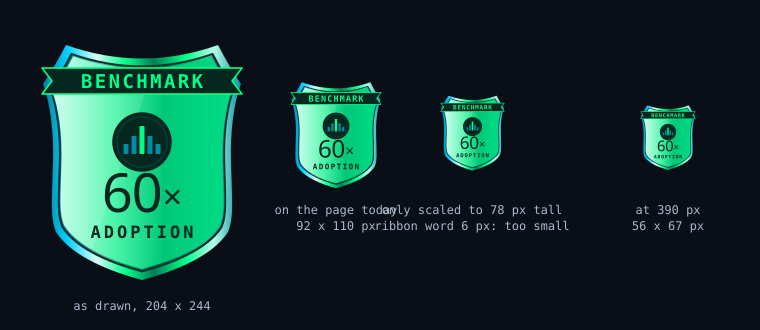
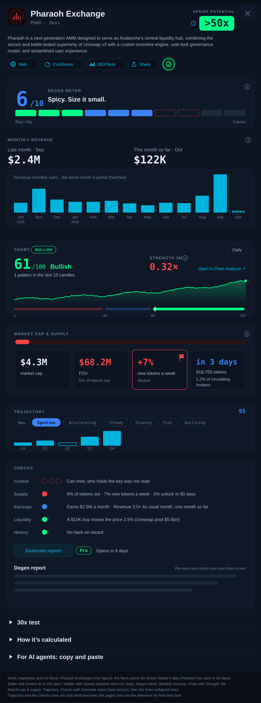

# Build request: Gem Screener, changes after ET-28688 (cymetica.com/gem-screener/app)

**For:** the lead agent of the Cymetica SDLC pipeline
**From:** Adam (product owner, Gem Screener)
**Scope:** the Chains tab (which chains it lists, what a chain's adoption is, the benchmark and its badge, the chart column and card) and a clean-up of what the owner reads: the coin's and the chain's detail, the Top Picks page, the Sectors table and the size of the badges. Build or change only what is named; leave the rest of the app as it is.

> **HOW TO READ THIS SPEC**
> 1. **Goals, not methods.** How you build it is your call. Where an item gives a rule or a number, it is a good default, and you may improve it; say what you changed and why in your spec.
> 2. **Every number is read on 2026-10-01** from the live page (its snapshot, generated 13:42 UTC, and what it draws), from DefiLlama, CoinGecko and the Chart Analyzer. They are there so you can check that a change took effect; they are not the requirement.
> 3. **English only**, degen-friendly: the number first, plain short words.
> 4. **Keep the look.** Change only what an item names.
> 5. **This spec starts from ET-28688 as built.** Two things are not here because they are already in hand: the orange for every warning (item 7 of ET-28688) and the altseason universe without assets priced at a currency unit (item 35 of ET-28606, which you said you are fixing under ET-28688). ET-28688 is still being built: where this spec says "live", it means the page on the evening of 2026-10-01; if ET-28688 changes any of those parts when it ships, what it ships is the starting point.
> 6. **The files are in this folder.** `assets/` holds what is ready to use; `reference/` holds the mocks of what is wanted (the badge, and the whole detail of an app); they are inspiration, not literal.

## What is ready to use (`assets/`)

| File | For item | What it is |
|---|---|---|
| `assets/benchmark-badge-adoption.svg` | 4 | The Chains benchmark badge: the badge of item 13 of ET-28688 with a neutral emblem in the medallion, "60×" and ADOPTION. |

---

## 1. Which chains the tab lists

**[1] The tab lists the L1 and L2 chains people look for, not only the chains DefiLlama shows fees for.** Live: 26 chains, built from DefiLlama's chains with fee data; the snapshot carries a `collection_floor_usd_30d` of $10K over 30 days, and which rule drops a chain cannot be read from the page. Of the 40 largest Layer 1 coins on CoinGecko, 17 have a DefiLlama chain row and are not on the tab: BTC, XRP, ZEC, ADA, BCH, LTC, CC, HBAR, TAO, CRO, ETC, ALGO, STABLE, VET, XDC, FLR, SEI. IOTA (rank 49 of Layer 1, market cap $258M; on DefiLlama its TVL is $2.0M) is not on the tab either.

The owner wants the list to be **every chain whose native token is in CoinGecko's "Layer 1" or "Layer 2" category with a market cap of $200M or more** (a good default; today that is 59 tokens, 47 of them with a DefiLlama chain row), each joined by its CoinGecko id (`gecko_id`) to DefiLlama's chain list, the data behind https://defillama.com/chains, for TVL, daily active addresses, DEX volume and stablecoins. DefiLlama alone does not give the list: its chain list has 468 chains, 316 of them with a CoinGecko id, and no field that says L1 or L2, while CoinGecko's two categories do. **A chain with no DefiLlama row, or with any of the four inputs missing, so that its adoption cannot be calculated, is not shown at all**: no row, no "no data" line (7 of the 40 largest Layer 1 coins have no DefiLlama row today: XMR, M, KAS, PI, NIGHT, BDX, TIA). Whether the 17 chains above and IOTA have all four inputs is for the build to find out; your spec lists the tokens of the list that were left out and the input each one lacks. Fees, or a floor on them, are no longer a condition for being listed. Chains without a token of their own (Base, Robinhood Chain, Ink, Abstract) stay off, as today. The list is rebuilt at every refresh.

---

## 2. What a chain's adoption is

**[2] A chain's adoption is real adoption: not fees, and hard to fake.** Live: adoption is the geometric mean of the chain's yearly fees and its daily users valued at a reference fee, sqrt(fees × users × 1.2016 × 365); recomputed on six chains it equals the page's `adoption.value` to six digits (where the page's own guards discount a chain's fees, as on Tron, the page's value is lower). So fees carry half the weight: at the same users, a chain with fees 10× cheaper gets about 3.2× less adoption, and Ethereum, with about 4× Sui's users (520K against 131K a day), gets about 15× its adoption. A fee in dollars is also gas times the token's price, so it rises with the price it is compared with. The owner said it before (item 13 of ET-28606): "yearly activity fees say what users paid, not how many use the chain". TVL, DEX volume and active users must all count, and no single input may lift a chain cheaply. A good default, which you may improve (say what and why):

- **Four inputs per chain, from DefiLlama.** U = daily active addresses, the lower of the 30-day and the 90-day median (a campaign spike counts only once it lasts). V = DEX volume over 30 days. T = TVL without the chain's own token and without double counting (TVL in its own token rises with the price it is meant to judge; the page does not split it today). S = stablecoins on the chain.
- **Cheap signals count only as far as expensive ones back them.** Addresses and volume are cheap to fake (bots, airdrop farming, wash trading), cheapest on cheap chains; TVL and stablecoins cost real money. U counts at most up to the 80th percentile, across the listed chains, of users per dollar of T or of users per dollar of S, whichever backs more (a payments chain such as Tron or Stellar holds its money in stablecoins, not in DeFi). V counts at most up to the 80th percentile of 30-day turnover, V / T.
- **Adoption = (U × V × T × S)^(1/4)**, with the held-back U and V: a geometric mean, so no input carries a chain on its own.
- **No fees in it.** Fees may stay as a column of their own.
- **No users squared** (Metcalfe's law): it squares fake addresses too, and across today's chains market cap grows with users at a power of about 0.4, not 2.
- **A missing input** means the chain is not shown (item 1): adoption is never made from three inputs, and there is no "no data" row.

**[3] The benchmark is the median of the large chains, and Upside follows it.** Today the benchmark is one chain, the one with the most adoption (Solana, 38×), and every chain's Upside is that chain's multiple divided by its own. With the new adoption the same rule would pick Ethereum (90×); the owner does not want that: Ethereum's price carries its role as money, so as the yardstick it makes 14 of the 22 chains with all four inputs look cheaper, Polygon by 20×, and one chain re-pricing would move every Upside on the tab. The owner wants:

- **Multiple** = market cap ÷ adoption. **Upside** = the benchmark multiple ÷ the chain's multiple (the same form as today). The price-tag line follows the same numbers.
- **Benchmark = the median multiple of the eligible large chains**: a year of data or more, market cap $1B or more, all four inputs fresh, and the held-back part at most half of the chain's users or volume. On the page's 22 chains that have all four inputs today, 14 chains are eligible (Avalanche, Polygon, Ethereum, Stellar, Solana, Sui, TON, Tron, ICP, Hyperliquid L1, Mantle, Arbitrum, BSC, X Layer) and the median is **60×**. Both the number and the list will move when item 1 widens the tab: say in your spec what the new benchmark is and which chains make it.

**[4] The Chains badge shows the median, with a neutral emblem.** Today the Chains badge is the shield of item 13 of ET-28688: ribbon BENCHMARK, Solana's logo in the medallion, "38×", "adoption". The benchmark is no longer one chain, so no chain's logo belongs in it.

The badge as a vector, ready to start from: `assets/benchmark-badge-adoption.svg`. It is the same shield, rim, ribbon and type as the badge of ET-28688, in the page's own colours (none is new). The mock is inspiration, not literal: the shape, the proportions and the wording are yours to improve, as long as it reads at a glance as the same badge with BENCHMARK on it.

- **Only the Chains badge changes.** The Apps badge (Hyperliquid, revenue) stays as built.
- **Shape and place** as in ET-28688: at the right end of the toolbar under the Legend button; the size is that of item 8. The number is the benchmark multiple (**60×** today) and the word under it is **ADOPTION**; both come from the snapshot at each refresh, not typed.
- **The medallion holds a neutral emblem**: five bars with the middle one lit, the median, "the typical one", in the page's cyan and green. At 56 px (390 px) the emblem stays and the ribbon word may drop to the tooltip, as ET-28688 already allows.
- **The tooltip** (hover, focus and tap, the dark card), in plain words: "The benchmark. A typical large chain is worth 60 times its adoption: the median of 14 chains with a market cap of $1B or more and a year of data (Avalanche, Polygon, Ethereum, Stellar, Solana, Sui, TON, Tron, ICP, Hyperliquid L1, Mantle, Arbitrum, BSC, X Layer). Adoption counts daily users, DEX volume, TVL and stablecoins together, so no single number can lift it. Every Upside on this page is measured against it." The names are the chains that qualify at that refresh.
- **The accessible name** is "Benchmark: the median of 14 large chains, 60x adoption", then the tooltip text, as the live badge does with its `aria-label`.

**[5] A tag where the token does not collect the chain's fees.** On some chains gas is paid in another token, so the chain's own token earns none of it. DefiLlama says which: its `gasTokenGeckoId` differs from the chain's `gecko_id`. Today that is Arbitrum, OP Mainnet, Linea and ZKsync Era (gas in ETH), and two of them have among the largest Upsides below. The owner wants a tag on the row and in the detail, in the page's tag style, in plain words: "Gas is paid in ETH: this token does not collect the chain's fees." A tag, not a gate: the chain stays listed and keeps its Upside.

**[6] Wherever adoption shows, it is this measure, and the numbers can be read.** The Adoption column, the chain detail's Adoption tile, the price-tag line and the Upside all use item 2's adoption. Its tooltip names the four inputs in plain words and says whether any was held back to what the chain's money backs. "How it's calculated" and the chain's record in the API carry the four inputs, the held-back values and the adoption, and the API fields are documented where the page's other chain fields are.

### What it gives today (to check the direction, not a target)

On the page's own data, the 22 chains that have all four inputs, with TVL as the page holds it today (the chain's own token still in it); with the token taken out the figures move.

- **Adoption order:** Ethereum, Solana, BSC, Tron, Polygon, Arbitrum, Avalanche, Hyperliquid L1, Sui, Monad, X Layer, Plasma, OP Mainnet, Stellar, Near, TON, Aptos, Mantle, Starknet, Linea, ICP, Filecoin.
- **Upside against 60×:** Polygon 13.6, Monad 13.2, Arbitrum 10.9, OP Mainnet 8.8, Plasma 7.3, Tron 2.5, Aptos 2.5, Linea 2.1, Avalanche 2.0, Starknet 1.9, Solana 1.5, X Layer 1.4, Sui 1.1; below 1: BSC 0.9, Ethereum 0.7, Hyperliquid L1 0.5, TON 0.4, Near 0.3, Stellar 0.3, Mantle 0.3, ICP and Filecoin about 0. Thirteen of 22 are above 1; the page has 5 today, with Polygon at 5.6.
- **What the held-back part changes:** volume on Near (−76 %), Solana (−48 %), Polygon (−32 %) and Hyperliquid L1 (−27 %), users on Filecoin (−6 %) and TON (−4 %); nothing else moves.
- **Faking 10× the users and 10× the DEX volume** lifts adoption ×1.2 on Near and Solana, ×1.5 on TON, ×1.6 on Sui, ×2.2 on Monad and ×2.85 on Tron (its stablecoins back many users). Without the held-back part it is ×3.2 everywhere; with today's measure ×3.2, or ×10 if the fake transactions also pay fees.

---

## 3. The chart on Chains

**[7] Chains get the Chart column and the Chart card, as Apps have them.** Live: the Apps table has a Chart column, a score from 1 to 100 (61 on Pharaoh) from the Chart Analyzer, and the Apps detail has the Chart card (the score and its band, below 40, 40 to 60 and 60 and up; the 90-day chart; the scale; "Open in Chart Analyzer ↗" and some small grey lines). The Chains table has no such column and a chain's detail has no such card: none of the 26 chains carries a chart score in the snapshot. The owner wants both on Chains, **the same component as on Apps, not a second look**:

- **The column** in the Chains table in the same place as on Apps (after the 12-month chart, before Upside), with the same cell, header, tooltip and sorting.
- **The card** in a chain's detail, the same card as in the Apps detail, in the place it has there: directly under the header.
- **The data is the same service**, https://cymetica.com/api/v1/chart-analyzer, on the chain's native token. The Chart Analyzer already holds exchange candles (Binance spot) for 292 symbols, and of 42 chain tokens tried (those of the chains on the tab today and the larger Layer 1 coins of item 1) 33 are among them (SOL, ETH, BNB, SUI, TRX, AVAX, ADA, TAO, HBAR, SEI and IOTA, for example), so a chain's token can be scored by its symbol. The 9 it does not hold (today CRO, FLR, HYPE, MNT, MON, OKB, QUAI, TON and XDC) are scored from the token's DEX pool by contract address as Apps are, or left without a score. How you reach each token is yours.
- **The card is the Apps card, the same component**; nothing is added to it or left out of it for chains (its small lines go, item 15).
- **A chain whose token cannot be scored** shows in the column what an app without a score shows, and its detail leaves the card out instead of showing an empty one (item 16 of ET-28688: nothing shown empty).

---

## 4. Smaller badges, less small print

**[8] The badges are smaller: the toolbar is as tall as its controls need.** Live, at 1360 px: the badge is 92 × 110 px and the toolbar is 122 px tall around controls that are 31 and 32 px high; the header (130) and the toolbar together pin 252 px of a 900 px screen, and set in a row of small controls the badge looks too big. The owner, looking at both tabs: the badge is too tall for the row and does not look good on Apps or on Chains; a bit smaller would be better. A good default: the badge about 78 px tall (today 110), the toolbar no taller than about 96 px (today 122), the pinned area about 226 px (today 252).

Do not only scale the drawing down: the word BENCHMARK is 8.6 px high today and has to stay readable, at least 8 px; scaled to 78 px tall it would be 6 px (the third badge in the mock under item 4). Draw it flatter instead: a lower shield, the ribbon, the number and the word under it kept at today's size, the medallion and the lower point giving up the height. Both badges, Apps and Chains, get the same size. At 390 px the rule of ET-28688 stays (about 56 px wide, the ribbon word may drop to the tooltip).

**[9] Top Picks: the small grey sentences nobody reads are gone.** The owner, looking at the Hot sectors cards: these small texts are unnecessary, nobody will ever read them. Live, each Hot sectors card has, under its name, a stage pill and trend icons, two grey lines at 10.5 px: "+38% vs the median sector this month, too few people talking to measure" (or "…talked about by 1.1% of people") and "Leaders: Collector Crypt 26x · Securitize 19x · Ready Cards 4.5x". The owner wants:

- **The two lines are gone from the card.** The card keeps the sector name, the stage pill, the trend icons and the fund line ("Gem Screener RWA · +5.4% since launch · Fund →").
- **Nothing is lost:** what the two lines said (the move against the median sector, how much the sector is talked about, the leaders with their multiples) moves into the card's tooltip, the one dark card of item 17 of ET-28688, on hover, focus and tap, in plain words, the numbers first.
- **The same for the paragraph under the backtest verdict** ("The criteria were written down and locked before the first result. So treat the cards below as an overview…", 10.5 px grey): it goes behind the verdict's own expand or tooltip; the verdict line itself ("Backtest 2024–2026: INCONCLUSIVE") stays.
- **What stays:** the reason lines on the pick cards ("Watch out: …", "DEX & perps theme already leads"), because they say why a coin is on the list. (The "if valued like Hyperliquid" line goes, item 20.)

---

## 5. Apps: revenue and dilution

**[10] Revenue is revenue; dilution is its own red flag, measured against the benchmark.** The owner: revenue and dilution are two different things and are not to be mixed anywhere on the page. Revenue is the protocol's income in USDC. Minting new tokens is free for the protocol and is no part of it. Dilution is what new tokens do to the people who hold the token, and it is a red flag when it is large.

Live, the page mixes the two in four places: (1) the Revenue 30d column on Apps shows "net +$1.2M", "net −$1.3M" in red or "net unknown" under the revenue, and its tooltip says "Revenue $2.5M minus $1.3M paid in tokens, last 30 days"; (2) the Supply card in a coin's detail has the tile "1.9× revenue covers the new tokens" and the line "+$1.2M a month after paying $1.3M of new tokens"; (3) the key figures say "Earns $2.5M a month, pays out $1.3M in new tokens."; (4) the Earnings row of the checks says "Earns $2.5M a month, $1.3M goes out as new tokens: +$1.2M". On the Top Picks cards the warning icon can say that earnings are below what the coin pays out in new tokens (item 31 of ET-28606), the same mix as a flag.

The owner wants:

- **Revenue is shown as revenue, everywhere.** The four mixes above go; "Earns $2.5M a month" stays and nothing is subtracted from it. The Revenue column shows the revenue and nothing under it, and its tooltip says what the number is (the income of the last 30 days, in USD).
- **Dilution is its own figure.** It already exists: "+7% new tokens a week" in the Supply card and in the Supply row of the checks (the value of the new tokens of the last 30 days against the market cap, per week: Pharaoh $1.31M against $4.3M is 7.1%). It stays where it is, and nothing else is added to it.
- **A high dilution is a red flag, compared with the benchmark's, as Upside is.** The benchmark app of Apps is Hyperliquid, and on the page's data its dilution is 0% a week (DefiLlama lists no emissions for it). A good default: caution when an app's dilution is more than 0.5 points a week above the benchmark's, red when it is more than 1 point above; live that is 12 and 9 of the 117 apps whose emissions are known (Topaz 19.7%, Neverland 17.1%, up 8.4%, Pharaoh 7.1%, Hybra 6.0%, nest 4.4%, RamsesX 3.4%, ORE Protocol 1.2% a week). The thresholds move with the benchmark's own dilution, so the comparison keeps its meaning if Hyperliquid starts to dilute. The tooltip names the benchmark's figure ("Hyperliquid, the benchmark: 0% a week").
- **It is a flag, not a gate or a sort key**, in the same icon style as the page's other warnings (orange from ET-28688), on the Apps row, the Top Picks card and the detail. On the pick cards it replaces the warning that earnings are below what the coin pays out in new tokens.
- **No data stays "unknown", never zero**, as today (98 of the 215 apps have no emissions data).

---

## 6. Apps: the Supply card

**[11] The Supply card is redone: market cap and FDV, the speed of dilution, the next unlock.** Live, the card in a coin's detail is a bar and four tiles: "6% of tokens out", "+7% new tokens a week", "0% unlock in 90 days" and "1.9× revenue covers the new tokens" (on a coin that does not mint the last tile reads "no mint" over the same label). Market cap and FDV are not in it, the unlocks are one percentage for 90 days without a date or an amount, and the last tile is the mix of revenue and dilution that item 10 removes. The owner wants the card to show, number first:

- **Market cap and FDV**, side by side, with the share of tokens out (market cap ÷ FDV, the "6% of tokens out" the card has today) next to them. The bar stays.
- **The speed of dilution**: "+7% new tokens a week", the figure and the flag of item 10.
- **The next unlock: when, how much, for whom.** In a tile of its own: the date or "in 3 days", the size in tokens, as a share of the circulating supply and in USD, and who receives it (insiders and so on). For example: "in 3 days · 918,750 tokens · 1.2% of circulating · insiders". The 90-day total goes into that tile's tooltip. The page's data has this for 22 of the 115 apps with unlock data (live: the next event with its date, tokens, share of circulating and receiver category, e.g. Stader in 3.3 days, 1.22% of circulating, insiders), and a 30-day amount for 49. Some unlocks are a daily stream, not an event; for those show the nearest event if the source has one, and otherwise the stream as a rate ("+0.4% of supply a week unlocking").
- **No data stays "unknown", never zero**: 100 of the 215 apps have no unlock data; "none in 90 days" is shown only when the source says so.
- **The tile "revenue covers the new tokens" is gone**, and so is "no mint" under that label.
- **The source line goes**: "DeFiLlama · Oct 1" at the bottom of the card. The source and its date move into the card's tooltip.

---

## 7. Apps: the Degen meter

**[12] The Degen meter card loses its two small lines.** Live, under "Spicy. Size it small." the Degen meter card in a coin's detail has two lines: "Range 5–8 · 2 checks not checked yet" and "Was 6 at the last report". The owner wants them gone. The card keeps the number (6/10), the verdict line, the bar with its dashed segments and the two end labels (Blue chip, Casino). What the two lines said (the range, how many checks have not been checked yet, the level at the last report) moves into the card's tooltip, in plain words, so nothing is lost.

---

## 8. The links in a coin's header

**[13] The links in the header get icons, and every coin has a web link.** Live, the header of a coin's detail (and of a chain's) shows three plain underlined links, "web ↗", "CoinGecko ↗" and "DEXTools ↗", and next to them the round, outlined Share button and report icon, so the row looks unfinished. And "web" is missing: the page holds no web address for 39 of the 215 apps and for all 26 chains, although every one of them has a CoinGecko id, and CoinGecko publishes the project's homepage (`links.homepage`; checked 2026-10-01: Sui gives https://sui.io/, ENS gives https://ens.domains/). The owner wants:

- **Icons.** Each link is a small chip with its icon, in the style of the Share button and the report icon beside it: a globe for the web site, the CoinGecko mark, the DEXTools mark, drawn as single-colour glyphs in the page's own colours (not the sites' brand colours). The name is in the tooltip, or stays beside the icon where it fits. The look is yours; the row must read as one row of controls of the same kind.
- **Every coin has a web link.** The project's own address from DefiLlama where it has one, otherwise CoinGecko's homepage, for apps and for chains. Where neither has one, there is no chip, never a dead one.
- **DEXTools stays only where the coin has a DEX pair** (36 apps have none today): no chip then.

---

## 9. Monthly revenue in a coin's detail

**[14] Monthly revenue moves up under the Degen meter, without its small print.** Live, the order of the detail is that of item 9 of ET-28688: header and Degen meter, Chart, Monthly revenue, Supply, the figures, Trajectory and so on. The owner wants **Monthly revenue directly under the Degen meter, above the Chart**; the rest of the order stays. And in the section the small lines go, because nobody reads them: "3.5× the usual month", "0.2× the usual month ($691K)" and "Usual month $691K = median of the previous 12 full months. Source: DeFiLlama." The section keeps its heading, the two figures ("Last month · Sep $2.4M", "This month so far · Oct $122K") and the monthly chart with its hatched partial month. What the lines said (the usual month and how it is worked out, the source) moves into the section's tooltip, in plain words.

---

## 10. The Chart card

**[15] The Chart card loses its small lines.** Live, the Chart card in a coin's detail has, besides the score and its band, the 90-day chart, the scale and "Open in Chart Analyzer ↗", small grey lines: "Not a forecast. On held-out data, high scores did not rise more often.", "Chart Analyzer, last closed candle Sep 30 · read Oct 1" and the note on where the candles come from ("DEX pool · not covered by the study" on most apps). The owner wants them gone: nobody reads them. What the lines said (that the score is not a forecast and what the study found, the source and the age of the candles) moves into the card's tooltip, in plain words, so the caveat is one hover away and not on the page. It is the same component on Apps and on Chains (item 7), so the Chains card has none of them either.

---

## 11. The key figures of a coin's detail

**[16] The six key-figure tiles go; Upside moves to the header and Strength 3M into the Chart card.** Live, a coin's detail has a grid of six tiles on two rows (Market cap, Revenue 30D, Emissions 30D, FDV, Upside, Strength 3M), each with a small explanatory sentence, and it takes a lot of room. Nearly everything in it now has a better place: market cap, FDV and emissions are in the Supply card (item 11) and the revenue has its own section (item 14). The owner wants the grid gone and the two figures that remain placed:

- **Upside in the header**, right at the top on the right, next to the close button: the label "Upside potential" and the number drawn as the table cell draws it, dark text in the green box (">50x"), with the table's symbol for "if all tokens were out" (item 10 of ET-28688). The sentences of the tile ("28x if all tokens were out", "priced at 0.3× yearly revenue (Hyperliquid 34×)", "Yearly revenue $13.0M, worth over $215.6M at that price") move into its tooltip.
- **Strength 3M in the Chart card**, as a figure beside the score in its own colour (0.32× in red today). Its sentence ("The price ran far ahead of revenue (under 0.5×), 3 months") moves into its tooltip.
- **The Supply card gets a new name**, because it now holds market cap, FDV, tokens out, dilution and unlocks: "Market cap & supply" is a good default; the name is yours.
- **On a chain** the same: Upside in the header and Strength 3M in the Chart card (item 7). The two figures that remain, Market cap and Adoption, stay as one slim row, because a chain has no Supply card.

The detail then opens with the header (name and Upside), the Degen meter, Monthly revenue, the Chart with Strength 3M, Market cap & supply, Trajectory and the rest, with no tile grid.

---

## 12. The collapsed lines go to the bottom

**[17] "30x test", "How it's calculated" and "For AI agents: copy and paste" go to the very bottom of the detail.** Live (order of item 9 of ET-28688), the three collapsed lines stand after Trajectory, above the checks and the Degen report. The owner: hardly anybody is interested in them. They move to the very end of a coin's detail, below the Checks section, and stay collapsed as they are. The detail then runs: header (name, Upside), Degen meter, Monthly revenue, Chart (with Strength 3M), Market cap & supply, Trajectory, the Checks section (the last section; it holds the Generate report button and the report, item 18), and last the three collapsed lines. On a chain, "How it's calculated" and "For AI agents" are already last (item 16 of ET-28688) and stay there.

The picture is a mock of the whole detail of an app after items 10 to 18, in the page's own colours: inspiration, not literal. It shows Pharaoh Exchange's live figures, except the Next unlock tile, which carries Stader's data because Pharaoh has none in 90 days. **A section that no item names stays exactly as it is live, not as drawn here:** Trajectory (except the caption item 18 removes), the rows and circles of the checks, the Chart's graph and the like are only sketched in the picture.

---

## 13. The report status card, the Generate report button and the Trajectory caption

**[18] The report status card under the Degen meter goes; "Generate report" lives in the Checks section, the last one; and the Trajectory caption goes.** Live, under the Degen meter a card says "Degen report ready, researched 1 day ago. Read it ↓", holds the button "Ask for a fresh Degen report" with its Pro badge, and says "A fresh report opens in 6 days, or sooner if something changes." The owner wants the card gone (this replaces what item 9 of ET-28688 kept: "Read it ↓" under the meter and the Ask button beside it). The Checks section, which comes after Trajectory and is the last section of the detail, is where the report belongs, because a report is what fills the checks that are not checked yet: the button, called **"Generate report"**, goes there, with its Pro badge, and when a report exists its text stands in the same section under the checks, not as a section of its own. The collapsed lines of item 17 come after it. The report icon in the header (the green document icon beside Share) stays and scrolls to the report.

The button must work for a Pro plan and say why when it does not. The owner has a Pro plan and sees it disabled; and a click on "Pro" sends the owner to https://cymetica.com/usage, which does not help a Pro account. Read on 2026-10-01: the page disables the button in two cases only, while a report is being made and while a report is under 7 days old (`refresh_open: false`); all 16 coins read had a ready report from 2026-09-30 or 10-01 with `refresh_opens_at` 2026-10-07 or 10-08, so today the button is locked on every coin. Plan has no part in that, but nothing on the page says so once the card above is gone. The owner wants:

- **A locked button says why, next to it, in a few words** ("Opens in 6 days"), not only in a tooltip.
- **A Pro account is never refused for its plan:** the button is disabled by the lock or while researching, and by nothing else; the Pro badge is not a link for an account that has the plan, and "See the plans" appears only to an account that has not.
- **If every coin is locked for a week, that is a product question for you to answer in your spec:** why a Pro account cannot ask for a fresh report sooner.

In the Trajectory section the caption "Growth per month in each quarter; an outlined bar is a fall. Source: DeFiLlama." goes as well; its words go into the section's tooltip.

---

## 14. The same on a chain's detail

**[19] The changes of the coin's detail apply to a chain's detail, where they can.** The owner: do the same for the chains. Live, the detail of a chain (Polygon) has: the header with CoinGecko, DEXTools and Share (no web link), three pills, "✓ Vetted — the upside can be taken seriously", the Monthly activity fees, Monthly stablecoins and Monthly DEX volume charts, "How it's calculated", "Buy & hold", "For AI agents: copy and paste", and the report card with "Read it ↓" and "Ask for a fresh Degen report". It has no Degen meter, no Supply card and no checks. What applies and what does not:

- **Applies as it is:** the icon chips and the web link (item 13); Upside in the header and Strength 3M in the Chart card (items 7, 15 and 16); the Chart card without its small lines (item 15); the Trajectory caption goes (item 18); "How it's calculated" and "For AI agents" last and collapsed (item 17); any small grey line of the kind the owner struck on Apps, if a chain's detail carries one (the owner reads nothing of that kind).
- **Applies with the chain's own parts:** the monthly series (activity fees, stablecoins, DEX volume) stand directly under the header, above the Chart, as Monthly revenue does on an app (item 14); the slim row with Market cap and Adoption (item 16) stands directly under the header too. The report card under the header goes and "Generate report" moves to the bottom of the detail, in a section of its own above the collapsed lines, with the rules of item 18 (the report text under it, a locked button says why, a Pro account is never refused); a chain has no checks to put it in.
- **Does not apply:** the Degen meter (item 12), the Supply card and its renaming (item 11), revenue and dilution (item 10): a chain has none of them.

A chain's detail then runs: header (name, Upside, chips; the pills and the Vetted line stay under it), the slim row, the monthly series, the Chart with Strength 3M, Trajectory, Buy & hold, the report section, and last the two collapsed lines.

---

## 15. The pick card and the Sectors table

**[20] The Top Picks pick card is trimmed: the "if valued like Hyperliquid" line and the whole bottom block go.** Live, a pick card (Pharaoh Exchange) has, under the big ">50x", the grey line "$4.3M → >$215.6M if valued like Hyperliquid", the blue "28x if all tokens were out", the chips, the Degen meter, and a bottom block of three rows: "30x test ✓ $129.3M Uniswap $5.6bn", "$10K buy ≈ 2.5% slippage · pharaoh ↗" and "HL price ceiling >$6.42 today $0.128". The owner wants the grey line and the whole bottom block gone, so the card ends with the meter. What those lines said (the value if priced like the benchmark, the 30x test, the slippage of a $10K buy, the price ceiling) moves into the card's tooltip, in plain words; the coin's detail has them as well.

**[21] Sectors: Theme is the first column.** Live, the Sectors table starts with Stage and then Theme. The owner wants the two swapped: Theme first (the sector name, its coin icons and trend icons, "15 coins"), Stage second (the pill and "was Falling"). The stage groups (Emerging, Hot, Fading, Falling) and the other columns stay as they are.

---

## 16. Memecoins and the Launchpad

**[22] Memecoins carry a symbol that says "launch your own", linking to the Launchpad.** EventTrader has its own launchpad, https://cymetica.com/launchpad, where anybody can launch a token. The Gem Screener shows Memecoins as a sector and has no link to it anywhere (live: no link on the page goes to it). The owner wants Memecoins to carry a nice, small symbol that tells a visitor they can make a memecoin of their own, and that opens the Launchpad:

- **Where:** the Memecoins row in the Sectors table, the Memecoins sector's panel, and its card on Top Picks when it shows there as a hot sector. Only the Memecoins sector has it.
- **What:** a small icon in the page's own style (a rocket, a coin with a plus, or what you draw; one colour, the page's green or cyan, in the style of the chips of item 13). Its tooltip reads "Launch your own memecoin"; a click or tap opens https://cymetica.com/launchpad in a new tab (`rel="noopener"`). Use the address without a trailing slash: with one it redirects.
- **What it does not do:** it carries no claim about fees or chains (the Launchpad page says that itself), and it does not change the sector's stage, numbers or order.

---

## 17. Links

**[23] Every link that leaves the page opens in a new tab.** Live (scanned on Top Picks, Apps, Chains, Sectors, the Legend and one coin's detail), 103 links leave the page: 67 open in a new tab (`target="_blank"` with `rel="noopener"`) and 36 use `target="_top"`, which replaces the whole window: the logo in the header (https://cymetica.com), the "Fund →" links on the Hot sectors cards (`/fund-performance/...`) and others of the kind, and in the page's code the "See the plans ↗" link too. The owner wants every link, anywhere in the app, to open in a new tab, with `rel="noopener"`, including the links this spec adds (the web, CoinGecko and DEXTools chips of item 13 and the Launchpad icon of item 22). Links inside the page (a jump to a card, switching a tab, opening a coin) stay as they are.

---

## Checklist (one line each; done when all are true)

- [ ] 1 The Chains tab lists every chain whose token is in CoinGecko's Layer 1 or Layer 2 category with a market cap of $200M or more (or the cut you chose, named in your spec), joined to DefiLlama by `gecko_id`.
- [ ] 1 A chain is on the tab only if all four inputs exist for it; a chain with a missing input, or no DefiLlama row, is not shown at all (no row, no "no data" line).
- [ ] 1 The spec names the chains of the token list that were left out for a missing input, with the input each lacks, and says whether BTC, XRP, ADA, HBAR, TAO, CRO, ALGO, SEI and IOTA are on the tab.
- [ ] 1 Fees, or a floor on them, are not a condition for being listed; chains with no token of their own (Base, Robinhood Chain, Ink, Abstract) are still off.
- [ ] 2 A chain's adoption is made of daily users, DEX volume, TVL without the chain's own token, and stablecoins; fees are not an input.
- [ ] 2 Users and volume are held back to what the chain's TVL or stablecoins back; the spec says the rule chosen and the cut used.
- [ ] 2 Multiplying a chain's users and DEX volume by 10 lifts its adoption by less than 3×, and the spec shows the test for at least five chains.
- [ ] 2 A chain missing an input is not shown; no adoption or Upside is ever made from three inputs.
- [ ] 3 The benchmark is the median multiple of the eligible large chains (a year of data, $1B or more, all four inputs, no more than half held back), not one chain; the spec says its number and its chains after item 1.
- [ ] 3 Upside = the benchmark multiple ÷ the chain's multiple; the price-tag line follows.
- [ ] 4 The Chains badge has the neutral five-bar emblem in the medallion, the live benchmark number and ADOPTION; the Apps badge is unchanged.
- [ ] 4 The badge's tooltip names the chains the median is made of; it fits at 390 px and at 1360 px at the size of item 8.
- [ ] 5 Arbitrum, OP Mainnet, Linea and ZKsync Era carry the tag "Gas is paid in ETH: this token does not collect the chain's fees" (when they are listed); the tag does not hide the row or change its Upside.
- [ ] 6 The Adoption column, the detail tile, the price-tag line and the Upside all use the new adoption; the tooltip names the four inputs; the API record carries the inputs, the held-back values and the adoption, and the fields are documented.
- [ ] 7 The Chains table has a Chart column in the same place, with the same cell, header, tooltip and sorting as on Apps, scored by the Chart Analyzer on the chain's native token.
- [ ] 7 A chain's detail has the Chart card, the same component and place as on Apps (band, scale, "Open in Chart Analyzer ↗").
- [ ] 7 A chain whose token cannot be scored shows in the column what an app without a score shows, and its detail has no empty card.
- [ ] 7 The spec says, for each listed chain, whether its token is scored from exchange candles, from a DEX pool, or not at all.
- [ ] 8 At 1360 px the Apps and the Chains badge are about 78 px tall (today 110), the toolbar no taller than about 96 px (today 122), and the pinned header and toolbar about 226 px (today 252).
- [ ] 8 The word BENCHMARK on the badge is at least 8 px high; the badge still reads as a badge with the number and its word, and both badges are the same size on both tabs.
- [ ] 8 At 390 px the badge keeps the rule of ET-28688 (about 56 px wide, the ribbon word may drop to the tooltip) and covers no control.
- [ ] 9 A Hot sectors card on Top Picks shows the sector name, the stage pill, the trend icons and the fund line; the "vs the median sector" line and the "Leaders" line are gone from it.
- [ ] 9 What those two lines said is in the card's tooltip (hover, focus, tap), in plain words with the numbers first.
- [ ] 9 The paragraph under the backtest verdict is behind the verdict's expand or tooltip; the verdict line stays; the reason lines on the pick cards stay.
- [ ] 10 Revenue is shown as revenue everywhere: no "net" line or "net unknown" in the Revenue column, no "revenue covers the new tokens" tile or "after paying … of new tokens" line in the Supply card, no "pays out … in new tokens" in the key figures, nothing subtracted in the Earnings row; the revenue tooltip says what the number is (income of the last 30 days, in USD).
- [ ] 10 Dilution ("+7% new tokens a week") keeps its place in the Supply card and the Supply row of the checks, as a figure of its own.
- [ ] 10 A high dilution is flagged against the benchmark's (caution above 0.5 points a week over it, red above 1 point, or the thresholds you chose, named in your spec), moving with the benchmark's own dilution; the tooltip names the benchmark's figure.
- [ ] 10 The flag is not a gate or a sort key; on the pick cards it replaces the warning that earnings are below what the coin pays out in new tokens; an app with no emissions data shows "unknown", never zero.
- [ ] 11 The Supply card shows market cap and FDV side by side with the share of tokens out, and keeps the bar.
- [ ] 11 It shows the speed of dilution ("+7% new tokens a week", with the flag of item 10).
- [ ] 11 It shows the next unlock in a tile of its own: when, how many tokens, the share of circulating supply, the value in USD and who receives it; the 90-day total is in its tooltip.
- [ ] 11 An app with no unlock data shows "unknown", not zero and not "none"; a daily stream with no single event is shown as a rate.
- [ ] 11 The tile "revenue covers the new tokens" and the "no mint" value under it are gone.
- [ ] 11 The card has no "DeFiLlama · Oct 1" line at its foot; the source and its date are in the card's tooltip.
- [ ] 12 The Degen meter card in a coin's detail shows the number, the verdict line, the bar with its dashed segments and the two end labels; "Range … · … checks not checked yet" and "Was … at the last report" are gone from it.
- [ ] 12 What those two lines said is in the card's tooltip (hover, focus, tap), in plain words.
- [ ] 13 The web, CoinGecko and DEXTools links in a coin's and a chain's header are icon chips in the style of the Share button and the report icon, in the page's colours, with the name in the tooltip.
- [ ] 13 Every app and every chain whose project has a homepage in DefiLlama or CoinGecko shows a web chip; none shows a dead or empty one.
- [ ] 13 The DEXTools chip shows only where the coin has a DEX pair.
- [ ] 14 In a coin's detail Monthly revenue stands directly under the Degen meter, above the Chart; the rest of the order of item 9 of ET-28688 is unchanged.
- [ ] 14 The Monthly revenue section has no "× the usual month" line and no "Usual month … = median of the previous 12 full months. Source: DeFiLlama." line; it keeps its two figures and the chart.
- [ ] 14 What those lines said is in the section's tooltip, in plain words.
- [ ] 15 The Chart card (Apps and Chains) shows the score and band, the 90-day chart, the scale and "Open in Chart Analyzer ↗"; the "Not a forecast…" line, the "Chart Analyzer, last closed candle … · read …" line and the line on where the candles come from are gone from it.
- [ ] 15 What those lines said, including that the score is not a forecast, is in the card's tooltip (hover, focus, tap), in plain words.
- [ ] 16 The six-tile key-figure grid is gone from an app's detail; market cap, FDV and emissions are in the Supply card and the revenue is in its own section.
- [ ] 16 The header shows "Upside potential" and its number on the right, as the table cell draws it (dark text in the green box), with the table's "if all tokens were out" symbol; the sentences of the old tile are in its tooltip.
- [ ] 16 Strength 3M is a coloured figure in the Chart card and its sentence is in its tooltip.
- [ ] 16 The Supply card has a new name that says it holds market cap and supply.
- [ ] 16 A chain's detail has Upside in the header, Strength 3M in the Chart card and one slim row with Market cap and Adoption.
- [ ] 17 In an app's detail "30x test", "How it's calculated" and "For AI agents: copy and paste" are the last three lines, below the Checks section, still collapsed.
- [ ] 18 The card under the Degen meter ("Degen report ready, researched … ago. Read it ↓", the Ask button, "A fresh report opens in …") is gone.
- [ ] 18 "Generate report" with its Pro badge is in the Checks section, the last section after Trajectory; a report, when there is one, stands in that section under the checks; the report icon in the header still scrolls to it.
- [ ] 18 A locked button says why next to it in a few words; a Pro account is never refused for its plan (disabled only by the lock or while researching); the Pro badge is not a link for an account that has the plan.
- [ ] 18 The Trajectory section has no "Growth per month in each quarter… Source: DeFiLlama." caption; its words are in the section's tooltip.
- [ ] 19 A chain's detail has the icon chips with a web link (item 13), Upside in the header and Strength 3M in the Chart card, the Chart card without small lines, and no Trajectory caption.
- [ ] 19 A chain's monthly series and the slim row (Market cap, Adoption) stand directly under the header, above the Chart; the report card under the header is gone.
- [ ] 19 A chain's "Generate report" is in a section of its own above the collapsed lines, with the rules of item 18; "How it's calculated" and "For AI agents" are last and collapsed.
- [ ] 20 A Top Picks pick card has no "$… → … if valued like Hyperliquid" line and no bottom block (30x test, $10K buy, HL price ceiling); it ends with the Degen meter.
- [ ] 20 What those lines said is in the card's tooltip (hover, focus, tap), in plain words.
- [ ] 21 The Sectors table has Theme as its first column and Stage as its second; the stage groups and the other columns are unchanged.
- [ ] 22 The Memecoins sector (its row in Sectors, its panel, and its card on Top Picks when it shows there) carries a small icon with the tooltip "Launch your own memecoin"; a click or tap opens https://cymetica.com/launchpad in a new tab.
- [ ] 22 No other sector has the icon; it is drawn in the page's colours and does not change the sector's numbers, stage or order.
- [ ] 23 Every link that leaves the page, anywhere in the app, opens in a new tab with `rel="noopener"`; none uses `target="_top"` or replaces the window (the header logo, "Fund →" and "See the plans ↗" included).
- [ ] 23 Links inside the page (a jump to a card, switching a tab, opening a coin) behave as before.
