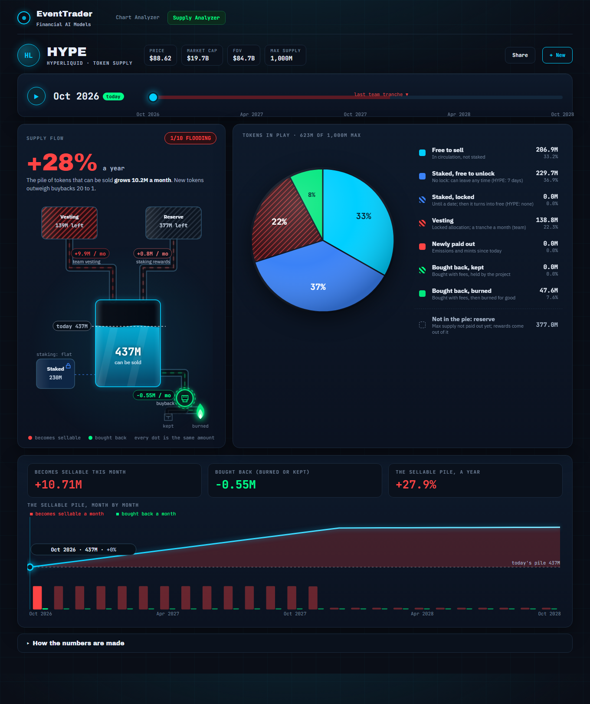
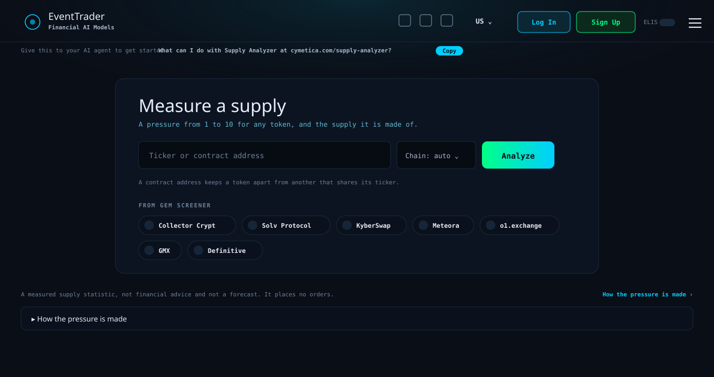
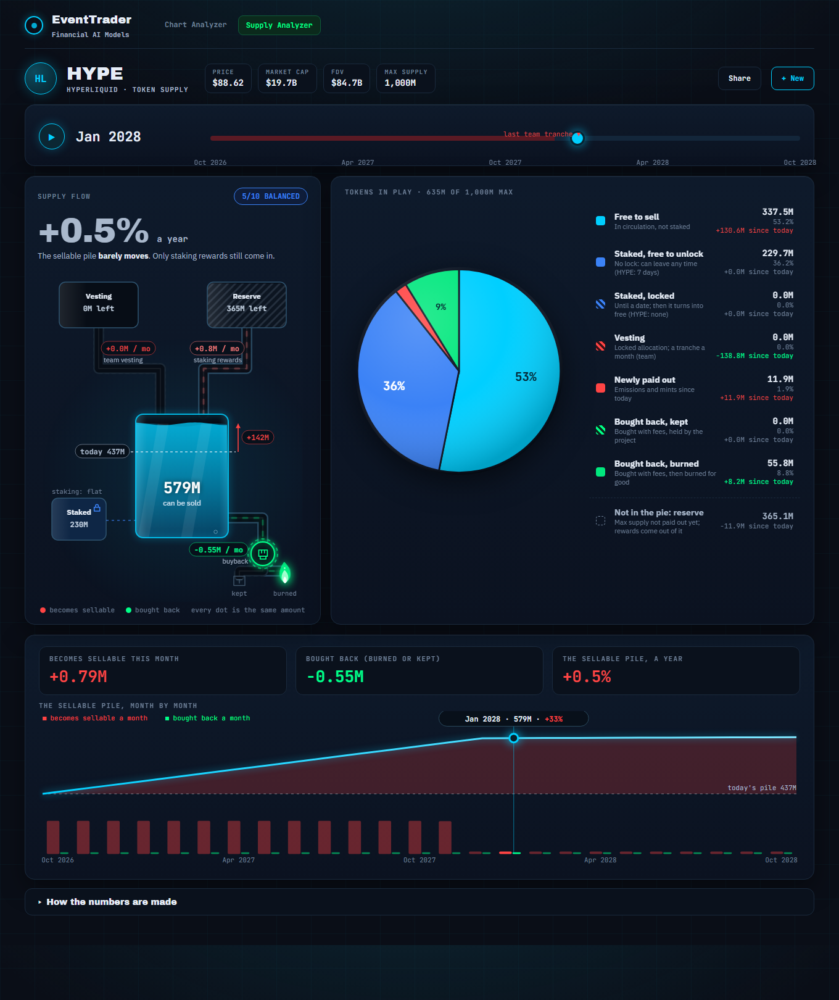
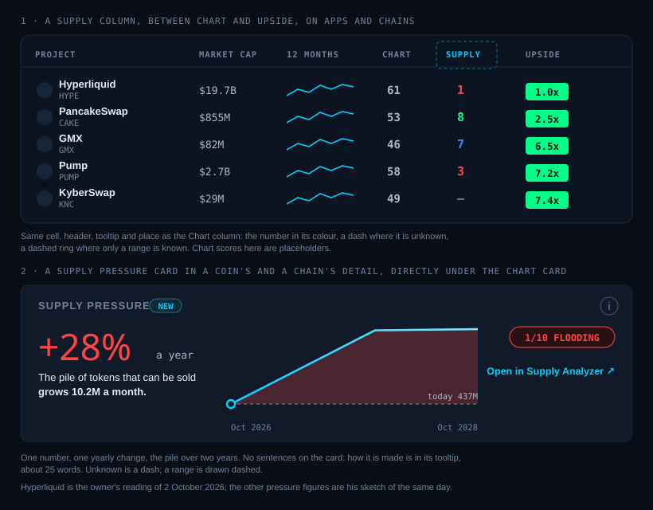

# Build request: Supply Analyzer, a new app, and its place in the Gem Screener (cymetica.com/supply-analyzer)

**For:** the lead agent of the Cymetica SDLC pipeline
**From:** Adam (product owner, Gem Screener)
**Scope:** a new standalone app, the Supply Analyzer, built the way the Chart Analyzer is built (type any token, get a result page, a public API and an MCP tool); and its place in the Gem Screener: a Supply column in the Apps and Chains tables (a mini pie beside the number), one Supply card in a coin's and a chain's detail that replaces "Market cap & supply", the end of the FDV view, and the end of the dilution warning icon in the rows. Build or change only what is named; leave the rest of the apps as they are.

> **HOW TO READ THIS SPEC**
> 1. **Goals, not methods.** How you build it is your call. Where an item gives a rule or a number, it is a good default, and you may improve it; say what you changed and why in your spec.
> 2. **The data is the job, and no source is named on purpose.** Where it comes from is yours to choose and to pay for. The owner does not want to limit you, and does not want excuses either: see item 6.
> 3. **Every number is read on 2026-10-01 or 2026-10-02** from the live Gem Screener and from public records. They move; they are there so you can check that a change took effect, not as the requirement.
> 4. **English only**, degen-friendly: the number first, plain short words.
> 5. **Keep the look.** The reference page in this folder is the look and the motion the owner wants; the finish is yours to improve, the structure is not.
> 6. **This spec starts from ET-28821 as shipped.** The Dilution figure of the Gem Screener stays what it is there: gross, one figure for the page.
> 7. **Unknown is never zero.** Where a figure has no source, the page says "unknown" in grey and names what is missing. This holds for every item below.
> 8. **If you need a list from us** (addresses of contracts or wallets with a public source each, for the tokens you want first), say which and it will be supplied. Do not wait for it.

## What is ready (`reference/`)

| File | For item | What it is |
|---|---|---|
| `reference/supply-analyzer-hyperliquid.html` | 3, 4, 5, 13 | A working page for Hyperliquid, with the owner's reading of 2 October 2026 as sample data. Open it in a browser: the month slider and the play button move the tank, the pie, the numbers and the chart; hover any part of the tank. `?m=15` opens it in the 15th month. It is the look and the motion, not the code |
| `reference/shot-month-0.png`, `reference/shot-month-15.png` | 3 | The same page in October 2026 and in January 2028, as pictures |
| `reference/input-page.svg` | 2 | The input page, in the Chart Analyzer's own layout |
| `reference/gem-screener-integration.svg` | 8, 9 | The Supply column with its mini pie, and the one card that replaces "Market cap & supply", inside the Gem Screener |

---

## 1. What it is

**[1] The Supply Analyzer shows a token's supply as a flow: how many of its tokens can be sold, what pours in, what is taken out, month by month.** A price moves with what can be sold and what is bought. The tools that exist show one piece at a time: an unlock calendar, a staking figure, a burn counter. As far as the owner knows, none puts the pile that can be sold, the vesting, the locks, the new issuance and the buybacks into one picture that moves through time. That is the gap. The app's one number is **the yearly change of the pile that can be sold**: +28% for Hyperliquid today, which means that the pile of tokens that can be sold grows by more than a quarter every year, and a small 1 to 10 number says it in a word (item 5). (The team's monthly tranche is the owner's least settled input for that example: public trackers give from about 6M to 10M HYPE a month, and your figure wins.)

It must work for **every token in the Gem Screener** (215 apps and 33 chains) **and for any token a user types**, whatever the user found, wherever.

## 2. The input

**[2] The input is the Chart Analyzer's input.** Live, https://cymetica.com/chart-analyzer has a box "Ticker or contract address", a "Chain: auto" select, an Analyze button, a line saying that a contract address keeps a token apart from another that shares its ticker, a row of chips "FROM GEM SCREENER", a collapsed "How the number is made", the strip "Give this to your AI agent to get started", and on a result the buttons Share and + New. The owner wants the same, for supply:

- **The same box, select and button**, the same chips (the Gem Screener's current picks, read live), the same strip for agents, the same Share and + New.
- **A ticker that two tokens share asks which one**, and a contract keeps them apart (INDEX, MET, EDGE and UP are each two apps in the Gem Screener today).
- **Deep links**: `?symbol=` and `?contract=&chain=` open the result, so the Gem Screener and agents can link to it.

## 3. The result page

**[3] The result page has these parts, in this order.** The reference page shows each one.

- **The header**: the token, and its price, market cap and max supply as small chips. No FDV: the tokens not out yet are in the pie, as vesting, dated (item 9).
- **The month slider** (item 4), with a play button, above everything.
- **The supply flow card, on the left**: the hero number (the yearly change of the pile, +28%, red when the pile grows, green when it shrinks, grey when it barely moves, with the sentence under it: "The pile of tokens that can be sold grows 10.2M a month. New tokens outweigh buybacks 20 to 1"); the 1 to 10 pill with its word; and **an animated tank**. The tank is the pile that can be sold, its level moves with the month, a dashed line marks where it stands today and a bracket shows the change since, in M. Into it pour **two sources**: the vesting (a vault that empties as the tranches are released) and the reserve (the part of the max supply not paid out yet, from which rewards come). Out of it goes **the buyback**, through a pump, to a flame (burned) or a vault (kept). Staking in and out is a dashed pipe, marked "flat" when it is not measured. **Every flow is dots**: how many dots a second and how fast they move follow the monthly amount, and every dot is the same amount of tokens, so a 10.7M inflow against a 0.55M outflow is a stream against a trickle.
- **The pie, on the right**: the tokens in play, seven slices with generic names so that one page works for any token: *Free to sell*, *Staked, free to unlock* (it can leave at any time; the page says how long the exit takes), *Staked, locked* (until a date, then it turns into free), *Vesting*, *Newly paid out* (emissions, mints and rewards since today), *Bought back, kept* and *Bought back, burned*. The percentages stand in the slices, a legend gives each amount, its share and its change since today, and the reserve stands under the legend as one line, outside the pie, because it is not in anyone's hands. Hovering a slice or a legend row lights the other.
- **A chart of the pile month by month**, with today's level as a dashed line, a marker on the month of the slider, and under it the monthly inflow and buyback as bars.
- **Three figures** above the chart: what becomes sellable this month, what is bought back this month, and the yearly change.
- **"How the numbers are made"**, collapsed (item 11).

**Hovering or tapping any part of the tank** (the vault, the reserve, the tank, the pump, the flame, the kept vault, the staking pipe) says in about 30 words what it is and what the month's figure is.

## 4. The month slider

**[4] The month slider replays the supply through time.** It moves the tank, the hero number, the pie, the legend and the chart together. A vesting tranche that reaches its date moves from *Vesting* to *Free to sell*; a lock that ends moves from *Staked, locked* to *Free to sell*; emissions and rewards grow *Newly paid out* and shrink the reserve; every buyback grows *Bought back, burned* or *Bought back, kept*. The range runs from today to the last scheduled event of the token, at least 24 months and at most 60, with the last vesting marked on the track. The play button steps through the months. The pie shows the **tokens in play** (for Hyperliquid 623M of the 1,000M max); the reserve stands outside it.

## 5. The numbers and the words

**[5] The pile, what comes in, what goes out, and the number.** A good default, which you may improve (say what and why):

- **The sellable pile** = the tokens in circulation that are not locked, plus the staked tokens that can leave at any time, plus the tokens whose lock has ended.
- **What comes in** (becomes sellable): vesting and unlock tranches reaching their date; locks and unstaking queues ending; emissions, mints and staking rewards paid out; airdrops and other distributions.
- **What goes out**: buybacks (burned or kept); burns; new staking and new locks.
- **The yearly change** = (in − out) × 12 ÷ the pile, in %. It is the hero number.
- **The pressure number, 1 to 10** = 6 − ceil(the yearly change ÷ 2.5%), kept between 1 and 10: 10 means buyers squeeze the pile, 1 means new tokens flood it, and 5 and 6 sit either side of a flat pile. 8 to 10 is *Squeezing*, 4 to 7 *Balanced*, 1 to 3 *Flooding*. It is a measure of the supply, not a forecast of the price.
- **Gross.** What comes in is the gross figure: where it overlaps with the Gem Screener's Dilution figure it is the same figure, the larger of the emissions of the last 30 days and the unlocks of the next 30 days, per week. Buybacks are not netted off Dilution anywhere in the Gem Screener; the net exists only inside this app, because there it is the point.
- **Unknown never counts as good** (the Degen meter's rule). An unknown outflow counts as 0; an unknown inflow counts as the typical token's (a good default: the median of the tokens that have data, about 5% a year today); the result is then a **range**, drawn dashed, and the page names the unknown input. If both flows are unknown, the number is "?" in grey.
- **Scheduled is not moved.** A schedule says when tokens can be sold, not that they were. Where it can be seen how much of an unlocked tranche has moved since it unlocked, the page says so beside the tranche. (Hyperliquid's team tranches are an example: they unlock on a schedule, and how much of each has moved is a separate fact.)

## 6. The data

**[6] The data is the job, and it must be had.** This is the hard part, and it is why the app is worth building. **The owner does not accept a result page full of empty states because a feed lacks a field.** Where a number cannot be had from a free source, buy the feed, read the chain, read the project's own published schedule, or enter it by hand with a link: the choice is yours, the result is not optional. What cannot be known after that is shown as unknown, input by input, and each unknown is a work item you can name, never a verdict on the token. What the page needs for a token:

| Input | What it is |
|---|---|
| Supply today | max and total supply, circulating, burned, the staked and locked amounts, split by how they can leave |
| Staking | the amount staked; whose it is (the project's own, or everyone's); the exit rule: at once, after a delay, or locked until a date |
| Vesting and unlocks | the dated schedule: amounts, who receives them, and, where it can be seen, how much of each past tranche has moved |
| Emissions, mints and rewards | the schedule or the rate, and what pays them (a reserve, an inflation rule) |
| Buybacks | the amount a period; whether the tokens are burned or kept; how firm it is (programmatic with an end date, or at the team's discretion); who buys |
| Burns | the amount burned and the rate (supply burns, fee burns) |
| New staking and new locks | the net staked in and out a period |
| Price and market cap | to turn dollars into tokens |

Rules for all of them:

- **Every figure carries its source and its date**, in its tooltip; "How the numbers are made" names, in plain words, the sources used for this token.
- **Two sources that disagree** are both shown, and the page says which it used (the Gem Screener's "supply sources disagree" tag is the same idea).
- **A schedule that exists in a public document or contract is used even if no feed carries it**, with its link, and read again when the project changes it. The owner knows that the project's published schedule is often the only complete source.
- **Refresh at least daily**; a figure older than 7 days says so.
- **Wallets the project has not published are not labelled by guesswork.** Whatever depends on them stays unknown.
- **Coverage at delivery.** Your spec says, for the 215 apps and the 33 chains, how many have every input, and for each of the others which input is missing and what you did about it. The goal is all of them.

## 7. Any token

**[7] A token nobody has analysed yet is analysed when it is typed.** The page opens at once with what it already knows, shows a progress line while it reads, and fills in without a reload; a good default is a first result within 30 seconds for any token with a contract on a chain you read. Your spec names the chains and the order in which you cover the Gem Screener's tokens. What is read is kept and refreshed like any other token's: a token typed once is covered from then on. The native token of a chain works the same way. **A token the app cannot analyse at all** says which inputs it could not read and why, and is queued; it never shows a blank page and never an invented number.

## 8. In the Gem Screener

**[8] A Supply column in the Apps and Chains tables.** Live, the Chart column stands between the 12-month chart and Upside. The Supply column stands between Chart and Upside, with the same cell, header, tooltip and place as the Chart column. The cell holds **a small pie of the token's supply** (the pie of item 3 in miniature, about 22 px, the same colours) **and the pressure number beside it**, in its band's colour (green, blue, red as in the Degen meter); a dashed ring and a dash where it is unknown, a dashed ring around a pie where only a range is known. The header's tooltip says what it is in about 25 words. **It is sortable**, because the owner wants to find the squeezed ones first. It is not a gate, and the default views, the gates and the picks do not change in this request.

**[9] One Supply card replaces "Market cap & supply" in a coin's detail.** Live, that card is a bar and four tiles (market cap; FDV with the share of tokens out; new tokens a week with its flag; the next unlock). The owner wants them gone: the pie says what they said. The new card, in the same place and with the same name, holds:

- **Small chips along the top**: MCAP; the Dilution figure with its flag (ET-28821 item 10, "NEW TOKENS +1.0% a week" with the warning icon, read from the schedule of item 10 below, so the Supply row of the checks and the Apps row still read the same figure); and the next unlock as one line (when, how much, for whom). **No FDV and no "out" share.**
- **The pie** of the token's supply, the tokens in play, with the percentages in the slices and a legend of the slices that are not empty, each with its amount; a short line saying how much of the max supply is in play and that the rest is the reserve. The grey tag "supply sources disagree" stays under it where it applies.
- **The hero number** (the yearly change of the pile that can be sold), the 1 to 10 pill, a 24-month curve of the pile with today's line, and the link "Open in Supply Analyzer ↗", which opens the result for that token in a new tab (`rel="noopener"`, like every link that leaves the page).
- No other sentence: how it is made is in the card's tooltip, about 25 words. Where the number is unknown it is a dash, and the tooltip names the unknown inputs.
- **On a chain** there is no "Market cap & supply" card (its detail has the slim row with Market cap and Adoption). The same card stands directly under the Chart card and the slim row stays.

**The FDV view goes from the Gem Screener's display.** Valuing a token by all of its tokens, including those that are not out yet, is the wrong lens: what is still to come is in the pie as vesting and reserve, dated, and the pressure number measures it better. So the FDV tile, the "if all tokens were out" symbol and tooltip in the Upside cell, and the "x if all tokens were out" lines on the pick cards and in the detail's Upside tooltip go. The Upside itself (against the market cap), the gates, the picks and the API fields stay as they are.

**The dilution warning goes from the rows and the pick cards.** Live, a coin with heavy dilution shows a red warning icon beside its name, with a tooltip ("Heavy dilution 7.5% a week ...", the figure against the market cap, the benchmark's figure and the two lines). The Supply column shows the same thing, so the icon and its tooltip go from the Apps table and from the Top Picks cards. The Dilution figure and its flag stay on the detail card's chip (above), because the Supply row of the checks and gate 7 read the same figure; the gate, its "heavy dilution" reason chip in the near-misses lane and the other warnings beside a name are unchanged.

**[10] The Gem Screener and the Supply Analyzer answer from one schedule.** Live, on Hyperliquid's detail the card "Market cap & supply" reads **"0% new tokens a week · emissions 30d: $0 · none in 90 days"**, and Hyperliquid is the benchmark of the Dilution flag: its 0.0% a week sets the lines at 0.5% and 1.0%. Yet its team vests 238M HYPE in 24 monthly tranches of about 9.9M (about 4.5% of its market cap a month), and the Gem Screener's own unlock record for it carries `tbd_pct: 61.2`. A token whose schedule is not in the data reads "none", which is an absence read as a zero. The owner wants: **where the Supply Analyzer knows a schedule, the Gem Screener's next unlock, its Dilution figure and its flag read that schedule**; "none in 90 days" is shown only when the schedule says so, and "unknown" otherwise; and the benchmark's figure that sets the flag lines is read from it too (the red line stays at most 1% a week, as ET-28821 has it).

## 9. For agents

**[11] The app has an API and an MCP tool, documented like the Chart Analyzer's.** One route for one token (a ticker, or a contract and a chain) and one for many (the Gem Screener reads it), and an MCP tool for each, in the same style as `chart_analyzer_score` and `chart_analyzer_batch`. The record carries: the token; every input with its value, unit, source and date; the unknown inputs by name; the monthly series (in, by kind; out, by kind; the pile; the pie's slices); the yearly change; the pressure number and its range; when it was refreshed. The routes are in the public OpenAPI, in `llms.txt` (with the fields) and in the agent card, and the strip on the input page tells an agent how to start.

## 10. A record, not a claim

**[12] The number is recorded for every token it covers, every week, from the first day, and its value is tested in the open.** Whether the pressure number tells anything about what a token does next is a question for data, not for this spec. A good default: each week the covered tokens above the median market cap are ranked by the pressure number; the top third is compared with the bottom third by the median return against BTC over the following four weeks; after at least 26 weeks the number counts as telling something only if the 90% bootstrap interval of the difference lies wholly above zero (wholly below zero: it points the wrong way; including zero: inconclusive). The test is written down before its first result and printed in "How the numbers are made". Until then the page says it is a measure and not a forecast.

## 11. Look, phone, motion

**[13] The look is the reference page's.** The same layout, the same tank scene, the same pie and legend, the same slider and chart, in the site's own palette and fonts (nothing new in colour). **At 390 px** the tank stands above the pie, the legend under the pie, the slider across the full width, hovering becomes tapping, and the page does not scroll sideways. **Reduced motion**: with the visitor's reduced-motion setting on, the dots and the waves stand still and the numbers still change; the animation pauses when the tab is hidden.

**[14] "How the numbers are made" is a collapsed block** (like the Chart Analyzer's) with the definitions of item 5, the sources used for this token, what is measured and what is estimated, and the test of item 12. No other small print on the page.

## Check on Hyperliquid (to check the direction, not a target)

The owner's reading of public records on 2 October 2026; the trackers differ on the team's day and amount, so treat the team's figure as the least settled.

- **Supply:** 222.4M in circulation of 1,000M max (22%); price $88.62, market cap $19.7B.
- **Staked:** 437.5M HYPE; the exit takes 7 days; about 207.8M of it is on the project foundation's own validators. No time-locked staking.
- **Vesting:** 238M HYPE for the core team in 24 monthly tranches of about 9.92M; about 138.8M still to come; the last tranche lands in November 2027.
- **Rewards:** about 0.79M HYPE a month paid to stakers out of the reserve.
- **Buyback:** $145M in Q3 2026, about 0.55M HYPE a month at today's price; all of it burned; 47.6M burned so far.
- **Result:** the pile that can be sold is about 437M; in October 2026 it grows about 10.2M a month, **+28% a year, pressure 1 of 10**; from December 2027, when the team is fully vested, it is about +0.5% a year, **pressure 5 of 10**.

## Not in this request

Orders or trades; a judgement of whether a token is good; labels on wallets nobody has published; a gate or a change of the Gem Screener's picks; the colour of the Gem Screener's warnings; and the changes listed after ET-28821, which stand as their own item.

---

## Checklist (one line each; done when all are true)

- [ ] 2 The page `/supply-analyzer` has the Chart Analyzer's input: the ticker or contract box, the chain select (auto), Analyze, the strip for AI agents and the chips from the Gem Screener's current picks; Share and + New on a result; `?symbol=` and `?contract=&chain=` open a result.
- [ ] 2 A ticker that two tokens share asks which one; a contract keeps them apart.
- [ ] 3 The result header shows the token with its price, market cap and max supply, and no FDV.
- [ ] 3 The hero number is the yearly change of the sellable pile (red when it grows, green when it shrinks, grey under 1%), with the sentence under it giving the monthly amount and the ratio of what comes in to what goes out; the 1 to 10 pill with its word stands beside the card's title.
- [ ] 3 The tank shows the sellable pile with a level that follows the month, a dashed "today" line and the change since in M; the vesting vault and the reserve pour in, the buyback pump leads to a flame (burned) and a vault (kept), and staking in and out is a dashed pipe marked "flat" when it is not measured.
- [ ] 3 Every flow is dots whose number a second and speed follow its monthly amount, and every dot is the same amount of tokens.
- [ ] 3 Hovering or tapping the vault, the reserve, the tank, the pump, the flame, the kept vault and the staking pipe says in about 30 words what it is and what the month's figure is.
- [ ] 3 The pie has seven slices with the generic names, the percentages in them, a legend with amount, share and change since today, the reserve as one line outside the pie, and hovering a slice or a legend row lights the other.
- [ ] 3 A chart shows the pile month by month with today's dashed line and a marker on the slider's month, and the monthly inflow and buyback as bars under it; three figures stand above it.
- [ ] 4 The month slider with a play button moves the tank, the hero number, the pie, the legend and the chart together; a vesting tranche that reaches its date, a lock that ends, a reward and a buyback each move the slices as item 4 says.
- [ ] 4 The slider runs from today to the last scheduled event (at least 24 months, at most 60) with the last vesting marked on the track.
- [ ] 5 The sellable pile, what comes in and what goes out are as item 5 defines them (or as your spec says you improved them, and why); the yearly change and the pressure number follow the formulas of item 5 or your improved ones, and the bands are Squeezing, Balanced and Flooding.
- [ ] 5 An unknown outflow counts as 0 and an unknown inflow as the typical token's; the result is then a dashed range with the unknown input named; both unknown reads "?" in grey; nothing unknown is ever shown as zero.
- [ ] 5 Where it can be seen how much of an unlocked tranche has moved since it unlocked, the page says so beside the tranche.
- [ ] 6 Every figure shows its source and date in its tooltip; two sources that disagree are both shown and the one used is named; a figure older than 7 days says so.
- [ ] 6 A schedule that exists only in a public document or contract is used, with its link, and read again when it changes; wallets nobody has published are never labelled by guesswork.
- [ ] 6 Your spec says, for the 215 apps and the 33 chains, how many have every input, and for each of the others which input is missing and what you did about it.
- [ ] 7 A token nobody has analysed opens the page at once, shows a progress line and fills in without a reload; the first result for a token with a contract on a chain you read comes within 30 seconds (or the time you chose, named in your spec); the token is then kept and refreshed.
- [ ] 7 A token the app cannot analyse says which inputs it could not read and why, and is queued; no blank page, no invented number. Your spec names the chains you read and the order you cover the Gem Screener's tokens in.
- [ ] 8 The Apps and Chains tables have a Supply column between Chart and Upside, with the Chart column's header, tooltip and place; its cell holds a small pie of the token's supply and the pressure number beside it in its band's colour, a dashed ring and a dash where unknown, a dashed ring around the pie for a range; it is sortable; the default views, the gates and the picks are unchanged.
- [ ] 9 In a coin's detail one Supply card, in the same place and with the same name, replaces "Market cap & supply": chips for MCAP, the Dilution figure with its flag and the next unlock as one line; the pie with percentages and a legend of the slices that are not empty; the hero number, the 1 to 10 pill, a 24-month curve with today's line and "Open in Supply Analyzer ↗" in a new tab with `rel="noopener"`; a tooltip of about 25 words and no other sentence; the "supply sources disagree" tag stays under the pie where it applies; a dash with the unknown inputs named in the tooltip where it is unknown.
- [ ] 9 On a chain the same card stands directly under the Chart card and the slim row (Market cap, Adoption) stays.
- [ ] 9 The FDV tile, the "if all tokens were out" symbol and tooltip in the Upside cell, and the "x if all tokens were out" lines on the pick cards and in the detail's Upside tooltip are gone from the display; the Upside against the market cap, the gates, the picks and the API fields are unchanged.
- [ ] 9 The dilution warning icon and its tooltip beside a project's name in the Apps table and on the Top Picks cards are gone; the Dilution figure and its flag stay on the detail card's chip, and the gate, its reason chip in the near-misses lane and the other warnings beside a name are unchanged.
- [ ] 10 Where the Supply Analyzer knows a schedule, the Gem Screener's next unlock, its Dilution figure and its flag read it; Hyperliquid's detail no longer reads "0% new tokens a week" and "none in 90 days" unless the schedule says so; the benchmark's figure that sets the flag lines is read from it, and the red line stays at most 1% a week.
- [ ] 11 The API has a route for one token and one for many; the record carries the inputs with value, unit, source and date, the unknown inputs by name, the monthly series, the slices, the yearly change, the pressure number with its range and the refresh time; the routes are in the public OpenAPI, in `llms.txt` with their fields and in the agent card.
- [ ] 11 An MCP tool for one token and one for many exist, in the style of the Chart Analyzer's.
- [ ] 12 The number is recorded weekly for every token it covers from the first day; the test of item 12 (or your improved one) is written down and printed in "How the numbers are made" before its first result; the page makes no claim that the number predicts anything.
- [ ] 13 The page looks and moves like the reference page; at 390 px the tank stands above the pie, the slider spans the width, hovering is tapping, and the page does not scroll sideways.
- [ ] 13 With the visitor's reduced-motion setting on, the dots and waves stand still and the numbers still change; the animation pauses when the tab is hidden.
- [ ] 14 "How the numbers are made" is a collapsed block with the definitions, the sources used for this token, what is measured and what is estimated, and the test of item 12; there is no other small print.
- [ ] Hyperliquid: your result reads about +28% a year (pressure 1 of 10) in October 2026 and about +0.5% a year (5 of 10) from December 2027, or your spec says why it differs from the owner's reading.
- [ ] All text is English; the colours and fonts are the site's own, nothing new.
